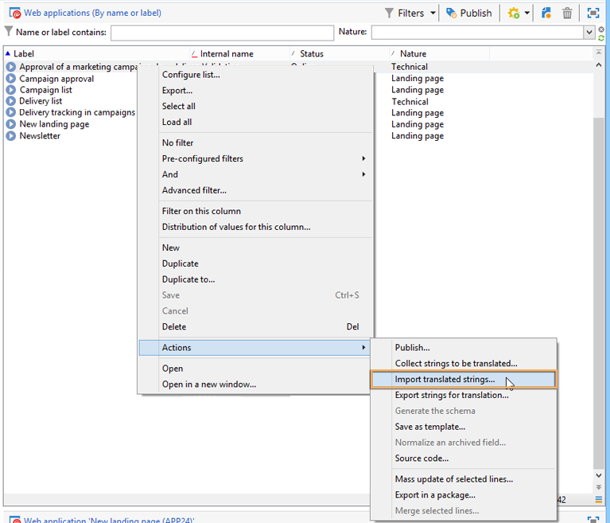

# 解释 Web 窗体{#translating-a-web-form}


可以将Web应用程序本地化为多种语言。

您可以直接在Adobe Campaign控制台中执行翻译(请参阅 [在编辑器中管理翻译](#managing-translations-in-the-editor))，或导出和导入字符串以将翻译外部化(请参阅 [将翻译外部化](#externalizing-translation))。

有关默认提供的翻译语言列表详情，请参阅 [更改表单显示语言](#changing-forms-display-language).

Web应用程序采用编辑语言设计：这是用于输入标签和其他要翻译内容的参考语言。

默认语言是如果未向其访问URL添加语言设置，则Web应用程序将以哪种语言显示。

>[!NOTE]
>
>默认情况下，编辑语言和默认语言与控制台语言相同。

## 选择语言 {#choosing-languages}

要定义一种或多种翻译语言，请单击 **[!UICONTROL Properties]** 按钮，然后 **[!UICONTROL Localization]** 选项卡。 单击 **[!UICONTROL Add]** 按钮来定义Web应用程序的新翻译语言。

>[!NOTE]
>
>此窗口还允许您更改默认语言和编辑语言。


为Web应用程序添加翻译语言时（或者当默认语言和编辑语言不同时）， **[!UICONTROL Translation]** 子选项卡将添加到 **[!UICONTROL Edit]** 选项卡以管理翻译。

Adobe Campaign包含用于翻译和管理多语言翻译的工具。 通过此编辑器，您可以查看要翻译或批准的字符串、在界面中直接输入翻译或导入/导出字符串以将翻译外部化。

## 在编辑器中管理翻译 {#managing-translations-in-the-editor}

### 收集字符串 {#collecting-strings}

此 **[!UICONTROL Translations]** 通过制表符，您可以为构成Web应用程序的字符串输入翻译。

首次打开此选项卡时，它将不包含任何数据。 单击 **[!UICONTROL Collect the strings to translate]** 用于更新Web应用程序中字符串的链接。

Adobe Campaign收集 **[!UICONTROL Texts]** 所有静态元素的选项卡：HTML块、Javascript等 有关静态元素的详情，请参见 [Web窗体中的静态元素](static-elements-in-a-web-form.md).


>[!CAUTION]
>
>此过程可能需要几分钟时间，具体取决于要处理的数据量。
> 
>如果出现警告表明系统字典中缺少某些翻译，请参阅 [翻译系统字符串](#translating-the-system-strings).

每次翻译字符串时，都会将其翻译添加到翻译词典中。

当收集过程检测到已存在翻译时，此翻译将显示在 **[!UICONTROL Text]** 字符串的列。 字符串的状态已转换为 **[!UICONTROL Translated]**.

对于从未翻译过的字符串，将 **[!UICONTROL Text]** 字段为空，状态为 **[!UICONTROL To translate]**.

### 筛选字符串 {#filtering-strings}

默认情况下，将显示Web应用程序的每种翻译语言。 有两种默认筛选器：语言和状态。 单击 **[!UICONTROL Filters]** 按钮，然后单击 **[!UICONTROL By language or status]** 显示匹配的下拉框。 您还可以创建高级过滤器。 有关详细信息，请参见[此页面](../../platform/using/creating-filters.md#creating-an-advanced-filter)。


转到 **[!UICONTROL Language]** 用于选择翻译语言的下拉框。

要仅显示未翻译的字符串，请选择 **[!UICONTROL To translate]** 在 **[!UICONTROL Status]** 下拉框。 您还可以仅显示已翻译或已批准的字符串。

### 翻译字符串 {#translating-strings}

1. 要翻译单词，请双击字符串列表中的单词。

   

   源字符串显示在窗口的上部。

1. 在下部输入其翻译。 要批准它，请选中 **[!UICONTROL Translation approved]** 选项。

   >[!NOTE]
   >
   >翻译审批是可选的，不会阻止该流程。

   未批准的翻译显示为 **[!UICONTROL Translated]**. 已批准的翻译显示为 **[!UICONTROL Approved]**.

## 将翻译外部化 {#externalizing-translation}

可以导出和导入字符串，以使用Adobe Campaign以外的工具翻译它们。

>[!CAUTION]
>
>导出字符串后，请勿使用集成工具执行任何翻译。 当您重新导入翻译时，这会导致冲突，并且这些翻译将会丢失。

### 导出文件 {#exporting-files}

1. 选择要导出其字符串的Web应用程序，右键单击并选择 **[!UICONTROL Actions > Export strings for translation...]**

   

1. 选择 **[!UICONTROL Export strategy]** ：

   * **[!UICONTROL One file per language]**：导出操作将为每种翻译语言生成一个文件。 每个文件对所有选定的Web应用程序都是通用的。
   * **[!UICONTROL One file per Web application]**：导出操作将为每个选定的Web应用程序生成一个文件。 每个文件将包含所有翻译语言。

     >[!NOTE]
     >
     >此类型的导出不适用于XLIFF导出。

   * **[!UICONTROL One file per language and per Web application]**：导出将生成多个文件。 每个文件将包含每个Web应用程序的一种翻译语言。
   * **[!UICONTROL One file for all]**：导出将为所有Web应用程序生成一个多语言文件。 它将包含所有选定Web应用程序的所有翻译语言。

     >[!NOTE]
     >
     >此类型的导出不适用于XLIFF导出。

1. 然后，选择 **[!UICONTROL Target folder]** 将记录文件的位置。
1. 选择文件格式( **[!UICONTROL CSV]** 或 **[!UICONTROL XLIFF]** )，然后单击 **[!UICONTROL Start]**.


>[!NOTE]
>
>导出文件的名称会自动生成。 如果多次执行相同的导出，则将用新文件替换现有文件。 如果需要保留以前的文件，请更改 **[!UICONTROL Target folder]** ，然后单击 **[!UICONTROL Start]** 再次运行导出。

在中导出文件时 **CSV格式**，每种语言均链接到状态和审批状态。 此 **批准？** 列允许您批准翻译。 此列可能包含值 **是** 或 **否**. 至于集成编辑器(请参阅 [在编辑器中管理翻译](#managing-translations-in-the-editor))，则批准翻译是可选的，不会阻止该流程。

### 正在导入文件 {#importing-files}

外部翻译完成后，您可以导入已翻译文件。

1. 转到Web应用程序列表，右键单击，然后选择 **[!UICONTROL Actions > Import translated strings...]**

   >[!NOTE]
   >
   >无需选择翻译涉及的Web应用程序。 将光标放置在Web应用程序列表上的任意位置。

   

1. 选择要导入的文件，然后单击 **[!UICONTROL Upload]**.

   

>[!NOTE]
>
>外部翻译总是比内部翻译更重要。 如果发生冲突，内部翻译将由外部翻译覆盖。

## 更改表单显示语言 {#changing-forms-display-language}

Web窗体以 **[!UICONTROL Localization]** 选项卡上的Web应用程序属性。 要更改语言，必须在URL末尾添加以下字符(其中 **xx** 是语言的符号)：

```
?lang=xx
```

语言是URL的第一个参数或唯一参数。 例如： **https://myserver/webApp/APP34**

```
&lang=xx
```

如果URL中的语言之前还有其他参数。 例如： **https://myserver/webApp/APP34?status=1&amp;lang=en**

下面列出了默认提供的翻译语言和词典。

**默认系统词典**：某些语言包含默认词典，其中包含系统字符串的翻译。 有关详细信息，请参见 [翻译系统字符串](#translating-the-system-strings).

**日历管理**：Web应用程序的页面可以包含用于输入日期的日历。 默认情况下，此日历提供多种语言版本（日翻译、日期格式）。

<table> 
 <tbody> 
  <tr> 
   <td> <strong>语言（符号）</strong><br /> </td> 
   <td> <strong>默认系统词典</strong><br /> </td> 
   <td> <strong>日历管理</strong><br /> </td> 
  </tr> 
  <tr> 
   <td> 德语(de)<br /> </td> 
   <td> 是<br /> </td> 
   <td> 是<br /> </td> 
  </tr> 
  <tr> 
   <td> 英语(en)<br /> </td> 
   <td> 是<br /> </td> 
   <td> 是<br /> </td> 
  </tr> 
  <tr> 
   <td> 英语（美国） (en_US)<br /> </td> 
   <td> </td> 
   <td> </td> 
  </tr> 
  <tr> 
   <td> 英语（英国）(en_GB)<br /> </td> 
   <td> </td> 
   <td> </td> 
  </tr> 
  <tr> 
   <td> 阿拉伯语(ar)<br /> </td> 
   <td> </td> 
   <td> </td> 
  </tr> 
  <tr> 
   <td> 中文(zh)<br /> </td> 
   <td> </td> 
   <td> </td> 
  </tr> 
  <tr> 
   <td> 韩语(ko)<br /> </td> 
   <td> </td> 
   <td> </td> 
  </tr> 
  <tr> 
   <td> 丹麦语(da)<br /> </td> 
   <td> 是<br /> </td> 
   <td> 是<br /> </td> 
  </tr> 
  <tr> 
   <td> 西班牙语(es)<br /> </td> 
   <td> 是<br /> </td> 
   <td> 是<br /> </td> 
  </tr> 
  <tr> 
   <td> 爱沙尼亚语(et)<br /> </td> 
   <td> </td> 
   <td> </td> 
  </tr> 
  <tr> 
   <td> 芬兰语(fi)<br /> </td> 
   <td> </td> 
   <td> 是<br /> </td> 
  </tr> 
  <tr> 
   <td> 法语(fr)<br /> </td> 
   <td> 是<br /> </td> 
   <td> 是<br /> </td> 
  </tr> 
  <tr> 
   <td> 法语（比利时） (fr_BE)<br /> </td> 
   <td> </td> 
   <td> </td> 
  </tr> 
  <tr> 
   <td> 法语（法国） (fr_FR)<br /> </td> 
   <td> </td> 
   <td> </td> 
  </tr> 
  <tr> 
   <td> 希腊语(el)<br /> </td> 
   <td> </td> 
   <td> 是<br /> </td> 
  </tr> 
  <tr> 
   <td> 希伯来语(he)<br /> </td> 
   <td> </td> 
   <td> </td> 
  </tr> 
  <tr> 
   <td> 匈牙利语(hu)<br /> </td> 
   <td> </td> 
   <td> 是<br /> </td> 
  </tr> 
  <tr> 
   <td> 印度尼西亚语(id)<br /> </td> 
   <td> </td> 
   <td> </td> 
  </tr> 
  <tr> 
   <td> 爱尔兰语(ga)<br /> </td> 
   <td> </td> 
   <td> </td> 
  </tr> 
  <tr> 
   <td> 意大利语(it)<br /> </td> 
   <td> 是<br /> </td> 
   <td> 是<br /> </td> 
  </tr> 
  <tr> 
   <td> 意大利语（意大利） (it_IT)<br /> </td> 
   <td> </td> 
   <td> </td> 
  </tr> 
  <tr> 
   <td> 意大利语（瑞士） (it_CH)<br /> </td> 
   <td> </td> 
   <td> </td> 
  </tr> 
  <tr> 
   <td> 日语(ja)<br /> </td> 
   <td> </td> 
   <td> </td> 
  </tr> 
  <tr> 
   <td> 拉脱维亚语(lv)<br /> </td> 
   <td> </td> 
   <td> 是<br /> </td> 
  </tr> 
  <tr> 
   <td> 立陶宛语(lt)<br /> </td> 
   <td> </td> 
   <td> </td> 
  </tr> 
  <tr> 
   <td> 马耳他语(mt)<br /> </td> 
   <td> </td> 
   <td> </td> 
  </tr> 
  <tr> 
   <td> 荷兰语(nl)<br /> </td> 
   <td> </td> 
   <td> 是<br /> </td> 
  </tr> 
  <tr> 
   <td> 荷兰语（比利时） (nl_BE)<br /> </td> 
   <td> </td> 
   <td> </td> 
  </tr> 
  <tr> 
   <td> 荷兰语（荷兰） (nl_NL)<br /> </td> 
   <td> </td> 
   <td> </td> 
  </tr> 
  <tr> 
   <td> 挪威语（挪威）(no_NO)<br /> </td> 
   <td> </td> 
   <td> 是<br /> </td> 
  </tr> 
  <tr> 
   <td> 波兰语(pl)<br /> </td> 
   <td> </td> 
   <td> 是<br /> </td> 
  </tr> 
  <tr> 
   <td> 葡萄牙语(pt)<br /> </td> 
   <td> </td> 
   <td> 是<br /> </td> 
  </tr> 
  <tr> 
   <td> 葡萄牙语（巴西） (pt_BR)<br /> </td> 
   <td> </td> 
   <td> </td> 
  </tr> 
  <tr> 
   <td> 葡萄牙语（葡萄牙） (pt_PT)<br /> </td> 
   <td> </td> 
   <td> </td> 
  </tr> 
  <tr> 
   <td> 俄语(ru)<br /> </td> 
   <td> </td> 
   <td> 是<br /> </td> 
  </tr> 
  <tr> 
   <td> 斯洛文尼亚语(sl)<br /> </td> 
   <td> </td> 
   <td> </td> 
  </tr> 
  <tr> 
   <td> 斯洛伐克语(sk)<br /> </td> 
   <td> </td> 
   <td> </td> 
  </tr> 
  <tr> 
   <td> 瑞典语(sv)<br /> </td> 
   <td> 是<br /> </td> 
   <td> 是<br /> </td> 
  </tr> 
  <tr> 
   <td> 瑞典语（芬兰） (sv_FI)<br /> </td> 
   <td> </td> 
   <td> </td> 
  </tr> 
  <tr> 
   <td> 瑞典语（瑞典） (sv_SE)<br /> </td> 
   <td> </td> 
   <td> </td> 
  </tr> 
  <tr> 
   <td> 捷克语(cs)<br /> </td> 
   <td> </td> 
   <td> </td> 
  </tr> 
  <tr> 
   <td> 泰语(th)<br /> </td> 
   <td> </td> 
   <td> </td> 
  </tr> 
  <tr> 
   <td> 越南语(vi)<br /> </td> 
   <td> </td> 
   <td> </td> 
  </tr> 
  <tr> 
   <td> 瓦隆(wa)<br /> </td> 
   <td> </td> 
   <td> </td> 
  </tr> 
 </tbody> 
</table>

>[!NOTE]
>
>要添加默认提供的语言以外的其他语言，请参阅 [添加翻译语言](#adding-a-translation-language)

## 示例：以多种语言显示Web应用程序 {#example--displaying-a-web-application-in-several-languages}

下列Web表单有四种语言版本：英语、法语、德语和西班牙语。 字符串已全部通过 **[!UICONTROL Translation]** Web窗体的选项卡。 由于默认语言是英语，因此在发布调查时，请使用标准URL以英语显示。


添加 **？lang=fr** 在URL末尾以法文显示：

>[!NOTE]
>
>每种语言的符号列表详见 [更改表单显示语言](#changing-forms-display-language).


您可以添加 **？lang=es** 或 **？lang=de** 以西班牙语或德语显示。

>[!NOTE]
>
>如果此Web应用程序已经使用了其他参数，请添加 **&amp;lang=**.\
>例如： **https://myserver/webApp/APP34?status=1&amp;lang=en**

## 高级翻译配置 {#advanced-translation-configuration}

>[!CAUTION]
>
>本部分仅供专家用户使用。

### 翻译系统字符串 {#translating-the-system-strings}

系统字符串是所有Web应用程序使用的现成字符串。 例如： **[!UICONTROL Next]** ， **[!UICONTROL Previous]**， **[!UICONTROL Approve]** 按钮， **[!UICONTROL Loading]** 消息等 默认情况下，某些语言包含包含这些字符串的翻译词典。 有关语言的详细列表，请参见 [更改表单显示语言](#changing-forms-display-language).

如果您将Web应用程序翻译成未翻译系统词典的语言，则会显示一条警告消息，通知您缺少某些翻译。


要添加语言，请应用以下步骤：

1. 转到Adobe Campaign树，然后单击 **[!UICONTROL Administration > Configuration > Global dictionary > System dictionary]** .
1. 在窗口的上部，选择要翻译的系统字符串，然后单击 **[!UICONTROL Add]** 在下面部分。

   

1. 选择翻译语言并输入字符串的翻译。 您可以通过选中 **[!UICONTROL Translation approved]** 选项。

   

   >[!NOTE]
   >
   >翻译审批是可选的，不会阻止该流程。

>[!CAUTION]
>
>请勿删除现成的系统字符串。

### 添加翻译语言 {#adding-a-translation-language}

要将Web应用程序翻译为默认应用程序以外的语言(请参阅 [更改表单显示语言](#changing-forms-display-language))，您将需要添加新的翻译语言。

1. 单击 **[!UICONTROL Administration > Platform > Enumerations]** Adobe Campaign节点，然后选择 **[!UICONTROL Languages available for translation]** 从名单上。 可用翻译的列表显示在窗口的下部。

   

1. 单击 **[!UICONTROL Add]** 按钮，然后输入 **[!UICONTROL Internal name]**， **[!UICONTROL Label]** 图像的和标识符（标志）。 要添加新图像，请联系您的管理员。

   
