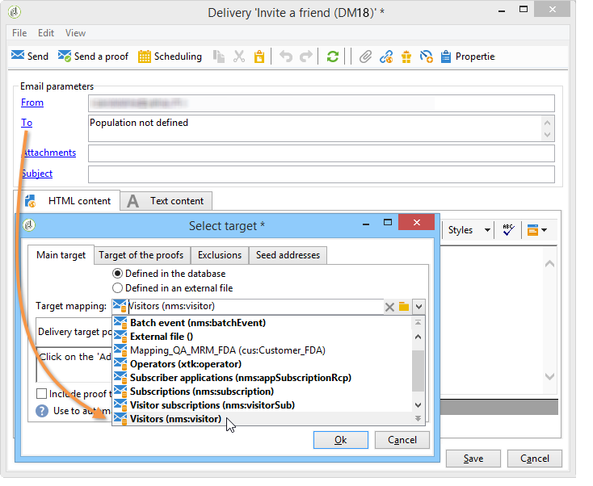
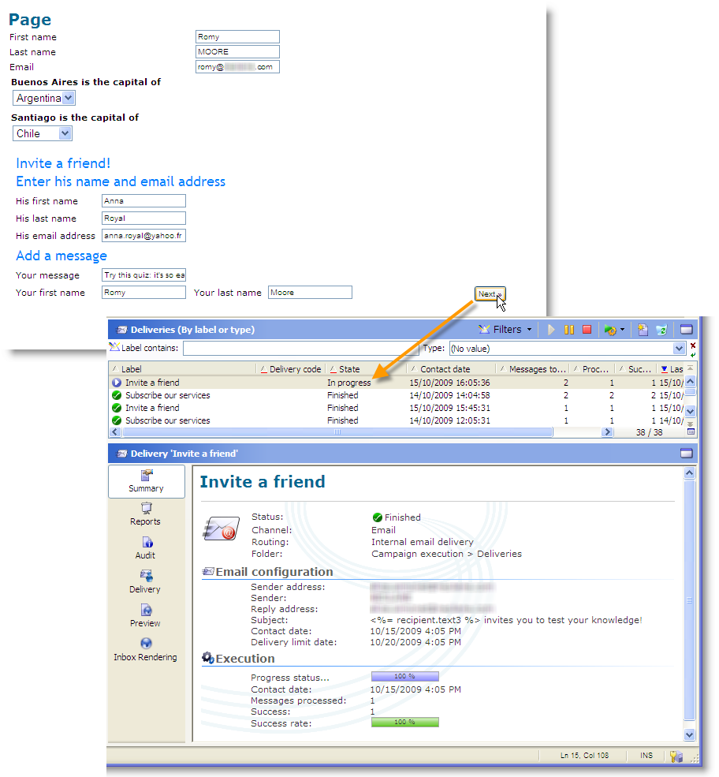

# 用例：创建引用表单{#use-case-creating-a-refer-a-friend-form}

在此示例中，我们要将竞争优惠到数据库中的收件人。 Web表单将包含一个用于输入答案的部分，另一个用于通过输入朋友的电子邮件地址来引荐朋友。


使用前面描述的过程创建标识和竞争块。

要配置和创建引用块，请应用以下步骤：

1. 创建包含问题的竞赛Web表单，并创建一个用于输入朋友的联系信息的字段，如下所示：

   

   在&#x200B;**消息**&#x200B;字段中，可以输入被推荐人的消息。 推荐人还必须输入其&#x200B;**姓氏**、**名字**&#x200B;和&#x200B;**电子邮件**。

   在字段中输入的信息存储在称为访客表的特定表中。

   >[!NOTE]
   >
   >只要收件人未表示同意，您就不能将其与收件人一起存储在数据库中。 它们将临时存储在专为病毒式营销活动设计的&#x200B;**访客**&#x200B;表(**nms:访客**)中。 此表因&#x200B;**清理**&#x200B;操作而定期清除。
   >
   >在此示例中，我们希望目标收件人建议他们参加推荐人推荐的竞争。 但是，在此消息中，我们还希望将他们优惠为我们的某个信息服务。 如果用户订阅，则可以将其存储在数据库中。

   

   与被推荐人有关的字段内容将用于用户档案创建脚本和发送给它们的消息中。

1. 开始，方法是创建一个脚本，将推荐人链接到被推荐人。

   它包含以下说明：

   

   ```
   ctx.recipient.visitor.@id = xtk.session.GetNewIds(1)
   ctx.recipient.visitor.@forwardUrl = "APP5"
   ctx.recipient.visitor.@referrerEmail = ctx.recipient.@email
   ctx.recipient.visitor.@referrerFirstName = ctx.recipient.@firstName
   ctx.recipient.visitor.@referrerLastName = ctx.recipient.@lastName
   ```

   在页面标识块中输入的姓、名和电子邮件地址标识为推荐人的姓、名和电子邮件地址。 这些字段将重新注入发送到被推荐人的消息正文中。

   APP5值与Web表单的内部名称相匹配：此信息可让您了解被推荐人的来源，即将访客链接到基于其创建的Web表单。

1. 存储框允许您收集信息并将其存储在数据库中。

   

1. 然后创建链接到在步骤1中创建的投放模板的信息服务。 它将在信息服务的&#x200B;**[!UICONTROL Choose scenario]**&#x200B;字段中选择。

   用于创建引用优惠消息的投放模板包含以下信息：

   

   此模板具有以下特点：

   * 选择访客表作为目标映射。

      

   * 被推荐人的联系信息以及推荐人信息均从访客表中获取。 它使用个性化按钮插入。

      

   * 此模板包含一个指向竞赛表单的链接以及被推荐人订阅新闻稿的订阅链接。

      订阅链接通过个性化块插入。 默认情况下，它允许您将用户档案订阅&#x200B;**newsletter**&#x200B;服务。 可以根据您的需要更改此个性化基块，例如，将收件人订阅到其他服务。

   * 内部名称(此处为“推荐人”)将用在消息投放脚本中，如下所示。
   >[!NOTE]
   >
   >有关投放模板的详细信息，请参阅[此页](../../delivery/using/about-templates.md)。

1. 创建用于传送订阅消息的第二个脚本。

   

   ```
   // Updtate visitor to have a link to the referrer recipient
   ctx.recipient.visitor.@referrerId = ctx.recipient.@id
   ctx.recipient.visitor.@xtkschema = "nms:visitor"
   ctx.recipient.visitor.@_operation = "update" 
   ctx.recipient.visitor.@_key = "@id" 
   xtk.session.Write(ctx.recipient.visitor)
   
   // Send email to friend
   nms.delivery.QueueNotification("referrer",
   <delivery>
   <targets>
     <deliveryTarget>
       <targetPart type='query' exclusion='false' ignoreDeleteStatus='false'>
         <where>
           <condition expr={'@id IN ('+ ctx.recipient.visitor.@id +')' }/>
         </where>
       </targetPart>
      </deliveryTarget>
     </targets>
    </delivery>)
   ```

1. 发布竞赛表单并向初始目标的收件人发送邀请。 当其中一个用户邀请朋友时，将创建基于&#x200B;**引用优惠**&#x200B;模板的投放。

   

   被推荐人将添加到&#x200B;**[!UICONTROL Administration > Visitors node]**&#x200B;中的访客文件夹：

   

   其用户档案包含其推荐人输入的信息。 它根据在表单脚本中输入的配置进行存储。 如果他们决定订阅新闻稿，则会将其保存在收件人表中。

