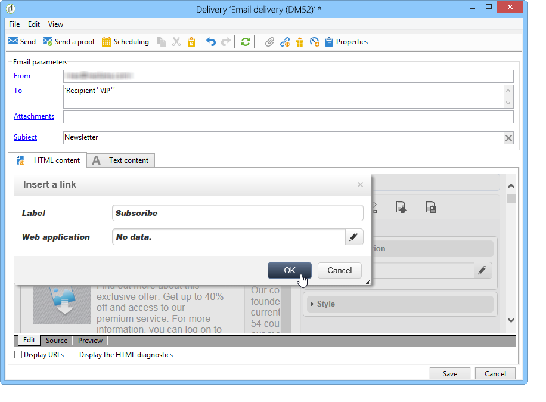

# 用例：创建电子邮件投放{#use-case-creating-an-email-delivery}

在此用例中，您将学习使用Adobe Campaign数字内容编辑器(数字内容编辑器)设计电子邮件投放的步骤。

我们的最终目标是使用包含以下内容的个性化模板创建投放:

* 收件人的直接地址（使用第一名和第二名）
* 指向外部URL的两种链接
* 镜像页面
* 指向Web 应用程序的链接

>[!NOTE]
>
>在开始之前，必须至少配置一个&#x200B;**HTML模板**&#x200B;以托管将来投放的内容。
>
>在投放&#x200B;**[!UICONTROL Properties]**&#x200B;中，确保将&#x200B;**[!UICONTROL Content editing mode]**（在&#x200B;**[!UICONTROL Advanced]**&#x200B;选项卡中）设置为&#x200B;**[!UICONTROL DCE]**。 要确保编辑器的最佳操作，请参阅[内容编辑最佳实践](../../web/using/content-editing-best-practices.md)。

## 步骤1 — 创建投放{#step-1---creating-a-delivery}

要创建新投放，请将光标放在&#x200B;**活动**&#x200B;选项卡中，然后单击&#x200B;**投放**。 然后，单击现有列表上方的&#x200B;**创建**&#x200B;按钮。 有关创建投放的详细信息，请参阅[此页](../../delivery/using/about-email-channel.md)。

## 步骤2 — 选择模板{#step-2---selecting-a-template}

选择投放模板，然后命名投放。 此名称仅对Adobe Campaign控制台的用户可见，而对收件人不可见，但此标题将显示在投放列表中。 单击 **[!UICONTROL Continue]**.

## 步骤3 — 选择内容{#step-3---selecting-a-content}

该数字内容编辑器附带各种具有不同结构（列、文本区域等）的现成模板。

选择要使用的内容模板，然后单击&#x200B;**[!UICONTROL Start with the selected content]**&#x200B;按钮以在创建的投放中显示该模板。

也可以通过选择&#x200B;**[!UICONTROL From a file]**&#x200B;导入在Adobe Campaign之外创建的HTML内容。

您可以将此内容保存为模板供将来使用。 创建个性化内容模板后，您便可以从模板的列表对其进行预览。 有关详细信息，请参阅[模板管理](../../web/using/template-management.md)。

>[!CAUTION]
>
>如果您使用&#x200B;**Adobe Campaign Web界面**，则必须导入包含HTML内容和相关图像的.zip文件。

## 第4步 — 设计消息{#step-4---designing-the-message}

* 显示收件人的名字

   要将收件人的第一个和第二个名称插入投放的文本字段中，请单击所选文本字段，然后将光标放在要显示它们的位置。 单击弹出工具栏中的第一个图标，然后单击&#x200B;**[!UICONTROL Personalization block]**。 选择&#x200B;**[!UICONTROL Greetings]**，然后单击&#x200B;**[!UICONTROL OK]**。

   

* 在图像中插入链接

   要通过图像将投放收件人到外部地址，请单击相关图像以显示弹出工具栏，将光标放在第一个图标上，然后单击&#x200B;**[!UICONTROL Link to an external URL]**。 有关详细信息，请参阅[添加链接](../../web/using/editing-content.md#adding-a-link)。

   

   在&#x200B;**URL**&#x200B;字段中输入链接的URL，格式为&#x200B;**https://www.myURL.com**，然后进行确认。

   可使用窗口右侧的部分随时更改链接。

* 在文本中插入链接

   要将外部链接集成到投放中的文本中，请选择一些文本或文本块，然后单击弹出工具栏中的第一个图标。 单击&#x200B;**[!UICONTROL Link to an external URL]**，在&#x200B;**[!UICONTROL URL]**&#x200B;字段中输入链接地址。 有关详细信息，请参阅[添加链接](../../web/using/editing-content.md#adding-a-link)。

   可使用窗口右侧的部分随时更改链接。

   >[!CAUTION]
   >
   >在&#x200B;**[!UICONTROL Label]**&#x200B;字段中输入的文本将替换原始文本。

* 添加镜像页面

   要允许收件人在Web浏览器中视图投放内容，您可以将指向镜像页面的链接集成到投放中。

   单击要查看已发布链接的文本字段。 单击弹出工具栏中的第一个图标，选择&#x200B;**[!UICONTROL Personalization block]**，然后选择&#x200B;**[!UICONTROL Link to Mirror Page (MirrorPage)]**。 单击&#x200B;**[!UICONTROL Save]**&#x200B;进行确认。

   

   >[!CAUTION]
   >
   >个性化基块标签会自动替换您投放中的原始文本。

* 将链接集成到Web 应用程序

   该数字内容编辑器允许您从Adobe Campaign控制台(如登陆页或表单页面)集成指向Web 应用程序的链接。 有关详细信息，请参阅[链接至Web 应用程序](../../web/using/editing-content.md#link-to-a-web-application)。

   为指向Web 应用程序的链接选择一个文本字段，然后单击第一个图标。 选择&#x200B;**[!UICONTROL Link to a Web application]**，然后单击&#x200B;**Web 应用程序**&#x200B;字段末尾的图标，选择所需的应用程序。

   

   单击&#x200B;**保存**&#x200B;进行确认。

   >[!NOTE]
   >
   >此步骤要求您至少提前保存一个Web 应用程序。 这些图标可在控制台的&#x200B;**[!UICONTROL Campaigns > Web applications]**&#x200B;选项卡中找到。

## 步骤5 — 保存投放{#step-5---saving-the-delivery}

集成内容后，单击&#x200B;**保存**&#x200B;保存投放。 它现在将显示在您的投放列表中，位于&#x200B;**[!UICONTROL Campaigns > Deliveries]**&#x200B;选项卡中。
