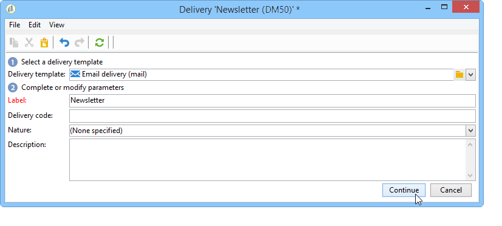
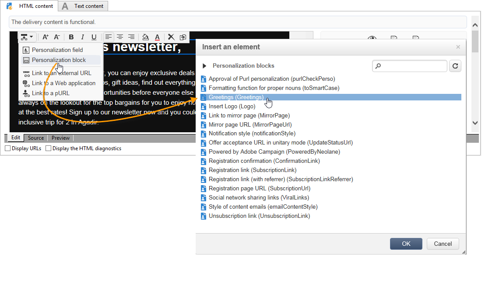

# 用例：创建电子邮件投放{#use-case-creating-an-email-delivery}

在此使用案例中，您将了解使用Adobe Campaign数字内容编辑器(DCE)设计电子邮件投放的步骤。

我们的最终目标是使用个性化模板创建投放，该模板包含：

* 收件人的直接地址（使用第一和第二名称）
* 外部URL的两种链接类型
* 镜像页面
* 指向Web应用程序的链接

>[!NOTE]
>
>开始之前，您必须至少拥有一个 **HTML模板** 配置为托管未来投放的内容。
>
>在投放中 **[!UICONTROL Properties]**，确保 **[!UICONTROL Content editing mode]** (在 **[!UICONTROL Advanced]** 选项卡)设置为 **[!UICONTROL DCE]**. 要确保编辑器获得最佳操作，请参阅 [内容编辑最佳实践](content-editing-best-practices.md).

## 步骤1 — 创建投放 {#step-1---creating-a-delivery}

要创建新投放，请将光标置于 **营销活动** 选项卡，然后单击 **投放**. 接下来，单击 **创建** 按钮来指定现有投放列表的上方。 有关创建投放的更多信息，请参阅 [此页面](../../delivery/using/about-email-channel.md).

## 第2步 — 选择模板 {#step-2---selecting-a-template}

选择投放模板，然后命名您的投放。 此名称仅对Adobe Campaign控制台的用户可见，收件人不可见，不过此标题将显示在投放列表中。 单击 **[!UICONTROL Continue]**。

## 步骤3 — 选择内容 {#step-3---selecting-a-content}

数字内容编辑器附带各种现成的模板，这些模板具有不同的结构（列、文本区域等）。

选择要使用的内容模板，然后单击 **[!UICONTROL Start with the selected content]** 按钮以在创建的投放中显示模板。

您还可以通过选择导入在Adobe Campaign之外创建的HTML内容 **[!UICONTROL From a file]**.

您可以将此内容另存为模板，以供将来使用。 创建个性化内容模板后，您可以从模板列表中预览该模板。 有关详细信息，请参见 [模板管理](template-management.md).

>[!CAUTION]
>
>如果您使用 **Adobe Campaign Web界面**&#x200B;中，您必须导入一个包含HTML内容和相关图像的.zip文件。

## 第4步 — 设计报文 {#step-4---designing-the-message}

* 显示收件人的名字和第二个名字

  要将收件人的名字和第二个名字插入到投放的文本字段中，请单击您选择的文本字段，然后将光标放在要显示它们的位置。 单击弹出式工具栏中的第一个图标，然后单击 **[!UICONTROL Personalization block]**. 选择 **[!UICONTROL Greetings]**，然后单击 **[!UICONTROL OK]**.

  

* 将链接插入图像

  要将投放收件人通过图像转到外部地址，请单击相关图像以显示弹出工具栏，将光标放在第一个图标上，然后单击 **[!UICONTROL Link to an external URL]**. 有关详细信息，请参见 [添加链接](editing-content.md#adding-a-link).

  

  在中输入链接的URL **URL** 字段使用以下格式 **https://www.myURL.com**，然后确认。

  可以随时使用窗口右侧的部分更改链接。

* 在文本中插入链接

  要将外部链接集成到投放的文本中，请选择一些文本或文本块，然后单击弹出工具栏中的第一个图标。 单击 **[!UICONTROL Link to an external URL]**，在中输入链接地址 **[!UICONTROL URL]** 字段。 有关详细信息，请参见 [添加链接](editing-content.md#adding-a-link).

  可以随时使用窗口右侧的部分更改链接。

  >[!CAUTION]
  >
  >在中输入的文本 **[!UICONTROL Label]** 字段替换原始文本。

* 添加镜像页面

  要允许收件人在Web浏览器中查看投放内容，您可以将指向镜像页面的链接集成到投放中。

  单击您希望在其中发布链接的文本字段。 单击弹出式工具栏中的第一个图标，然后选择 **[!UICONTROL Personalization block]**，则 **[!UICONTROL Link to Mirror Page (MirrorPage)]**. 单击 **[!UICONTROL Save]** 确认。

  

  >[!CAUTION]
  >
  >个性化块标签会自动替换投放中的原始文本。

* 将链接集成到Web应用程序

  数字内容编辑器允许您从Adobe Campaign控制台集成指向Web应用程序的链接，如登陆页或表单页。 有关详细信息，请参见 [链接到Web应用程序](editing-content.md#link-to-a-web-application).

  为指向Web应用程序的链接选择一个文本字段，然后单击第一个图标。 选择 **[!UICONTROL Link to a Web application]**，然后单击页面末尾的图标以选择所需的应用程序 **Web应用程序** 字段。

  

  单击&#x200B;**保存**&#x200B;确认。

  >[!NOTE]
  >
  >此步骤要求您事先至少保存一个Web应用程序。 这些可在以下位置找到： **[!UICONTROL Campaigns > Web applications]** 选项卡中。

## 步骤5 — 保存投放 {#step-5---saving-the-delivery}

集成内容后，单击以保存投放 **保存**. 它现在将显示在投放列表中，可在 **[!UICONTROL Campaigns > Deliveries]** 选项卡。
