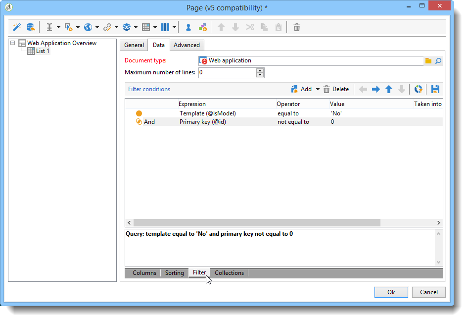
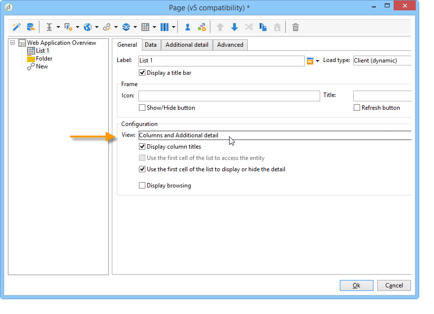

# 用例：创建概述页{#use-cases-creating-overviews}

在以下示例中，我们将创建概述类型Web 应用程序以显示数据库中的所有Web 应用程序。 配置以下元素：

* 文件夹上的过滤器（请参阅[在文件夹上添加过滤器](#adding-a-filter-on-a-folder)），
* 用于创建新Web 应用程序的按钮(请参阅[添加按钮以配置新Web 应用程序](#adding-a-button-to-configure-a-new-web-application)),
* 列表中每个条目的详细信息显示(请参阅[向列表](#adding-detail-to-a-list)添加详细信息),
* 每个链接编辑工具一个过滤器（请参阅[使用链接编辑器](#creating-a-filter-using-a-link-editor)创建过滤器），
* 刷新链接（请参阅[创建刷新链接](#creating-a-refresh-link)）。


## 创建单页Web 应用程序{#creating-a-single-page-web-application}

1. 创建单个&#x200B;**[!UICONTROL Page]** Web 应用程序，并禁用到下一页的出站过渡和过渡。

   

1. 更改页面标题。

   此标题将显示在概述标题和Web 应用程序概述中。

1. 在Web 应用程序属性中，通过选择&#x200B;**[!UICONTROL Single-page Web application]**&#x200B;模板修改应用程序的呈现。

   

1. 打开Web 应用程序的&#x200B;**[!UICONTROL Page]**&#x200B;活动并打开列表(**[!UICONTROL Static element > List]**)。
1. 在列表的&#x200B;**[!UICONTROL Data]**&#x200B;选项卡中，选择&#x200B;**[!UICONTROL Web applications]**&#x200B;文档的类型以及&#x200B;**[!UICONTROL Label]**、**[!UICONTROL Creation date]**&#x200B;和&#x200B;**[!UICONTROL Type of application]**&#x200B;输出列。
1. 在&#x200B;**[!UICONTROL Filter]**&#x200B;子选项卡中，创建以下筛选器，如下所示，以便仅显示Web 应用程序并从视图中排除模板。

   

1. 关闭页面的配置窗口，然后单击&#x200B;**[!UICONTROL Preview]**。

   将显示列表库中可用Web 应用程序。

   

## 在文件夹{#adding-a-filter-on-a-folder}上添加过滤器

在概述中，您可以根据数据在Adobe Campaign树中的位置选择访问数据。 这是文件夹上的过滤器。 应用以下过程将其添加到概述中。

1. 将光标放在Web 应用程序的&#x200B;**[!UICONTROL Page]**&#x200B;节点上，并添加&#x200B;**[!UICONTROL Select folder]**&#x200B;元素(**[!UICONTROL Advanced controls > Select folder]**)。
1. 在出现的&#x200B;**[!UICONTROL Storage]**&#x200B;窗口中，单击&#x200B;**[!UICONTROL Edit variables]**&#x200B;链接。
1. 更改变量标签以满足您的需求。
1. 使用&#x200B;**folder**&#x200B;值更改变量名。

   >[!NOTE]
   >
   >变量的名称必须与链接到文件夹(在模式中定义)的元素的名称匹配，即&#x200B;**folder**。 引用表时，必须重新使用此名称。

1. 将&#x200B;**[!UICONTROL XML]**&#x200B;类型应用于变量。

   

1. 选择&#x200B;**[!UICONTROL Refresh page]**&#x200B;交互。

   

1. 将光标放在列表上，在&#x200B;**[!UICONTROL Advanced]**&#x200B;选项卡中，引用之前在列表的&#x200B;**[!UICONTROL Folder filter XPath]**&#x200B;选项卡中创建的变量。 必须使用文件夹链接所关注元素的名称，即&#x200B;**folder**。

   

   >[!NOTE]
   >
   >在此阶段，Web 应用程序不在其应用程序上下文中，因此无法对文件夹测试筛选器。

## 添加按钮以配置新Web 应用程序{#adding-a-button-to-configure-a-new-web-application}

1. 将光标放在&#x200B;**[!UICONTROL Page]**&#x200B;元素上并添加链接(**[!UICONTROL Static elements > Link]**)。
1. 修改链接标签，因为链接标签将显示在概述的按钮上。

   在我们的示例中，标签为&#x200B;**New**。

1. 在URL字段中插入以下URL:**xtk://open/?schema=nms:webApp&amp;form=nms:newWebApp**。

   >[!NOTE]
   >
   >**nms:** webApp与Web 应用程序模式一致。
   >
   >**nms:** newWebApp与新的Web 应用程序创建向导重合。

1. 选择在同一窗口中显示URL。
1. 在图像字段中添加Web 应用程序图标：**/nms/img/webApp.png**。

   此图标将显示在&#x200B;**[!UICONTROL New]**&#x200B;按钮上。

1. 在&#x200B;**[!UICONTROL Style]**&#x200B;字段中输入&#x200B;**button**。

   此样式在以前选择的&#x200B;**[!UICONTROL Single-page Web application]**&#x200B;模板中引用。

   

## 向列表{#adding-detail-to-a-list}添加详细信息

在概述中配置列表时，您可以选择在列表上显示每个条目的其他详细信息。

1. 将光标放在先前创建的列表元素上。
1. 在&#x200B;**[!UICONTROL General]**&#x200B;选项卡中，在下拉列表中选择&#x200B;**[!UICONTROL Columns and additional detail]**&#x200B;显示模式。

   

1. 在&#x200B;**[!UICONTROL Data]**&#x200B;选项卡中，添加&#x200B;**[!UICONTROL Primary key]**、**[!UICONTROL Internal name]**&#x200B;和&#x200B;**[!UICONTROL Description]**&#x200B;列，并为每个列选择&#x200B;**[!UICONTROL Hidden field]**&#x200B;选项。

   

   这样，此信息将仅在每个条目的详细信息中可见。

1. 在&#x200B;**[!UICONTROL Additional detail]**&#x200B;选项卡中，添加以下代码：

   ```
   <div class="detailBox">
     <div class="actionBox">
       <span class="action"><a title="Open" class="linkAction" href="xtk://open/?schema=nms:webApp&form=nms:webApp&pk=
       <%=webApp.id%>">Open...</a></span>
       <% 
       if( webApp.@appType == 1 ) { //survey
       %>
       <span class="action"><a target="_blank" title="Reports" class="linkAction" href="/xtk/report.jssp?_context=selection&
         _schema=nms:webApp&_selection=<%=webApp.@id%>
         &__sessiontoken=<%=document.controller.getSessionToken()%>">Reports</a></span>
       <% 
       } 
       %>
     </div>
     <div>
       Internal name: <%= webApp.@internalName %>
     </div>
     <%
     if( webApp.desc != "" )
     {
     %>
     <div>
       Description: <%= webApp.desc %>
     </div>
     <% 
     } 
     %>
   </div>
   ```

>[!NOTE]
>
>在服务器上刷新JavaScript库需要五分钟。 您可以重新启动服务器以避免等待此延迟。

## 过滤和更新列表{#filtering-and-updating-the-list}

在本节中，您将创建一个过滤器，用于显示由特定运算符创建的Web 应用程序的概述。 此过滤器是使用链接编辑器创建的。 选择运算符后，请刷新列表以应用过滤器；这需要创建刷新链接。

这两个元素将以同一容器分组，以便在概述中以图形方式分组。

1. 将光标放在&#x200B;**[!UICONTROL Page]**&#x200B;元素上，然后选择&#x200B;**[!UICONTROL Container > Standard]**。
1. 将列数设置为&#x200B;**2**，以便链接编辑器和链接彼此相邻。

   

   有关元素布局的信息，请参阅[本节](../../web/using/about-web-forms.md)。

1. 应用&#x200B;**dottedFilter**。

   此样式在以前选择的&#x200B;**[!UICONTROL Single-page Web applicatio]** n模板中引用。

   

### 使用链接编辑器{#creating-a-filter-using-a-link-editor}创建筛选器

1. 将光标置于在上一阶段创建的容器上，并通过&#x200B;**[!UICONTROL Advanced controls]**&#x200B;菜单插入链接编辑器。
1. 在自动打开的存储窗口中，选择&#x200B;**[!UICONTROL Variables]**&#x200B;选项，然后单击&#x200B;**[!UICONTROL Edit variables]**&#x200B;链接并创建用于筛选数据的XML变量。

   

1. 修改标签。

   它将显示在概述中的&#x200B;**[!UICONTROL Filter]**&#x200B;字段旁边。

1. 选择“运算符”表作为应用程序模式。

   

1. 将光标放在列表元素上，并通过&#x200B;**[!UICONTROL Data > Filter]**&#x200B;选项卡创建过滤器：

   * **表达式:** “创建者”链接的外键
   * **运算符：** 等于
   * **值：变** 量（变量）
   * **考虑if:** &#39;$(var2/@id)&#39;!=&quot;

   

>[!CAUTION]
>
>Web 应用程序用户必须是已标识的具有相应Adobe Campaign权限的操作员才能访问信息。 此类配置对匿名Web 应用程序无效。

### 创建刷新链接{#creating-a-refresh-link}

1. 将光标放在容器上，并通过&#x200B;**[!UICONTROL Static elements]**&#x200B;菜单插入&#x200B;**[!UICONTROL Link]**。
1. 修改标签。
1. 选择 **[!UICONTROL Refresh data in a list]**。
1. 添加以前创建的列表。

   

1. 在&#x200B;**[!UICONTROL Image]**&#x200B;字段中添加刷新图标：**/xtk/img/refresh.png**。
1. 使用排序箭头重新组织Web 应用程序的各种元素，如下所示。

   

Web 应用程序现已配置。 可以单击&#x200B;**[!UICONTROL Preview]**&#x200B;选项卡来预览它。


