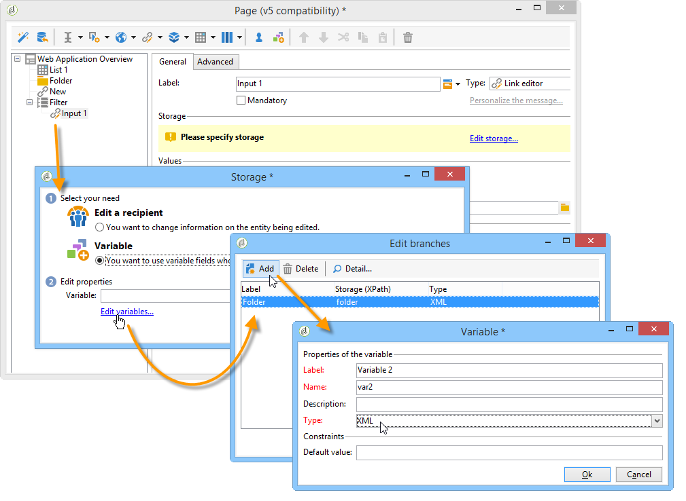
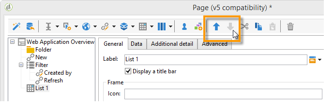

# 用例：创建概述页面{#use-cases-creating-overviews}


在以下示例中，我们将创建概述类型的Web应用程序，以显示数据库中的所有Web应用程序。 配置以下元素：

* 文件夹上的过滤器(请参阅 [在文件夹中添加过滤器](#adding-a-filter-on-a-folder))、
* 用于创建新Web应用程序的按钮(请参阅 [添加按钮以配置新的Web应用程序](#adding-a-button-to-configure-a-new-web-application))、
* 列表中每个条目的详细显示(请参阅 [向列表添加详细信息](#adding-detail-to-a-list))、
* 每个链接编辑工具一个过滤器(请参阅 [使用链接编辑器创建过滤器](#creating-a-filter-using-a-link-editor))、
* 刷新链接(请参阅 [创建刷新链接](#creating-a-refresh-link))。


## 创建单页Web应用程序 {#creating-a-single-page-web-application}

1. 创建单个 **[!UICONTROL Page]** Web应用程序，并禁用叫客过渡和过渡到下一页。

   

1. 更改页面标题。

   此标题将显示在概述标题和Web应用程序概述中。

1. 在Web应用程序属性中，通过选择 **[!UICONTROL Single-page Web application]** 模板。

   

1. 打开 **[!UICONTROL Page]** 活动，并打开一个列表(**[!UICONTROL Static element > List]**)。
1. 在 **[!UICONTROL Data]** ，请选择 **[!UICONTROL Web applications]** 文档和 **[!UICONTROL Label]** , **[!UICONTROL Creation date]** 和 **[!UICONTROL Type of application]** 输出列。
1. 在 **[!UICONTROL Filter]** 子选项卡中创建以下过滤器，如下所示，以便仅显示Web应用程序并从视图中排除模板。

   

1. 关闭页面的配置窗口并单击 **[!UICONTROL Preview]**.

   将显示数据库中可用的Web应用程序列表。

   

## 在文件夹中添加过滤器 {#adding-a-filter-on-a-folder}

在概述中，您可以根据数据在Adobe Campaign树中的位置来选择访问数据。 这是文件夹上的过滤器。 应用以下流程将其添加到概述中。

1. 将光标放在 **[!UICONTROL Page]** 节点，并添加 **[!UICONTROL Select folder]** 元素(**[!UICONTROL Advanced controls > Select folder]**)。
1. 在 **[!UICONTROL Storage]** 窗口，单击 **[!UICONTROL Edit variables]** 链接。
1. 根据需要更改变量标签。
1. 使用 **文件夹** 值。

   >[!NOTE]
   >
   >变量的名称必须与链接到文件夹（在架构中定义）的元素的名称匹配，即 **文件夹** 在这种情况下。 引用表时必须重新使用此名称。

1. 应用 **[!UICONTROL XML]** 键入变量。

   

1. 选择 **[!UICONTROL Refresh page]** 互动。

   

1. 将光标放在列表上，并放在 **[!UICONTROL Advanced]** 选项卡，引用之前在 **[!UICONTROL Folder filter XPath]** 选项卡。 您必须使用文件夹链接所关联元素的名称，即 **文件夹**.

   

   >[!NOTE]
   >
   >此时，Web应用程序不在其应用程序上下文中，因此无法在文件夹上测试过滤器。

## 添加按钮以配置新的Web应用程序 {#adding-a-button-to-configure-a-new-web-application}

1. 将光标放在 **[!UICONTROL Page]** 元素并添加链接(**[!UICONTROL Static elements > Link]**)。
1. 修改链接标签，因为它将显示在概述的按钮上。

   在本例中，标签为 **新建**.

1. 在URL字段中插入以下URL: **xtk://open/?schema=nms:webApp&amp;form=nms:newWebApp**.

   >[!NOTE]
   >
   >**nms:webApp** 与Web应用程序模式一致。
   >
   >**nms:newWebApp** 与新的Web应用程序创建向导重合。

1. 选择在同一窗口中显示URL。
1. 在图像字段中添加Web应用程序图标： **/nms/img/webApp.png**.

   此图标将显示在 **[!UICONTROL New]** 按钮。

1. 输入 **按钮** 在 **[!UICONTROL Style]** 字段。

   在 **[!UICONTROL Single-page Web application]** 模板。

   

## 向列表添加详细信息 {#adding-detail-to-a-list}

在概述中配置列表时，您可以选择显示列表中每个条目的其他详细信息。

1. 将光标放在之前创建的列表元素上。
1. 在 **[!UICONTROL General]** 选项卡，选择 **[!UICONTROL Columns and additional detail]** 显示模式。

   

1. 在 **[!UICONTROL Data]** 选项卡，添加 **[!UICONTROL Primary key]** , **[!UICONTROL Internal name]** 和 **[!UICONTROL Description]** 列并选择 **[!UICONTROL Hidden field]** 选项。

   

   这样，此信息将只显示在每个条目的详细信息中。

1. 在 **[!UICONTROL Additional detail]** 选项卡，添加以下代码：

   ```
   <div class="detailBox">
     <div class="actionBox">
       <span class="action"><a title="Open" class="linkAction" href="xtk://open/?schema=nms:webApp&form=nms:webApp&pk=
       <%=webApp.id%>">Open...</a></span>
       <% 
       if( webApp.@appType == 1 ) { //survey
       %>
       <span class="action"><a target="_blank" title="Reports" class="linkAction" href="/xtk/report.jssp?_context=selection&
         _schema=nms:webApp&_selection=<%=webApp.@id%>
         &__sessiontoken=<%=document.controller.getSessionToken()%>">Reports</a></span>
       <% 
       } 
       %>
     </div>
     <div>
       Internal name: <%= webApp.@internalName %>
     </div>
     <%
     if( webApp.desc != "" )
     {
     %>
     <div>
       Description: <%= webApp.desc %>
     </div>
     <% 
     } 
     %>
   </div>
   ```

>[!NOTE]
>
>在服务器上刷新JavaScript库需要五分钟。 您可以重新启动服务器以避免等待此延迟。

## 筛选和更新列表 {#filtering-and-updating-the-list}

在此部分中，您将创建一个过滤器，用于显示由特定运算符创建的Web应用程序的概述。 此过滤器使用链接编辑器创建。 选择运算符后，刷新列表以应用过滤器；这需要创建刷新链接。

这两个元素将分组到同一个容器中，以便以图形方式在概述中分组。

1. 将光标放在 **[!UICONTROL Page]** 元素和选择 **[!UICONTROL Container > Standard]**.
1. 将列数设置为 **2**，以便链接编辑器和链接彼此相邻。

   

   有关元素布局的信息，请参阅 [此部分](about-web-forms.md).

1. 应用 **dottedFilter**.

   在 **[!UICONTROL Single-page Web application]** 模板。

   

### 使用链接编辑器创建过滤器 {#creating-a-filter-using-a-link-editor}

1. 将光标放在在上一阶段创建的容器上，并通过 **[!UICONTROL Advanced controls]** 菜单。
1. 在自动打开的存储窗口中，选择 **[!UICONTROL Variables]** 选项，然后单击 **[!UICONTROL Edit variables]** 链接，并创建用于过滤数据的XML变量。

   

1. 修改标签。

   它将显示在 **[!UICONTROL Filter]** 字段。

1. 选择运算符表作为应用程序架构。

   

1. 将光标放在列表元素上，并通过 **[!UICONTROL Data > Filter]** 选项卡：

   * **表达式：** “创建者”链接的外键
   * **运算符：** 等于
   * **值：** 变量（变量）
   * **在以下情况下，请考虑：** &#39;$(var2/@id&#39;!=&quot;

   

>[!CAUTION]
>
>Web应用程序用户必须是具有相应Adobe Campaign权限的已识别操作员，才能访问信息。 此类配置不适用于匿名Web应用程序。

### 创建刷新链接 {#creating-a-refresh-link}

1. 将光标放在容器上并插入 **[!UICONTROL Link]** 通过 **[!UICONTROL Static elements]** 菜单。
1. 修改标签。
1. 选择 **[!UICONTROL Refresh data in a list]**。
1. 添加之前创建的列表。

   

1. 在 **[!UICONTROL Image]** 字段： **/xtk/img/refresh.png**.
1. 使用排序箭头重新组织Web应用程序的各个元素，如下所示。

   

Web应用程序现已配置完成。 您可以单击 **[!UICONTROL Preview]** 选项卡进行预览。


