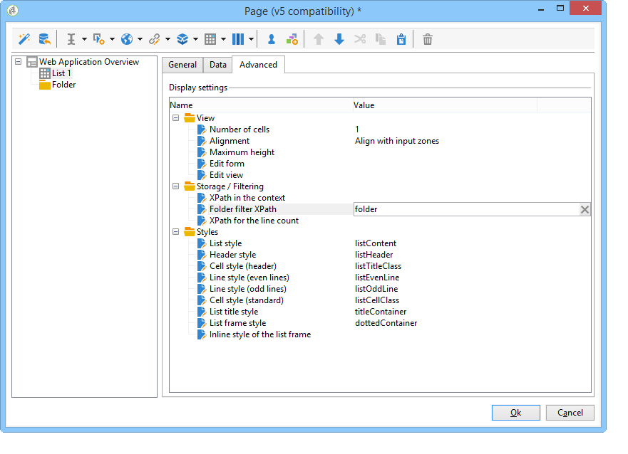

# 用例：创建概述{#use-cases-creating-overviews}

在以下示例中，我们将创建概述类型Web 应用程序以显示Web 应用程序库中的所有。 配置以下元素：

* 文件夹上的过滤器(请参 [阅在文件夹上添加过滤器](#adding-a-filter-on-a-folder)),
* 用于创建新Web 应用程序的按钮(请参 [阅添加按钮以配置新Web 应用程序](#adding-a-button-to-configure-a-new-web-application)),
* 列表中每个条目的详细信息显示(请 [参阅向列表添加详细信息](#adding-detail-to-a-list)),
* 每个链接编辑工具一个过滤器(请 [参阅使用链接编辑器创建过滤器](#creating-a-filter-using-a-link-editor)),
* 刷新链接(请参阅 [创建刷新链接](#creating-a-refresh-link))。


## Creating a single-page Web application {#creating-a-single-page-web-application}

1. 创建单个Web 应用程序 **[!UICONTROL Page]** 并禁用出站过渡和过渡到下一页。

   

1. 更改页面标题。

   此标题将显示在概述标题和Web 应用程序概述中。

1. 在Web 应用程序属性中，通过选择模板来修改应用程序的呈 **[!UICONTROL Single-page Web application]** 现。

   

1. 打开 **[!UICONTROL Page]** Web 应用程序的活动并打开列表(**[!UICONTROL Static element > List]**)。
1. 在列表 **[!UICONTROL Data]** 的选项卡中，选择文档的类 **[!UICONTROL Web applications]** 型以及 **[!UICONTROL Label]** 、和 **[!UICONTROL Creation date]** 输出 **[!UICONTROL Type of application]** 列。
1. 在子选 **[!UICONTROL Filter]** 项卡中，创建如下所示的以下筛选器，以便仅显示Web 应用程序并从视图中排除模板。

   

1. 关闭页面的配置窗口并单击 **[!UICONTROL Preview]**。

   将显示列表库中可用Web 应用程序的。

   

## 在文件夹中添加过滤器 {#adding-a-filter-on-a-folder}

在概述中，您可以根据数据在Adobe Campaign树中的位置选择访问数据。 这是文件夹上的过滤器。 应用以下流程，将其添加到概述中。

1. 将光标放在Web 应用程序 **[!UICONTROL Page]** 的节点上并添加一 **[!UICONTROL Select folder]** 个元素(**[!UICONTROL Advanced controls > Select folder]**)。
1. 在出现 **[!UICONTROL Storage]** 的窗口中，单击链 **[!UICONTROL Edit variables]** 接。
1. 更改变量标签以满足您的需求。
1. 用文件夹值更改变 **量名** 。

   >[!NOTE]
   >
   >变量的名称必须与链接到文件夹(在模式中定义)的元素的名称匹配，即在 **此例** 中为文件夹。 引用表时，必须重新使用此名称。

1. 将类 **[!UICONTROL XML]** 型应用于变量。

   

1. 选择交 **[!UICONTROL Refresh page]** 互。

   

1. 将光标放在列表上，在选 **[!UICONTROL Advanced]** 项卡中，引用先前在列表选项卡 **[!UICONTROL Folder filter XPath]** 中创建的变量。 必须使用文件夹链接所涉及元素的名称，即文件 **夹**。

   

   >[!NOTE]
   >
   >在此阶段，Web 应用程序不在其应用程序上下文中，因此无法对文件夹测试筛选器。

## 添加按钮以配置新Web 应用程序 {#adding-a-button-to-configure-a-new-web-application}

1. 将光标放在元 **[!UICONTROL Page]** 素上并添加链接(**[!UICONTROL Static elements > Link]**)。
1. 修改链接标签，因为链接标签将显示在概述的按钮上。

   在我们的示例中，标签为 **New**。

1. 在URL字段中插入以下URL: **xtk://open/?schema=nms:webApp&amp;form=nms:newWebApp**。

   >[!NOTE]
   >
   >**nms:webApp与Web 应用程序** 模式一致。
   >
   >**nms:newWebApp与** newWeb 应用程序创建向导重合。

1. 选择在同一窗口中显示URL。
1. 在图像字段中添加Web 应用程序图标： **/nms/img/webApp.png**。

   此图标将显示在按 **[!UICONTROL New]** 钮上。

1. 在字 **段中** ，输入 **[!UICONTROL Style]** 按钮。

   此样式在以前选择的模 **[!UICONTROL Single-page Web application]** 板中引用。

   

## 向列表添加详细信息 {#adding-detail-to-a-list}

在概述中配置列表时，您可以选择在列表中显示每个条目的其他详细信息。

1. 将光标放在先前创建的列表元素上。
1. 在选 **[!UICONTROL General]** 项卡中， **[!UICONTROL Columns and additional detail]** 在下拉列表中选择显示模式。

   

1. 在选 **[!UICONTROL Data]** 项卡中，添加 **[!UICONTROL Primary key]** 、 **[!UICONTROL Internal name]** 和列，然 **[!UICONTROL Description]** 后为每个 **[!UICONTROL Hidden field]** 选项选择选项。

   

   这样，此信息将仅在每个条目的详细信息中可见。

1. 在选项卡 **[!UICONTROL Additional detail]** 中，添加以下代码：

   ```
   <div class="detailBox">
     <div class="actionBox">
       <span class="action"><a title="Open" class="linkAction" href="xtk://open/?schema=nms:webApp&form=nms:webApp&pk=
       <%=webApp.id%>">Open...</a></span>
       <% 
       if( webApp.@appType == 1 ) { //survey
       %>
       <span class="action"><a target="_blank" title="Reports" class="linkAction" href="/xtk/report.jssp?_context=selection&
         _schema=nms:webApp&_selection=<%=webApp.@id%>
         &__sessiontoken=<%=document.controller.getSessionToken()%>">Reports</a></span>
       <% 
       } 
       %>
     </div>
     <div>
       Internal name: <%= webApp.@internalName %>
     </div>
     <%
     if( webApp.desc != "" )
     {
     %>
     <div>
       Description: <%= webApp.desc %>
     </div>
     <% 
     } 
     %>
   </div>
   ```

>[!NOTE]
>
>在服务器上刷新JavaScript库需要五分钟。 您可以重新启动服务器以避免等待此延迟。

## 筛选和更新列表 {#filtering-and-updating-the-list}

在本节中，您将创建一个过滤器，用于显示由特定运算符创建的Web 应用程序的概述。 此过滤器是使用链接编辑器创建的。 选择运算符后，请刷新列表以应用筛选器；这需要创建刷新链接。

这两个元素将在同一容器进行分组，以便在概述中以图形方式进行分组。

1. 将光标放在元素 **[!UICONTROL Page]** 上并选择 **[!UICONTROL Container > Standard]**。
1. 将列数设置为 **2**，以便链接编辑器和链接彼此相邻。

   

   有关元素布局的信息，请参 [阅此部分](../../web/using/about-web-forms.md)。

1. 应用 **dottedFilter**。

   此样式在以前选择的 **[!UICONTROL Single-page Web applicatio]** n个模板中引用。

   

### 使用链接编辑器创建过滤器 {#creating-a-filter-using-a-link-editor}

1. 将光标放在上一阶段创建的容器上，并通过菜单插入链接编 **[!UICONTROL Advanced controls]** 辑器。
1. 在自动打开的存储窗口中，选 **[!UICONTROL Variables]** 择选项，单 **[!UICONTROL Edit variables]** 击链接并创建用于筛选数据的XML变量。

   

1. 修改标签。

   它将显示在概述 **[!UICONTROL Filter]** 中的字段旁。

1. 选择“运算符”表作为应用程序模式。

   

1. 将光标放在列表元素上，并通过选项卡创建筛 **[!UICONTROL Data > Filter]** 选器：

   * **表达式:** “创建者”链接的外键
   * **运算符：** 等于
   * **值：** 变量（变量）
   * **在以下情况下，请考虑：** &#39;$(var2/@id)&#39;!=&quot;

   

>[!CAUTION]
>
>Web 应用程序用户必须是具有相应Adobe Campaign权限的已识别操作员才能访问信息。 此类配置对匿名Web 应用程序无效。

### 创建刷新链接 {#creating-a-refresh-link}

1. 将光标放在容器上，并通过 **[!UICONTROL Link]** 菜单插 **[!UICONTROL Static elements]** 入。
1. 修改标签。
1. 选择 **[!UICONTROL Refresh data in a list]**。
1. 添加以前创建的列表。

   

1. 在字段上添加刷新 **[!UICONTROL Image]** 图标： **/xtk/img/refresh.png**。
1. 使用排序顺序箭头重新组织Web 应用程序的各个元素，如下所示。

   

Web 应用程序现已配置。 您可以单击选 **[!UICONTROL Preview]** 项卡来预览它。


