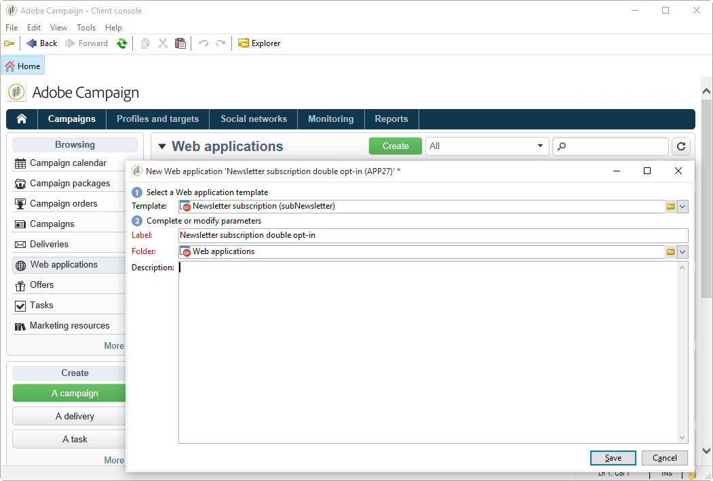
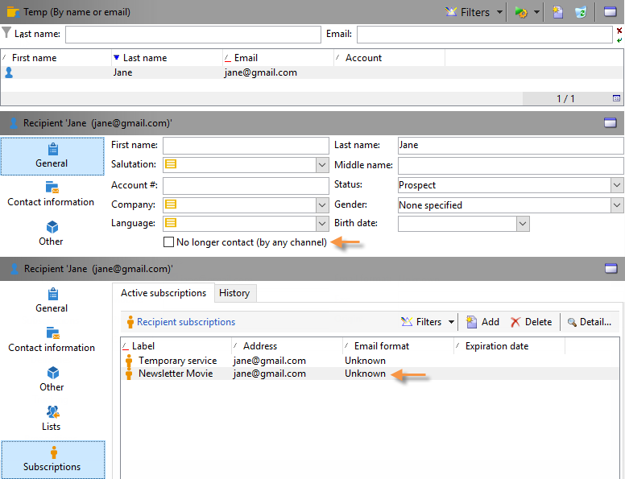

# 用例：Web 窗体{#use-cases-web-forms}


## 创建包含双重选择加入的订阅表单 {#create-a-subscription--form-with-double-opt-in}

当您提供信息服务时，收件人需要订阅才能接收所有链接通信。 为避免通信不当并确保收件人有意订阅，我们建议发送订阅确认请求以创建双重选择加入。 只有在用户单击确认消息中包含的链接后，订阅才会生效。

此示例基于以下方案：

1. 在网站上创建新闻稿订阅表单，该表单包含用于订阅临时服务的复选框。 此服务允许您交付订阅确认消息。
1. 使用链接到Web窗体的投放模板创建订阅确认投放。 它包含用于调用新闻稿订阅表单并显示订阅批准消息的确认链接。

### 步骤1 — 创建信息服务 {#step-1---creating-information-services}

1. 创建要提供给收件人的新闻稿订阅服务。 有关如何创建新闻稿的更多信息，请参阅 [本节](../../delivery/using/about-services-and-subscriptions.md).

   

1. 创建第二个信息服务，它是一个链接到投放模板的临时服务，用于发送订阅确认消息。

   

### 第2步 — 创建确认消息 {#step-2---creating-confirmation-messages}

确认消息通过临时服务级别引用的专用投放模板发送。

1. 在 **[!UICONTROL Explorer]** ，选择 **[!UICONTROL Resources > Templates > Delivery templates]**.
1. 创建用于发送订阅确认消息的投放模板。
1. 单击 **[!UICONTROL To]** 中的按钮 **[!UICONTROL Email parameters]** 将投放模板与订阅目标映射而非收件人关联。

   

1. 由于此投放的收件人尚未确认其审批，因此他们仍在数据库阻止列表中。 为了使其接收此通信，您需要根据此模板授权投放以在阻止列表时定位收件人。

   要执行此操作，请单击 **[!UICONTROL Exclusions]** 选项卡。

1. 单击 **[!UICONTROL Edit...]** 链接并取消选中 **[!UICONTROL Exclude recipients who no longer want to be contacted]** 选项。

   <!-- -->

   >[!IMPORTANT]
   >
   >只能在此类型的上下文中禁用此选项。

1. 将投放个性化，并将确认链接插入消息内容。 通过此链接，可访问Web表单以记录订阅确认。

   

1. 使用DCE，将您的URL链接到Web窗体。 由于尚未创建Web窗体，因此请在创建后立即替换该值。

   

1. 最后，将此模板链接到之前创建的临时服务。

   

### 第3步 — 创建订阅表单 {#step-3---creating-the-subscription-form}

通过Web窗体可以确认收件人订阅和订阅。

Web窗体工作流将包含以下活动：


为此请执行以下操作步骤：

1. 创建Web窗体并选择模板 **[!UICONTROL Newsletter subscription (subNewsletter)]**.

   

1. 在 **[!UICONTROL Edit]** 选项卡，我们需要配置现有工作流，因为我们希望向要订阅的收件人添加确认消息。

   要执行此操作，请双击 **[!UICONTROL Preloading]** 框并按照以下方式对其进行配置。

   

   这意味着，如果用户通过确认消息中的链接访问此表单，则将加载其用户档案信息。 如果他们通过网站的某个页面访问Web窗体，则不会加载任何信息。

1. 添加 **[!UICONTROL Test]** 活动添加到工作流。

   

   此 **[!UICONTROL Test]** 活动可能与收件人电子邮件有关。 在这种情况下，请按如下方式对其进行配置：

   

1. 添加两个 **[!UICONTROL Script]** 活动添加到工作流。

   

   第一个 **[!UICONTROL Script]** 活动将在阻止列表时添加收件人，直到他们确认订阅新闻稿为止。 其内容必须如下所示：

   ```
   ctx.recipient.@blackList=1
   ```

   

   第二个 **[!UICONTROL Script]** 活动可授权将投放发送给用户，并为其订阅新闻稿。 脚本的最后两行将允许您将收件人从temp文件夹转移到另一个文件夹，并在收件人确认订阅后立即与现有配置文件进行协调。

   ```
   ctx.recipient.@blackList=0
   nms.subscription.Subscribe("INTERNAL_NAME_OF_THE_NEWSLETTER", ctx.recipient, false)
   ctx.recipient.folder = <folder name="nmsRootRecipient"/>
   nms.subscription.Unsubscribe("TEMP", ctx.recipient)
   ```

   >[!NOTE]
   >
   >此 **[!UICONTROL Temp]** 还可以使用工作流定期清除分区。

   

1. 双击 **[!UICONTROL Subscription]** 活动个性化订阅表单，并将复选框与之前创建的临时服务链接。

   

1. 配置 **[!UICONTROL Storage]** 活动，用于保存在表单页面中输入的信息。

   通过此活动，可在专用的临时文件夹中创建收件人用户档案，以将其与数据库中可向其发送通信的用户档案区分开。

   

   >[!NOTE]
   >
   >不得定义任何协调选项。

1. 添加两个 **[!UICONTROL End]** 活动，为用户显示消息。

   第二个 **[!UICONTROL End]** 框将在订阅完成后显示确认消息。

   

1. 创建并配置Web表单后，您现在可以在投放模板中引用该表单以发送确认消息。

   

### 第4步 — 发布和测试表单 {#step-4---publishing-and-testing-the-form}

您现在可以发布表单，以便用户能够访问。


订阅新闻稿涉及以下步骤：

1. 网站用户登录到订阅页面并批准表单。

   

   用户将通过浏览器中的消息收到通知，告知其请求已被考虑。

   

   用户会添加到的Adobe Campaign数据库中 **[!UICONTROL Temp]** 文件夹，并且其配置文件处于阻止列表状态，直到他们通过电子邮件确认其订阅。

   

1. 将向他们发送确认消息，其中包含批准其订阅的链接。

   

1. 当他们单击此链接时，其浏览器中会显示批准页面。

   

   在Adobe Campaign中，用户配置文件已更新：

   * 他们不再是阻止列表人，
   * 他们订阅了信息服务。

      

## 根据选定的值显示不同的选项 {#displaying-different-options-depending-on-the-selected-values}

在以下示例中，要求用户选择一种车辆。 您可以根据所选类型显示可用的车辆类别。 这意味着右侧列中显示的项目取决于用户的选择：


* 当用户选择“私家车”时，可以选择“紧凑”和“小货车”。

   

* 当用户选择“商务车辆”时，选择显示在下拉列表中：

   

在此示例中，车辆类型未存储在数据库中。 下拉列表的配置如下所示：


此信息存储在局部变量中。

在容器中配置了右侧列的条件显示：


* 私家车字段的条件可见性：

   

* 商用车辆字段的条件可见性：

   
