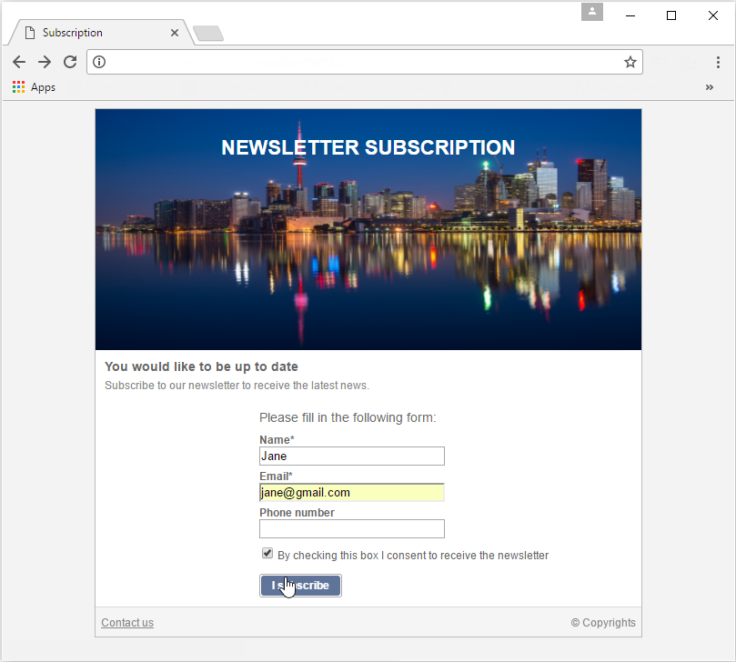

# 用例：Web 窗体{#use-cases-web-forms}


## 通过双重选择加入创建订阅表单 {#create-a-subscription--form-with-double-opt-in}

当您提供信息服务时，收件人需要订阅才能接收所有链接的通信。 为避免通信不当并确保收件人有意订阅，我们建议发送订阅确认请求以创建双重选择加入。 仅当用户单击确认消息中包含的链接时，订阅才会生效。

此示例基于以下情景：

1. 在网站上创建新闻稿订阅表单，该表单中包含用于订阅临时服务的复选框。 此服务将允许您发送订阅确认消息。
1. 使用链接到Web表单的投放模板创建订阅确认投放。 它包含确认链接，用于调用新闻稿订阅表单并显示订阅批准消息。

### 步骤1 — 创建信息服务 {#step-1---creating-information-services}

1. 创建要提供给收件人的新闻稿订阅服务。 有关如何创建新闻稿的更多信息，请参阅 [此部分](../../delivery/using/about-services-and-subscriptions.md).

   

1. 创建第二信息服务，链接到用于发送订阅确认消息的投放模板的临时服务。

   

### 步骤2 — 创建确认消息 {#step-2---creating-confirmation-messages}

确认消息通过在临时服务级别引用的专用投放模板发送。

1. 在 **[!UICONTROL Explorer]** ，选择 **[!UICONTROL Resources > Templates > Delivery templates]**.
1. 创建用于发送订阅确认消息的投放模板。
1. 单击 **[!UICONTROL To]** 按钮 **[!UICONTROL Email parameters]** 将投放模板与订阅目标映射而不是收件人关联。

   

1. 由于此投放的收件人尚未确认其批准，因此他们仍在数据库阻止列表中。 要让他们接收此通信，您需要根据此模板授权投放，以定向的阻止列表收件人。

   为此，请单击 **[!UICONTROL Exclusions]** 选项卡。

1. 单击 **[!UICONTROL Edit...]** 链接并取消选中 **[!UICONTROL Exclude recipients who no longer want to be contacted]** 选项。

   <!-- -->

   >[!IMPORTANT]
   >
   >只能在此类型的上下文中禁用此选项。

1. 个性化投放，并将确认链接插入消息内容。 此链接允许您访问Web窗体以记录订阅确认。

   

1. 使用DCE ，将您的URL链接到Web窗体。 由于尚未创建Web窗体，因此在创建该窗体后立即替换该值。

   

1. 最后，将此模板链接到之前创建的临时服务。

   

### 步骤3 — 创建订阅表单 {#step-3---creating-the-subscription-form}

Web窗体支持收件人订阅和订阅确认。

Web窗体工作流将包括以下活动：


为此请执行以下操作步骤：

1. 创建Web窗体并选择模板 **[!UICONTROL Newsletter subscription (subNewsletter)]**.

   

1. 在 **[!UICONTROL Edit]** 选项卡，我们需要配置现有工作流，因为我们想向要订阅的收件人添加确认消息。

   为此，请双击 **[!UICONTROL Preloading]** 框中，并按如下方式对其进行配置。

   

   这意味着如果用户通过确认消息中的链接访问此表单，则将加载其用户档案信息。 如果用户通过网站的某个页面访问Web窗体，则不会加载任何信息。

1. 添加 **[!UICONTROL Test]** 活动。

   

   的 **[!UICONTROL Test]** 活动可能与收件人电子邮件有关。 在这种情况下，请按如下方式对其进行配置：

   

1. 添加2 **[!UICONTROL Script]** 活动。

   

   第一个 **[!UICONTROL Script]** 活动将在时添阻止列表加收件人，直到他们确认订阅了新闻稿为止。 其内容必须如下：

   ```
   ctx.recipient.@blackList=1
   ```

   

   第二个 **[!UICONTROL Script]** 活动可授权向用户发送投放并将其订阅到新闻稿。 利用脚本的最后两行，可将收件人从临时文件夹转移到其他文件夹，并在确认订阅后立即与现有用户档案协调。

   ```
   ctx.recipient.@blackList=0
   nms.subscription.Subscribe("INTERNAL_NAME_OF_THE_NEWSLETTER", ctx.recipient, false)
   ctx.recipient.folder = <folder name="nmsRootRecipient"/>
   nms.subscription.Unsubscribe("TEMP", ctx.recipient)
   ```

   >[!NOTE]
   >
   >的 **[!UICONTROL Temp]** 也可以使用工作流定期清除分区。

   

1. 双击 **[!UICONTROL Subscription]** 活动，以个性化订阅表单，并将复选框与之前创建的临时服务关联。

   

1. 配置 **[!UICONTROL Storage]** 活动，以保存在表单页面中输入的信息。

   利用此活动，可在专用临时文件夹中创建收件人用户档案，以将其与数据库中可将通信发送到的用户档案分开。

   

   >[!NOTE]
   >
   >您不得定义任何协调选项。

1. 添加2 **[!UICONTROL End]** 活动，以向用户显示消息。

   第二个 **[!UICONTROL End]** 订阅完成后，将显示确认消息。

   

1. 创建并配置Web窗体后，您现在可以在投放模板中引用该窗体以发送确认消息。

   

### 第4步 — 发布和测试表单 {#step-4---publishing-and-testing-the-form}

您现在可以发布表单，以便用户访问。


订阅新闻稿涉及以下步骤：

1. 网站的用户登录到订阅页面并批准表单。

   

   浏览器中会显示一条消息，告知用户其请求已得到考虑。

   

   用户将添加到Adobe Campaign数据库(位于 **[!UICONTROL Temp]** 文件夹中，且其配置文件处于状阻止列表态，直到他们通过电子邮件确认订阅为止。

   

1. 系统会向他们发送确认消息，其中包含用于批准其订阅的链接。

   

1. 单击此链接时，其浏览器中会显示批准页面。

   

   在Adobe Campaign中，用户配置文件会进行更新：

   * 他们不再阻止列表,
   * 他们订购了信息服务。

      

## 根据所选值显示不同的选项 {#displaying-different-options-depending-on-the-selected-values}

在以下示例中，要求用户选择一种车辆类型。 您可以根据所选类型显示可用的车辆类别。 这意味着右列中显示的项目取决于用户的选择：


* 当用户选择“私有车辆”时，将提供“紧凑型”和“微型车”之间的选择。

   

* 当用户选择“商用车”时，将在下拉列表中显示选择：

   

在本例中，车辆类型未存储在数据库中。 下拉列表的配置如下所示：


此信息存储在本地变量中。

右列的条件显示在容器中配置：


* 专用车辆的字段的条件可见性：

   

* 商业车辆的场的条件可见性：

   
