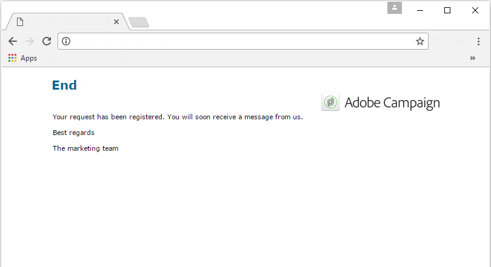

# 用例：Web表单{#use-cases-web-forms}

## 创建双选加入的订阅表单 {#create-a-subscription--form-with-double-opt-in}

当您提供信息服务时，收件人需要订阅才能收到所有链接的通信。 为避免不当通信并确保接收者有意订阅，我们建议发送订阅确认请求以创建双重加入。 只有用户单击确认消息中包含的链接后，订阅才有效。

此示例基于以下场景：

1. 在网站上创建新闻稿订阅表单，其中包含用于订阅临时服务的复选框。 此服务将允许您发送订阅确认消息。
1. 使用链接到Web表单的分发模板创建订阅确认分发。 它包含用于调用新闻稿订阅表单的确认链接，并显示订阅批准消息。

### 第1步——创建信息服务 {#step-1---creating-information-services}

1. 创建要提供给收件人的新闻稿订阅服务。 有关如何创建Newsletter的详细信息，请参阅 [此部分](../../delivery/using/about-services-and-subscriptions.md)。

   

1. 创建第二个信息服务，即链接到分发模板的用于发送订阅确认消息的临时服务。

   

### 第2步——创建确认消息 {#step-2---creating-confirmation-messages}

确认消息通过在临时服务级别引用的专用交付模板发送。

1. 在中， **[!UICONTROL Explorer]** 选择 **[!UICONTROL Resources > Templates > Delivery templates]**。
1. 创建用于发送订阅确认消息的分发模板。
1. 单击中 **[!UICONTROL To]** 的按钮，将 **[!UICONTROL Email parameters]** 分发模板与订阅目标映射（而非收件人）关联。

   

1. 由于此递送的收件人尚未确认其批准，因此他们仍在数据库中列入黑名单。 要让他们接收此通信，您需要授权基于此模板的分发以定位列入黑名单的收件人。

   要执行此操作，请单击选 **[!UICONTROL Exclusions]** 项卡。

1. 单击链 **[!UICONTROL Edit...]** 接并取消选中 **[!UICONTROL Exclude recipients who no longer want to be contacted (blacklist)]** 选项。

   

   >[!CAUTION]
   >
   >此选项只能在此类上下文中禁用。

1. 个性化您的交付，并在消息内容中插入确认链接。 通过此链接，您可以访问Web表单以记录订阅确认。

   

1. 使用DCE将URL链接到Web表单。 由于尚未创建Web表单，请在创建该表单后立即替换它。

   

1. 最后，将此模板链接到先前创建的临时服务。

   

### 第3步——创建订阅表单 {#step-3---creating-the-subscription-form}

Web表单支持收件人订阅和订阅确认。

Web表单工作流将包括以下活动：


为此请执行以下操作步骤：

1. 创建Web表单并选择模板 **[!UICONTROL Newsletter subscription (subNewsletter)]**。

   

1. 在该选 **[!UICONTROL Edit]** 项卡中，我们需要配置现有工作流，因为我们要向要订阅的收件人添加确认消息。

   为此，请双击该框， **[!UICONTROL Preloading]** 并按如下配置它。

   

   这意味着，如果用户通过确认消息中的链接访问此表单，则将加载其配置文件信息。 如果他们通过网站的某个页面访问Web表单，则不会加载任何信息。

1. 向工作 **[!UICONTROL Test]** 流中添加活动。

   

   活动 **[!UICONTROL Test]** 可能与收件人电子邮件有关。 在这种情况下，请按如下方式配置它：

   

1. 将两个 **[!UICONTROL Script]** 活动添加到工作流中。

   

   在收件人确 **[!UICONTROL Script]** 认其订阅新闻稿之前，第一项活动将将将收件人列入黑名单。 其内容必须如下：

   ```
   ctx.recipient.@blackList=1
   ```

   

   第二个 **[!UICONTROL Script]** 活动授权将分发发送给用户并将其订阅到新闻稿。 脚本的最后两行将允许您将收件人从临时文件夹转移到另一个文件夹，并在他们确认订阅后立即与现有配置文件进行协调。

   ```
   ctx.recipient.@blackList=0
   nms.subscription.Subscribe("INTERNAL_NAME_OF_THE_NEWSLETTER", ctx.recipient, false)
   ctx.recipient.folder = <folder name="nmsRootRecipient"/>
   nms.subscription.Unsubscribe("TEMP", ctx.recipient)
   ```

   >[!NOTE]
   >
   >也 **[!UICONTROL Temp]** 可以使用工作流定期清除分区。

   

1. 双击活动以个 **[!UICONTROL Subscription]** 性化订阅表单，并将复选框与先前创建的临时服务关联。

   

1. 配置活 **[!UICONTROL Storage]** 动以保存在表单页面中输入的信息。

   通过此活动，您可以在专用临时文件中创建收件人配置文件，以便将收件人配置文件与数据库中的配置文件分开，然后将通信发送到数据库中。

   

   >[!NOTE]
   >
   >您不得定义任何对帐选项。

1. 添加两 **[!UICONTROL End]** 个活动以显示用户的消息。

   订阅完 **[!UICONTROL End]** 成后，第二个框将显示确认消息。

   

1. 创建和配置Web表单后，您现在可以在分发模板中引用它来发送确认消息。

   

### 第4步——发布和测试表单 {#step-4---publishing-and-testing-the-form}

您现在可以发布表单，使用户能够访问它。


订阅新闻稿涉及以下步骤：

1. 网站的用户登录到订阅页面并批准表单。

   

   他们会通过浏览器中的一条消息收到通知，告知他们的请求已被考虑在内。

   

   该用户将添加到文件夹中的Adobe Campaign数据库， **[!UICONTROL Temp]** 其个人资料将列入黑名单，直到他们确认其通过电子邮件订阅为止。

   

1. 系统会向他们发送确认消息，其中包含用于批准其订阅的链接。

   

1. 当他们单击此链接时，审批页面会显示在他们的浏览器中。

   

   在Adobe Campaign中，用户配置文件会更新：

   * 不再被列入黑名单，
   * 他们订阅了信息服务。

      

## 根据所选的值显示不同的选项 {#displaying-different-options-depending-on-the-selected-values}

在以下示例中，用户被要求选择一种车辆类型。 您可以根据所选的类型显示可用的车辆类别。 这意味着右侧列中显示的项目取决于用户的选择：


* 当用户选择“私用车”时，提供“Compact”和“Minivan”之间的选择。

   

* 当用户选择“商用车”时，选择显示在下拉列表中：

   

在本例中，车辆类型不存储在数据库中。 下拉列表的配置如下：


此信息存储在本地变量中。

右侧列的条件显示在容器中配置：


* 私有车辆的字段的条件可见性：

   

* 商业车辆的字段条件可见性：

   

