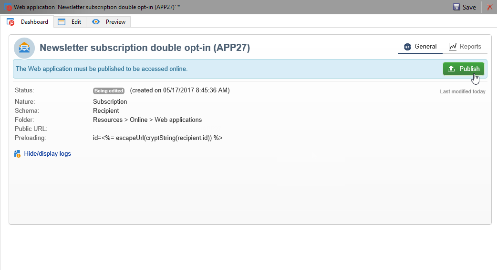
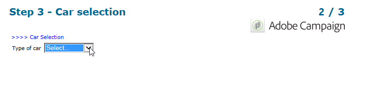

# 用例：Web 窗体{#use-cases-web-forms}

## 创建包含订阅选择加入的多次表单 {#create-a-subscription--form-with-double-opt-in}

当您优惠信息服务时，收件人需要订阅才能接收所有链接的通信。 为避免不当通信并确保收件人有意订阅，我们建议发送订阅确认请求以创建多次选择加入。 只有当用户单击确认消息中包含的链接时，订阅才会生效。

此示例基于以下方案：

1. 在包含用于订阅临时服务的复选框的网站上创建新闻稿订阅表单。 此服务将允许您发送订阅确认消息。
1. 使用链接到Web表单的订阅创建投放确认投放模板。 它包含确认链接，用于调用表单进行Newsletter订阅并显示订阅批准消息。

### 第1步——创建信息服务 {#step-1---creating-information-services}

1. 创建要提供给您的订阅服务的Newsletter收件人。 有关如何创建新闻稿的详细信息，请参阅 [此部分](../../delivery/using/about-services-and-subscriptions.md)。

   

1. 创建第二个信息服务，即链接到投放模板的临时服务，用于发送订阅确认消息。

   

### 第2步——创建确认消息 {#step-2---creating-confirmation-messages}

确认消息通过在临时服务级别引用的专用投放模板发送。

1. In the **[!UICONTROL Explorer]** , select **[!UICONTROL Resources > Templates > Delivery templates]**.
1. 创建用于发送投放模板确认消息的订阅。
1. 单击中 **[!UICONTROL To]** 的按 **[!UICONTROL Email parameters]** 钮，将投放模板与订阅目标映射而非收件人关联。

   

1. 由于此投放的收件人尚未确认其批准，因此他们仍在数据库阻止列表。 要让投放接收此通信，您需要根据此模板授权目标收件人。

   为此，请单击选 **[!UICONTROL Exclusions]** 项卡。

1. 单击链 **[!UICONTROL Edit...]** 接并取消选中 **[!UICONTROL Exclude recipients who no longer want to be contacted]** 选项。

   <!-- -->

   >[!IMPORTANT]
   >
   >此选项只能在此类型的上下文中禁用。

1. 个性化您的投放，并在消息内容中插入确认链接。 通过此链接，您可以访问Web表单以记录订阅确认。

   

1. 通过该数字内容编辑器，将您的URL链接到Web表单。 由于尚未创建Web表单，请在创建该表单后立即替换它。

   

1. 最后，将此模板链接到先前创建的临时服务。

   

### 第3步——创建订阅表单 {#step-3---creating-the-subscription-form}

Web表单支持收件人订阅和订阅确认。

Web表单工作流将包括以下活动:


为此请执行以下操作步骤：

1. 创建Web表单并选择模板 **[!UICONTROL Newsletter subscription (subNewsletter)]**。

   

1. 在该选 **[!UICONTROL Edit]** 项卡中，我们需要配置现有工作流，因为我们要向要订阅的收件人添加确认消息。

   为此，请多次单击该 **[!UICONTROL Preloading]** 框并按如下配置。

   

   这意味着，如果用户通过确认消息中的链接访问此表单，则将加载其用户档案信息。 如果他们通过网站的某个页面访问Web表单，则不会加载任何信息。

1. 向工作 **[!UICONTROL Test]** 流中添加活动。

   

   活动 **[!UICONTROL Test]** 可以关注收件人电子邮件。 在这种情况下，请按如下方式配置它：

   

1. 将两个 **[!UICONTROL Script]** 活动添加到工作流。

   

   第一个活动 **[!UICONTROL Script]** 将添加收件人,阻止列表直到他们确认其订阅到新闻稿。 其内容必须如下：

   ```
   ctx.recipient.@blackList=1
   ```

   

   第二个 **[!UICONTROL Script]** 活动授权投放发送给用户并订阅新闻稿。 脚本的最后两行将允许您将收件人从临时文件夹传输到另一个文件夹，并在确认订阅后立即与现有用户档案协调。

   ```
   ctx.recipient.@blackList=0
   nms.subscription.Subscribe("INTERNAL_NAME_OF_THE_NEWSLETTER", ctx.recipient, false)
   ctx.recipient.folder = <folder name="nmsRootRecipient"/>
   nms.subscription.Unsubscribe("TEMP", ctx.recipient)
   ```

   >[!NOTE]
   >
   >也 **[!UICONTROL Temp]** 可以使用工作流定期清除分区。

   

1. 多次-单击活动 **[!UICONTROL Subscription]** 以个性化订阅表单，并将复选框与先前创建的临时服务链接起来。

   

1. 配置活动 **[!UICONTROL Storage]** 以保存在表单页面中输入的信息。

   此活动允许您在专用的临时文件夹中创建收件人用户档案，以将其与可向其发送通信的用户档案区分开。

   

   >[!NOTE]
   >
   >您不得定义任何对帐选项。

1. 添加两 **[!UICONTROL End]** 个活动，以显示用户的消息。

   订阅完 **[!UICONTROL End]** 成后，第二个框将显示确认消息。

   

1. 创建并配置Web表单后，您现在可以在投放模板中引用它以发送确认消息。

   

### 第4步——发布和测试表单 {#step-4---publishing-and-testing-the-form}

您现在可以发布表单，使用户能够访问它。



订阅新闻稿涉及以下步骤：

1. 网站的用户登录到订阅页面并批准表单。

   

   他们会通过浏览器中的消息收到通知，告知他们的请求已得到考虑。

   

   用户将添加到文件夹中的Adobe Campaign **[!UICONTROL Temp]** 用户档案库，并且其处于状态，阻止列表直到用户确认其与电子邮件的订阅。

   

1. 系统会向他们发送确认消息，其中包括用于批准其订阅的链接。

   

1. 当他们单击此链接时，其浏览器中将显示批准页面。

   

   在Adobe Campaign中，用户用户档案会更新：

   * 他们不再阻止列表,
   * 他们订阅了信息服务。

      

## 根据所选值显示不同的选项 {#displaying-different-options-depending-on-the-selected-values}

在以下示例中，用户将被要求选择一种车辆类型。 您可以根据所选类型显示可用的车辆类别。 这意味着在右列中显示的项目取决于用户的选择：



* 当用户选择“私家车”时，提供“紧凑型”和“微型车”之间的选择。

   

* 当用户选择“商用车”时，在下拉列表中显示选择：

   

在此示例中，车辆类型不存储在数据库中。 下拉列表配置如下：


此信息存储在本地变量中。

右列的条件显示在容器中配置：


* 私人车辆的字段条件可见性：

   

* 商业车辆的字段条件可见性：

   

