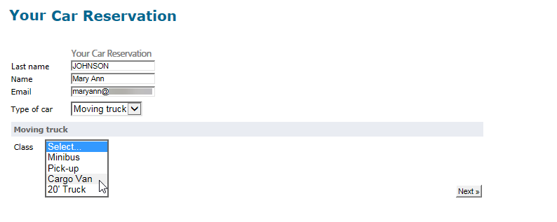

# Web 窗体答案{#web-forms-answers}


## 响应存储字段 {#response-storage-fields}

表单答案可以保存在数据库的字段中，也可以临时保存在本地变量中。 在字段创建期间，将选择答案的存储模式。 可以通过 **[!UICONTROL Edit storage...]** 链接。

对于表单中的每个输入字段，可使用以下存储选项：


* **[!UICONTROL Edit a recipient]**

   您可以选择数据库的字段：用户的答案将存储在此字段中。 对于每个用户，仅保存最后输入的值：它会添加到其配置文件中：请参阅 [在数据库中存储数据](#storing-data-in-the-database).

* **[!UICONTROL Variable]**

   如果不想在数据库中存储信息，则可以使用变量。 可以在上游声明局部变量。 请参阅 [将数据存储在本地变量中](#storing-data-in-a-local-variable).

### 在数据库中存储数据 {#storing-data-in-the-database}

要在数据库的现有字段中保存数据，请单击 **[!UICONTROL Edit expression]** 图标，然后从可用字段列表中选择它。


>[!NOTE]
>
>缺省参考文档为 **nms:recipient** 架构。 要查看或选择新表单，请从列表中选择表单，然后单击 **[!UICONTROL Properties]** 按钮。

### 将数据存储在本地变量中 {#storing-data-in-a-local-variable}

您可以使用本地变量，以便即使数据未存储在数据库中，也可以在页面或其他页面上重复使用，例如在字段显示上放置条件或个性化消息。

这意味着您可以使用未保存字段的值来授权在页面上显示一组选项。 在下面的页面中，车辆类型未存储在数据库中：


它存储在变量中，在创建下拉框时必须选择该变量，或通过 **[!UICONTROL Edit storage...]** 链接。


您可以通过 **[!UICONTROL Edit variables...]** 链接。 单击 **[!UICONTROL Add]** 按钮以创建新变量。


创建页面的输入字段后，添加的变量将在本地变量列表中可用。

>[!NOTE]
>
>对于每个表单，您可以创建上游变量。 要执行此操作，请选择表单并单击 **[!UICONTROL Properties]** 按钮。 的 **[!UICONTROL Variables]** 选项卡包含表单的本地变量。

**带有条件的本地存储的示例**

在上例中，仅当 **[!UICONTROL Private]** 选项，如可见性条件所示：


如果用户选择专用车辆，Web窗体将提供以下选项：


如果选择了专业选项，则将显示保存有关商用车数据的容器，如在可见性条件中所示：


这意味着，如果用户选择商业车辆，则表单提供以下选项：



## 使用收集的信息 {#using-collected-information}

对于每个表单，提供的答案可以在字段或标签中重复使用。 必须使用以下语法：

* 对于存储在数据库字段中的内容：

   ```
   <%=ctx.recipient.@field name%
   ```

* 对于存储在本地变量中的内容：

   ```
   <%= ctx.vars.variable name %
   ```

* 对于存储在HTML文本字段中的内容：

   ```
   <%== HTML field name %
   ```

   >[!NOTE]
   >
   >与其他 `<%=` 字符会被替换为转义字符，HTML内容会使用 `<%==` 语法。

## 保存Web窗体答案 {#saving-web-forms-answers}

要保存在表单页面中收集的信息，您需要在图表中放置一个存储框。


可使用此框的方法有两种：

* 如果通过电子邮件中发送的链接访问Web窗体，并且访问该应用程序的用户已在数据库中，则可以检查 **[!UICONTROL Update the preloaded record]** 选项。 有关更多信息，请参阅 [通过电子邮件投放表单](publishing-a-web-form.md#delivering-a-form-via-email).

   在这种情况下，Adobe Campaign会使用用户配置文件的已加密主密钥，该密钥是Adobe Campaign分配给每个配置文件的唯一标识符。 您需要配置信息以通过预加载框预加载。 有关更多信息，请参阅 [预加载表单数据](publishing-a-web-form.md#pre-loading-the-form-data).

   >[!CAUTION]
   >
   >如果有要输入的字段，则此选项将覆盖用户数据，包括电子邮件地址。 它不能用于创建新用户档案，并且需要在表单中使用预加载框。

* 要扩充数据库中收件人的数据，请编辑存储框并选择协调键值。 对于内部使用（通常是内部网系统）或用于创建新用户档案（例如）的表单，您可以选择协调字段。 该框提供在Web应用程序的各个页面中使用的数据库的所有字段：

   

默认情况下，数据将通过 **[!UICONTROL Update or insertion]** 操作：如果元素存在于数据库中，则会更新该元素（例如，选定的新闻稿或输入的电子邮件地址）。 如果不存在，则会添加信息。

但是，您可以更改此行为。 要执行此操作，请选择元素的根，然后从下拉列表中选择要执行的操作：


您可以选择要协调的搜索文件夹以及新配置文件的创建文件夹。 如果这些字段为空，则会在操作员的默认文件夹中搜索并创建用户档案。

>[!NOTE]
>
>可能的操作包括： **[!UICONTROL Simple reconciliation]**, **[!UICONTROL Update or insertion]**, **[!UICONTROL Insertion]**, **[!UICONTROL Update]**, **[!UICONTROL Deletion]**.\
>操作员的默认文件夹是操作员具有写权限的第一个文件夹。\
>请参阅[此小节](../../platform/using/access-management.md)。
