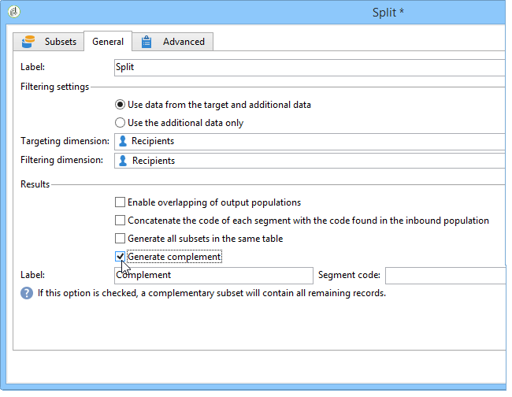

# A/B 测试{#a-b-testing}

如果电子邮件投放有多个内容，并且想了解哪个版本对目标用户群影响最大，可以将不同版本发送给某些收件人，然后选择成功率最高的版本并发送给其他收件人。

在此用例中，我们将通过定位工作流来比较两个电子邮件投放内容。 消息和文本在两个投放中是相同的：只更改布局。

目标人口分为三个：两个测试组和剩余人口。 投放的不同版本将发送到每个测试组。 在投放之后，在收集最佳打开速率的结果之前配置5天的等待时间。 得分最高的投放的内容随后由脚本恢复，并发送给未用作测试组的人群。

请注意，将决定哪个投放最佳的标准可能会根据您的需要而更改。 可以是开放率、点击率、订阅率、反应性等。

此外，此用例中详细介绍的测试只涉及两个投放，但您可以根据需要测试任意多个版本。 只需向工作流中添加活动。

要创建A/B测试，请应用以下步骤：

* [第1步：创建定位工作流](#step-1--creating-a-targeting-workflow)
* [第2步：配置填充示例](#step-2--configuring-population-samples)
* [第3步：创建两个投放模板](#step-3--creating-two-delivery-templates)
* [第4步：在工作流中配置投放](#step-4--configuring-the-deliveries-in-the-workflow)
* [第5步：创建脚本](#step-5--creating-the-script)
* [第6步：定义最终投放](#step-6--defining-the-final-delivery)
* [第7步：启动工作流](#step-7--starting-the-workflow)
* [第8步：分析结果](#step-8--analyzing-the-result)。

## 第1步：创建定位工作流{#step-1--creating-a-targeting-workflow}

您需要在活动的&#x200B;**[!UICONTROL Targeting and Workflows]**&#x200B;选项卡中创建工作流。 它由&#x200B;**[!UICONTROL Query]**&#x200B;活动、链接到两个&#x200B;**[!UICONTROL Email delivery]**&#x200B;活动的&#x200B;**[!UICONTROL Split]**&#x200B;活动、**[!UICONTROL Wait]**&#x200B;活动、**[!UICONTROL JavaScript code]**&#x200B;活动和&#x200B;**[!UICONTROL Delivery]**&#x200B;活动组成。

1. 如果尚未创建活动，请创建此区域（有关详细信息，请参阅此[部分](../../campaign/using/setting-up-marketing-campaigns.md#creating-a-campaign)）。

   

1. 转到 **[!UICONTROL Targeting and Workflows]** 选项卡。

   

1. 更改现有工作流的标签，或单击&#x200B;**[!UICONTROL Add]**&#x200B;创建新工作流。

   

1. 使用鼠标将活动拖放到工作流图中，包括&#x200B;**[!UICONTROL Query]**（**[!UICONTROL Target]**&#x200B;选项卡）、**[!UICONTROL Split]**（**[!UICONTROL Target]**&#x200B;选项卡）、两个&#x200B;**[!UICONTROL Email deliveries]**（**[!UICONTROL Deliveries]**&#x200B;选项卡）、**[!UICONTROL Wait]**&#x200B;活动（**[!UICONTROL Flow Control]**&#x200B;选项卡）、**[!UICONTROL JavaScript code]**&#x200B;活动（**[!UICONTROL Actions]**&#x200B;选项卡）和&#x200B;**[!UICONTROL Delivery]**&#x200B;活动（**[!UICONTROL Actions]**&#x200B;选项卡）。


## 第2步：配置填充示例{#step-2--configuring-population-samples}

### 配置查询活动{#configuring-the-query-activity}

* 多次-单击&#x200B;**[!UICONTROL Query]**&#x200B;活动。

   

* 单击&#x200B;**[!UICONTROL Edit query]**&#x200B;链接，然后选择要目标的收件人。

   

* 将&#x200B;**[!UICONTROL Query]**&#x200B;活动链接到&#x200B;**[!UICONTROL Split]**&#x200B;活动。

   

### 配置拆分活动{#configuring-the-split-activity}

此活动允许您创建多个人群：接收投放A的投放B，以及剩余人口。 使用随机选择，您只能目标每个投放的一部分人口。

1. 创建人口A:

   * 多次-单击&#x200B;**[!UICONTROL Split]**&#x200B;活动。

      

   * 在现有选项卡中，将标签更改为填充A。

      

   * 选择&#x200B;**[!UICONTROL Limit the selected records]**&#x200B;选项。

      

   * 单击&#x200B;**[!UICONTROL Edit]**&#x200B;链接，选择&#x200B;**[!UICONTROL Activate random sampling]**，然后单击&#x200B;**[!UICONTROL Next]**。

      

   * 将阈值设置为10%，然后单击&#x200B;**[!UICONTROL Finish]**。

      

1. 创建人口B:

   * 单击&#x200B;**[!UICONTROL Add]**&#x200B;为人口B创建新选项卡。

      

   * 将人口限制为以前的10%。

      

1. 创建剩余人口：

   * 转到 **[!UICONTROL General]** 选项卡。

      

   * 选择 **[!UICONTROL Generate complement]**。

      

   * 更改标签以指定此填充不包括A和B，然后单击&#x200B;**[!UICONTROL OK]**&#x200B;以关闭活动。

      

## 第3步：创建两个投放模板{#step-3--creating-two-delivery-templates}

我们现在想创建两个投放模板。 每个模板都将在链接到&#x200B;**[!UICONTROL Split]**&#x200B;活动的&#x200B;**[!UICONTROL Email delivery]**&#x200B;活动中引用。 有关更多信息，请参阅此](../../delivery/using/about-templates.md)章节[。

1. 转到&#x200B;**[!UICONTROL Resources > Delivery template]**&#x200B;文件夹。
1. 重复&#x200B;**[!UICONTROL Email]**&#x200B;投放模板。

   

1. 创建要用于投放A的内容。

   

1. 重复此过程以为投放B创建模板。

   

## 第4步：在工作流{#step-4--configuring-the-deliveries-in-the-workflow}中配置投放

下一步是配置投放。 它们的目标是前一阶段创造的三个人口：[步骤2:配置填充示例](#step-2--configuring-population-samples)。 前两个投放允许您向群体A和B发送不同的内容。第三个投放用于未接收A和B的群体。其内容将由脚本计算，并且与A或B相同，具体取决于打开率最高的群体。 我们需要为第三个投放配置等待期，以了解投放A和B的结果。这就是为什么第三个投放包括&#x200B;**[!UICONTROL Wait]**&#x200B;活动。

1. 转到&#x200B;**[!UICONTROL Split]**&#x200B;活动，将用于填充A的过渡链接到工作流中已有的电子邮件投放之一。

   

1. 多次-单击投放以打开它。
1. 使用下拉列表，选择投放A的模板。

   

1. 单击&#x200B;**[!UICONTROL Continue]**&#x200B;视图投放，然后保存它。

   

1. 将用于人口B的&#x200B;**[!UICONTROL Split]**&#x200B;活动的过渡链接到第二个电子邮件投放。

   

1. 打开投放，在投放B中选择模板，然后保存投放。

   

1. 将用于剩余人口的过渡链接到&#x200B;**[!UICONTROL Wait]**&#x200B;活动。

   

1. 打开&#x200B;**[!UICONTROL Wait]**&#x200B;活动并配置5天的等待期。

   

1. 将&#x200B;**[!UICONTROL Wait]**&#x200B;活动链接到&#x200B;**[!UICONTROL JavaScript code]**&#x200B;活动。

   

## 第5步：创建脚本{#step-5--creating-the-script}

投放内容的选择将由脚本计算。 此脚本以最高打开率恢复有关投放的信息，并将内容复制到最终投放。

### 脚本{#example-of-a-script}的示例

以下脚本可以像在定位工作流中一样使用（请参阅[配置脚本](../../workflow/using/a-b-testing.md#configuring-script)）。

```
 // query the database to find the winner (best open rate)
   var winner = xtk.queryDef.create(
     <queryDef schema="nms:delivery" operation="get">
       <select>
         <node expr="@id"/>
         <node expr="@label"/>
         <node expr="[@operation-id]"/>
         <node expr="[@workflow-id]"/>
       </select>
       <where>
         <condition expr={"@FCP=0 and [@workflow-id]= " + instance.id}/>
       </where>
       <orderBy>
         <node expr="[indicators/@estimatedRecipientOpenRatio]" sortDesc="true"/>
       </orderBy>
     </queryDef>).ExecuteQuery()
   
   // create a new delivery object and initialize it by doing a copy of
   // the winner delivery
   var delivery = nms.delivery.create()
   delivery.Duplicate("nms:delivery|" + winner.@id)

   // append 'final' to the delivery label
   delivery.label = winner.@label + " final"

   // link the delivery to the operation to make sure it will be displayed in
   // the campaign dashboard. This attribute needs to be set manually here since 
   // the Duplicate() method has reset it to its default value => 0
   delivery.operation_id = winner.@["operation-id"]
   delivery.workflow_id = winner.@["workflow-id"]

   // adjust some delivery parameters to make it compatible with the 
   // "Prepare and start" option selected in the Delivery tab of this activity
   delivery.scheduling.validationMode = "manual"
   delivery.scheduling.delayed = 0
 
   // save the delivery in database
   delivery.save()
 
   // store the new delivery Id in event variables
   vars.deliveryId = delivery.id
```

有关脚本的详细说明，请参阅[本节](../../workflow/using/a-b-testing.md#details-of-the-script)。

### 配置脚本{#configuring-script}

1. 打开&#x200B;**[!UICONTROL JavaScript code]**&#x200B;活动。
1. 将先前显示的[脚本](../../workflow/using/a-b-testing.md#example-of-a-script)复制到&#x200B;**[!UICONTROL JavaScript code]**&#x200B;窗口中。

   

1. 在&#x200B;**[!UICONTROL Label]**&#x200B;字段中，输入脚本的名称，即

   ```
   <%= vars.deliveryId %>
   ```

   

1. 关闭&#x200B;**[!UICONTROL JavaScript code]**&#x200B;活动。
1. 保存您的工作流。

### 脚本{#details-of-the-script}的详细信息

本节详细介绍了脚本的各个部分及其操作模式。

* 脚本的第一部分是查询。 使用&#x200B;**queryDef**&#x200B;命令，您可以从&#x200B;**NmsDelivery**&#x200B;表中恢复通过执行定位工作流创建的投放，并根据其估计的打开率对它们进行排序，然后恢复来自打开率最高的投放的信息。

   ```
   // query the database to find the winner (best open rate)
      var winner = xtk.queryDef.create(
        <queryDef schema="nms:delivery" operation="get">
          <select>
            <node expr="@id"/>
            <node expr="@label"/>
            <node expr="[@operation-id]"/>
          </select>
          <where>
            <condition expr={"@FCP=0 and [@workflow-id]= " + instance.id}/>
          </where>
          <orderBy>
            <node expr="[indicators/@estimatedRecipientOpenRatio]" sortDesc="true"/>
          </orderBy>
        </queryDef>).ExecuteQuery()
   ```

* 打开率最高的投放重复。

   ```
    // create a new delivery object and initialize it by doing a copy of
    // the winner delivery
   var delivery = nms.delivery.create()
   delivery.Duplicate("nms:delivery|" + winner.@id)
   ```

* 修改复制投放的标签，并将单词&#x200B;**final**&#x200B;添加到该标签中。

   ```
   // append 'final' to the delivery label
   delivery.label = winner.@label + " final"
   ```

* 投放被复制到活动仪表板。

   ```
   // link the delivery to the operation to make sure it will be displayed in
   // the campaign dashboard. This attribute needs to be set manually here since 
   // the Duplicate() method has reset it to its default value => 0
   delivery.operation_id = winner.@["operation-id"]
   delivery.workflow_id = winner.@["workflow-id"]
   ```

   ```
   // adjust some delivery parameters to make it compatible with the 
   // "Prepare and start" option selected in the Delivery tab of this activity
   delivery.scheduling.validationMode = "manual"
   delivery.scheduling.delayed = 0
   ```

* 投放保存在数据库中。

   ```
   // save the delivery in database
   delivery.save()
   ```

* 复制投放的唯一标识符存储在工作流变量中。

   ```
   // store the new delivery Id in event variables
   vars.deliveryId = delivery.id
   ```

### 其他选择条件{#other-selection-criteria}

以上示例允许您根据电子邮件打开率选择投放的内容。 您可以根据其他投放特定指标调整它：

* 最佳点击吞吐量：`[indicators/@recipientClickRatio]`,
* 最高反应率（打开电子邮件并在邮件中单击）:`[indicators/@reactivity]`,
* 最低投诉率：`[indicators/@refusedRatio]`
* 最高转化率:`[indicators/@transactionRatio]`,
* 接收消息后访问的页数：`[indicators/@totalWebPage]`,
* 最低退订率：`[indicators/@optOutRatio]`,
* 交易金额：`[indicators/@amount]`。

## 第6步：定义最终投放{#step-6--defining-the-final-delivery}

创建脚本以选择A/B测试入选方后，您可以定义最终投放的参数。

1. 将&#x200B;**[!UICONTROL JavaScript code]**&#x200B;活动连接到其余&#x200B;**[!UICONTROL Delivery]**&#x200B;活动。
1. 打开&#x200B;**[!UICONTROL Delivery]**&#x200B;活动。
1. 取消选中&#x200B;**[!UICONTROL Generate an outbound transition]**&#x200B;选项，以使用此活动完成工作流。
1. 保留其他选项的默认值。

   

准备在过渡中指定的投放(通过&#x200B;**[!UICONTROL Javascript Code]**&#x200B;活动定义)后，您便可以批准该并开始发送，如下一步所述。

## 第7步：启动工作流{#step-7--starting-the-workflow}

1. 单击&#x200B;**[!UICONTROL Start]**&#x200B;工作流。

   

1. 通过目标仪表板批准投放A和B的活动和内容。
1. 确认投放。
1. 等到5天期间结束，了解在投放开始结果后计算了哪些内容。

   

   在这种情况下，选择模板B。

1. 确定第三个投放的内容后，批准该目标和该内容。

## 第8步：分析结果{#step-8--analyzing-the-result}

发送测试投放后，您可以检查已将其发送到的收件人以及是否已打开它们。

* 要查找哪些收件人是目标投放，请通过活动仪表板打开一个，然后单击&#x200B;**[!UICONTROL Delivery]**&#x200B;选项卡。

   

* 要了解投放是否已打开，请转至&#x200B;**[!UICONTROL Tracking]**&#x200B;选项卡。

   

* 与其他投放比较。

   

在我们的例子中，投放B的公开率最高。 这意味着内容B将用于最终投放。


