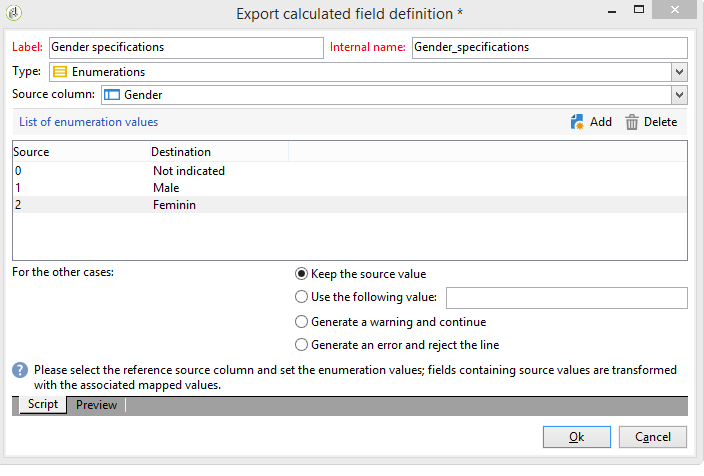

# 添加枚举类型计算字段{#adding-an-enumeration-type-calculated-field}

在此，我们要创建一个具有&#x200B;**[!UICONTROL Enumerations]**&#x200B;类型计算字段的查询。 此字段将在数据预览窗口中生成额外的列。 此列将为每个收件人（0、1和2）指定作为结果返回的数值。 新列中的每个值将分配一个性别：“Male”表示“1”，“Female”表示“2”，或“Not issided”（如果值等于“0”）。

* 需要选择哪个表？

   收件人表(nms:recipient)

* 要在输出列中选择的字段？

   姓氏、名字、性别

* 筛选信息所依据的标准？

   收件人语言

应用以下步骤：

1. 打开通用查询编辑器并选择收件人表(**[!UICONTROL nms:recipient]**)。
1. 在&#x200B;**[!UICONTROL Data to extract]**&#x200B;窗口中，选择&#x200B;**[!UICONTROL Last name]**、**[!UICONTROL First name]**&#x200B;和&#x200B;**[!UICONTROL Gender]**。

   

1. 在&#x200B;**[!UICONTROL Sorting]**&#x200B;窗口中，单击&#x200B;**[!UICONTROL Next]**:此示例不需要排序。
1. 在 **[!UICONTROL Data filtering]** 中，选择 **[!UICONTROL Filtering conditions]**。
1. 在&#x200B;**[!UICONTROL Target element]**&#x200B;窗口中，设置一个筛选条件以收集讲英语的收件人。

   

1. 在&#x200B;**[!UICONTROL Data formatting]**&#x200B;窗口中，单击&#x200B;**[!UICONTROL Add a calculated field]**。

   

1. 转到&#x200B;**[!UICONTROL Export calculated field definition]**&#x200B;窗口的&#x200B;**[!UICONTROL Type]**&#x200B;窗口，然后选择&#x200B;**[!UICONTROL Enumerations]**。

   定义新计算字段必须引用的列。 为此，请在&#x200B;**[!UICONTROL Source column]**&#x200B;字段的下拉菜单中选择&#x200B;**[!UICONTROL Gender]**&#x200B;列：目标值将与&#x200B;**[!UICONTROL Gender]**&#x200B;列一致。

   

   定义&#x200B;**Source**&#x200B;和&#x200B;**Destination**&#x200B;值：目标值使查询结果更易读。 此查询应返回收件人的性别，结果为0、1或2。

   对于要输入的每行“source-destination”，单击&#x200B;**[!UICONTROL List of enumeration values]**&#x200B;中的&#x200B;**[!UICONTROL Add]**:

   * 在&#x200B;**[!UICONTROL Source]**&#x200B;列中，在新行中输入每个性别(0,1,2)的源值。
   * 在&#x200B;**[!UICONTROL Destination]**&#x200B;列中，输入以下值：行“0”、行“1”和行“2”分别为“未指示”、“Male”和“Female”。

   选择&#x200B;**[!UICONTROL Keep the source value]**&#x200B;函数。

   单击&#x200B;**[!UICONTROL OK]**&#x200B;以批准计算字段。

   

1. 在&#x200B;**[!UICONTROL Data formatting]**&#x200B;窗口中，单击&#x200B;**[!UICONTROL Next]**。
1. 在预览窗口中， **[!UICONTROL start the preview of the data]**。

   附加的栏定义0、1和2的性别：

   * 0表示“未指示”
   * 1表示“男”
   * 2表示&quot;女性&quot;

   

   例如，如果未在&#x200B;**[!UICONTROL List of enumeration values]**&#x200B;中输入性别&quot;2&quot;，并且选择了&#x200B;**[!UICONTROL In other cases]**&#x200B;字段的&#x200B;**[!UICONTROL Generate a warning and continue]**&#x200B;函数，则会收到警告日志。 此日志表示未输入性别“2”（女性）。 它显示在数据预览窗口的&#x200B;**[!UICONTROL Logs generated during export]**&#x200B;字段中。

   

   让我们再举一个示例，说明未输入枚举值“2”。 选择&#x200B;**[!UICONTROL Generate an error and reject the line]**&#x200B;函数：所有性别为“2”的收件人都会引起异常，并在行中显示其他信息（名字和姓氏等） 将不导出。 数据预览窗口的&#x200B;**[!UICONTROL Logs generated during export]**&#x200B;字段中会显示错误日志。 此日志表示未输入枚举值“2”。

   
