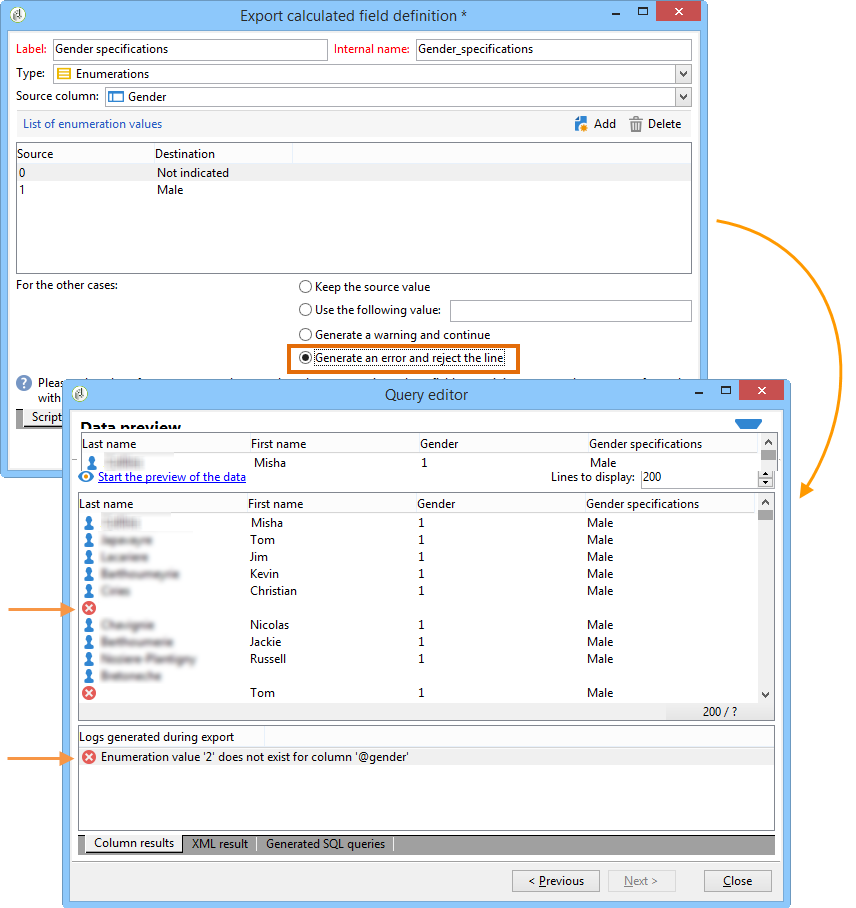

# 添加枚举类型计算字段 {#adding-an-enumeration-type-calculated-field}

在此，我们要创建一个带有类型计算字段 **[!UICONTROL Enumerations]** 的查询。 此字段将在数据预览窗口中生成另一列。 此列将指定作为每个收件人（0、1和2）的结果返回的数字值。 新列中的每个值将分配一个性别：“Male”表示“1”,“Female”表示“2”，或“Not ismended”（如果值等于“0”）。

* 需要选择哪个表？

   收件人表（nms：收件人）

* 要在输出列中选择的字段？

   姓、名、性别

* 要根据哪个标准筛选信息？

   收件人语言

应用以下步骤：

1. 打开“通用查询编辑器”，然后选择“收件人”表(**[!UICONTROL nms:recipient]**)。
1. 在窗口 **[!UICONTROL Data to extract]** 中，选择 **[!UICONTROL Last name]**, **[!UICONTROL First name]** 然后 **[!UICONTROL Gender]**。

   

1. 在窗口 **[!UICONTROL Sorting]** 中，单击 **[!UICONTROL Next]**:此示例不需要排序。
1. 在中 **[!UICONTROL Data filtering]**，选择 **[!UICONTROL Filtering conditions]**。
1. 在窗口 **[!UICONTROL Target element]** 中，设置过滤条件以收集说英语的收件人。

   

1. 在窗口 **[!UICONTROL Data formatting]** 中，单击 **[!UICONTROL Add a calculated field]**。

   

1. 转到窗 **[!UICONTROL Type]** 口并选 **[!UICONTROL Export calculated field definition]** 择 **[!UICONTROL Enumerations]**。

   定义新计算字段必须引用的列。 为此，请在字 **[!UICONTROL Gender]** 段的下拉菜单中选择列 **[!UICONTROL Source column]** :目标值将与列重 **[!UICONTROL Gender]** 合。

   

   定义“ **源** ”和“ **目标** ”值：目标值使查询结果更易于读取。 此查询应返回收件人性别，结果为0、1或2。

   对于要输入的每个“源——目标”行，请单 **[!UICONTROL Add]** 击以下 **[!UICONTROL List of enumeration values]**:

   * 在列 **[!UICONTROL Source]** 中，在新行中输入每个性别(0,1,2)的源值。
   * 在列 **[!UICONTROL Destination]** 中，输入以下值：行“0”的“未指示”、行“1”的“Male”和行“2”的“Male”。
   选择函 **[!UICONTROL Keep the source value]** 数。

   单击 **[!UICONTROL OK]** 以批准计算的字段。

   

1. 在窗口 **[!UICONTROL Data formatting]** 中，单击 **[!UICONTROL Next]**。
1. 在预览窗口中， **[!UICONTROL start the preview of the data]**。

   附加的一栏定义了0、1和2的性别：

   * 0表示“未指示”
   * 1表示“男性”
   * 2表示“女性”
   

   例如，如果您未在中输入性别“2” **[!UICONTROL List of enumeration values]**，并且选择了字 **[!UICONTROL Generate a warning and continue]** 段的 **[!UICONTROL In other cases]** 功能，您将收到警告日志。 此日志指示未输入性别“2”（女）。 它显示在数据 **[!UICONTROL Logs generated during export]** 预览窗口的字段中。

   

   让我们再举一个例子，说明未输入枚举值“2”。 选择函 **[!UICONTROL Generate an error and reject the line]** 数：所有性别“2”的收件人都会在行中引发异常和其他信息（名字和姓氏等）。将不导出。 数据预览窗口的字段中 **[!UICONTROL Logs generated during export]** 会显示错误日志。 此日志指示未输入枚举值“2”。

   
