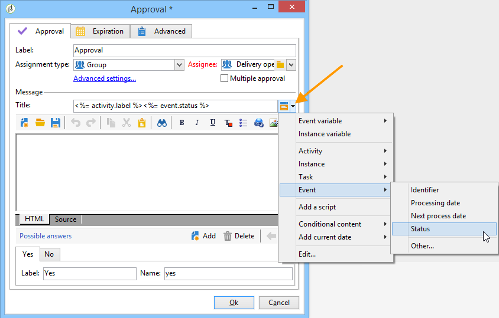

# 批准{#approval}

批 **准任务** 需要运营商的参与。 操作员会得到一个任务，并可以通过电子邮件、电子邮件中链接的网页或控制台进行回复。

## 任务分配 {#task-assignment}

默认情况下，批准会分配给操作员组。 此组表示角色，如“新闻稿内容组”或“新闻稿定位组”。 组中的每个操作员都可以回答，但只考虑第一个答复(多个批准的事件除外)。

如有必要，您可以将批准任务分配给单个运算符或由筛选器定义的一组运算符。

* 要选择单个运算符，请在字 **[!UICONTROL Operator]** 段中选 **[!UICONTROL Assignment type]** 择值，然后在字段的下拉列表中选择相关运 **[!UICONTROL Assignee]** 算符。

   

   >[!CAUTION]
   >
   >只有选定的运营商才有权批准任务。

* 您可以定义用于筛选批准运算符的查询。 为此，请在字段 **[!UICONTROL Filter]** 中选择 **[!UICONTROL Assignment type]** 值，然后单击链 **[!UICONTROL Advanced parameters...]** 接以定义筛选条件，如下例所示：

   

在单次审批事件中，激活与操作者选择对应的过渡，完成任务:其他运算符无法答复。

在多个批准的事件中，启用与每个操作者的选择对应的过渡。 任务在组的所有操作符都已回复或任务过期时完成。

此活动不会阻止处理，工作流可以在等待回复时执行其他任务。

操作员可以从控制台批准分配给该操作员的任务。 具有管理员权限的操作员可以视图和删除分配给任何操作员的任务，但无法答复。

修改活动的标题或消息正文不会影响当前任务，但是，另一方面，修改可能的选择会直接影响当前任务，后者会自动继承新的选择列表。

**可以** 从节点访问批准类型 **[!UICONTROL Administration > Production > Objects created automatically > Approvals pending]** 任务:运营商可以通过此视图直接访问批准表。

## 属性 {#properties}

可在发送给审阅者的邮件中使用自定义变量。 它们可以插入到邮件标题或正文中。

此 **[!UICONTROL Title]** 字段包含消息的标题：这是发送的电子邮件的主题。 标题以及消息正文都是JavaScript模板，因此可以包含根据工作流的上下文计算的值。

编辑器的下半部分允许您定义可能答案的列表。 每个答案都对应一个过渡。 名称是内部标识符，标签是将在选择列表中显示的文本。

单击链 **[!UICONTROL Advanced parameters...]** 接以选择用于通知操作符的投放模板。 默认模板（内部名称“notifyAssignee”）会获取标题和消息，并添加指向用于应答的网页的链接。

可以修改此模板以个性化消息布局，但最好复制。 不能修改定位机制(外部文件、目标映射)，因为通知必须正确运行。

定义审批中显示了 [审批示例](../../workflow/using/defining-approvals.md)。

## 输出参数 {#output-parameters}

* **[!UICONTROL response]**

   与响应相关的注释

* **[!UICONTROL responseOperator]**

   响应的运算符的标识符。 此字段是数值，但是是字 **[!UICONTROL String]** 段。

