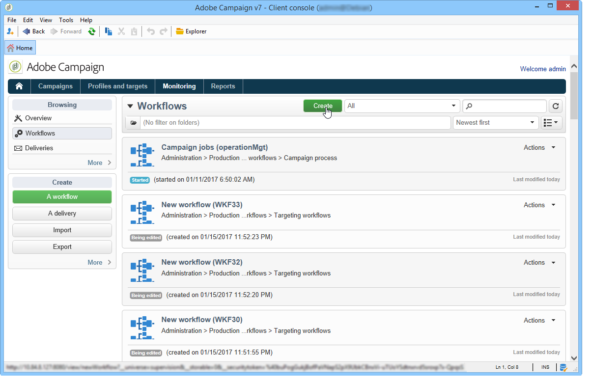
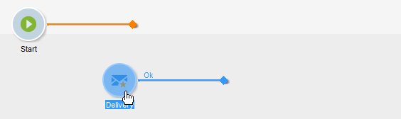

# 构建工作流 {#building-a-workflow}

本节详细介绍了构建活动工作流程的主要原则和最佳实践。

* 创建工作流，请参阅[创建新工作流](#creating-a-new-workflow)
* 设计工作流图，请参阅[添加和链接活动](#adding-and-linking-activities)
* 访问活动的参数和属性，请参阅[配置活动](#configuring-activities)
* 设计定位工作流，请参阅[定位工作流](#targeting-workflows)
* 使用工作流执行活动，请参阅[活动工作流](#campaign-workflows)
* 访问和创建技术工作流，请参阅[技术工作流](#technical-workflows)
* 使用模板创建工作流，请参阅[工作流模板](#workflow-templates)

## 创建新工作流{#creating-a-new-workflow}

从&#x200B;**[!UICONTROL Explorer]**&#x200B;访问工作流文件夹。 默认情况下，您可以使用&#x200B;**[!UICONTROL Profiles and Targets]** > **[!UICONTROL Jobs]** > **[!UICONTROL Targeting workflows]**。

单击位于列表上方的&#x200B;**[!UICONTROL New]**&#x200B;按钮。

或者，您也可以使用工作流概述（**[!UICONTROL Monitoring]** > **[!UICONTROL Workflow]**&#x200B;链接）中的&#x200B;**[!UICONTROL Create]**&#x200B;按钮。

输入标签，然后单击&#x200B;**[!UICONTROL Save]**。

>[!NOTE]
>
>修改工作流活动的内部名称或工作流本身时，请确保在关闭工作流之前保存该工作流，以便正确考虑新的内部名称。

## 添加和链接活动{#adding-and-linking-activities}

您现在必须定义各种活动，并在图表中将它们链接到一起。在此配置阶段，我们可以看到图标签和工作流状态（正在编辑）。 窗口的下部仅用于编辑图。 它包含工具栏、活动面板（左侧）和图本身（右侧）。

>[!NOTE]
>
>如果未显示调色板，请单击工具栏上的第一个按钮以显示它。

活动按类别在调色板的不同选项卡中进行分组。 可用的选项卡和活动可能因工作流类型(技术、定位或活动工作流)而异。

* 第一个选项卡包含定位和数据处理活动。 这些活动详见[定位活动](../../workflow/using/about-targeting-activities.md)。
* 第二个选项卡包含调度活动，这些活动主要用于协调其他。 这些活动详见[流量控制活动](../../workflow/using/about-flow-control-activities.md)。
* 第三个选项卡包含可在工作流中使用的工具和操作。 这些活动详见[操作活动](../../workflow/using/about-action-activities.md)。
* 第四个选项卡包含依赖于给定活动的事件，如收到电子邮件或到达服务器上的文件。 这些活动详见[事件活动](../../workflow/using/about-event-activities.md)。

创建图

1. 通过在调色板中选择活动，然后使用拖放操作将其移到图中，来添加该数据。

   在图上添加&#x200B;**开始**&#x200B;活动，然后添加&#x200B;**投放**&#x200B;活动。

   

1. 将&#x200B;**活动**&#x200B;活动过渡拖放到&#x200B;**投放**&#x200B;活动，将开始链接到一起。

   

   通过将新活动放置在活动的末尾，可以自动将过渡链接到前一个。

1. 添加所需活动并将它们链接在一起，如下图所示。

   

>[!CAUTION]
>
>您可以在同一工作流中复制和粘贴活动。 但是，我们不建议跨不同的活动复制粘贴工作流。 某些附加到活动(如投放和调度程序)的设置可能会导致在执行目标工作流时发生冲突和出错。 而是建议您&#x200B;**重复**&#x200B;工作流。 有关详细信息，请参阅[复制工作流](#duplicating-workflows)。

您可以使用以下元素更改图表的显示和布局：

* **使用工具栏**

   图编辑工具栏允许您访问工作流的布局和执行功能。

   

   这样，您可以调整编辑工具的布局：调色板的显示以及图形对象的概述、大小和对齐方式。

   

   与跟踪和启动高级定位工作流相关的图标在此[部分](../../campaign/using/marketing-campaign-deliveries.md#creating-a-targeting-workflow)中有详细介绍。

* **对象对齐**

   要对齐图标，请选择这些图标，然后单击&#x200B;**[!UICONTROL Align vertically]**&#x200B;或&#x200B;**[!UICONTROL Align horizontally]**&#x200B;图标。

   使用&#x200B;**CTRL**&#x200B;键可选择多个分散的活动或取消选择一个或多个活动。 单击图背景可取消选择所有内容。

* **图像管理**

   您可以自定义图的背景图像以及与各种活动相关的背景图像。 请参阅[管理活动图像](../../workflow/using/managing-activity-images.md)。

## 配置活动{#configuring-activities}

多次单击某个活动进行配置，或右键单击并选择&#x200B;**[!UICONTROL Open...]**。

>[!NOTE]
>
>活动工作流活动详见[本节](../../workflow/using/about-activities.md)。

第一个选项卡包含基本配置。 **[!UICONTROL Advanced]**&#x200B;选项卡包含附加参数，这些参数尤其用于在遇到错误时定义行为、指定活动的执行持续时间以及输入初始化脚本。

为了更好地了解活动并提高工作流的易读性，您可以在活动中输入注释：操作符滚动到活动上时，将自动显示这些值。

## 定位工作流{#targeting-workflows}

定位工作流使您能够构建多个投放目标。 您可以创建查询、根据特定条件定义合并或排除、添加计划，这都归功于工作流活动。 此定位的结果可以自动传输到列表，作为投放操作的目标

除了这些活动之外，数据管理选项还允许您处理数据并访问高级功能以满足复杂的定位问题。 有关详细信息，请参阅[数据管理](../../workflow/using/targeting-data.md#data-management)。

所有这些活动都可以在第一个工作流选项卡中找到。

>[!NOTE]
>
>[此部分](../../workflow/using/about-activities.md)中详细介绍了定位活动。

定位工作流可以通过Adobe Campaign树的&#x200B;**[!UICONTROL Profiles and Targets > Jobs > Targeting workflows]**&#x200B;节点或主页的&#x200B;**[!UICONTROL Profiles and Targets > Targeting workflows]**&#x200B;菜单创建和编辑。

在活动框架内定位工作流与所有活动工作流一起存储。

### 创建定位工作流{#implementation-steps-}的关键步骤

创建定位工作流的步骤在以下各节中详细介绍：

1. **在数** 据库中标识数据——请参 [阅创建查询](../../workflow/using/targeting-data.md#creating-queries)
1. **满足** 投放需求的准备数据——请 [参阅丰富和修改数据](../../workflow/using/targeting-data.md#enriching-and-modifying-data)
1. **使** 用投放执行更新或更新——请参 [阅更新数据库](../../workflow/using/how-to-use-workflow-data.md#updating-the-database)

所有扩充和在定位期间执行的所有处理的结果都在个性化字段中存储和可访问，特别是用于创建个性化消息。 有关详细信息，请参阅[目标数据](../../workflow/using/data-life-cycle.md#target-data)

### 定位和过滤维度{#targeting-and-filtering-dimensions}

在数据分段操作期间，定位密钥被映射到过滤维度。 定位维度允许您定义工序所针对的人口：收件人、合同受益人、运营商、订户等。 该过滤维度允许您根据特定条件选择人口：合同持有人、新闻稿订阅者等。

例如，要选择拥有5年以上人寿保险单的客户，请选择以下定位维度:**客户端**&#x200B;和以下过滤维度:**合同持有人**。 然后，您可以在查询活动中定义筛选条件

在定位维度选择阶段，接口中只提供兼容过滤维度。

这两个维必须是相关的。 因此，**[!UICONTROL Filtering dimension]**&#x200B;列表的内容取决于在第一个字段中指定的定位维度。

例如，对于收件人(**收件人**)，将提供以下过滤维度:

对于&#x200B;**Web 应用程序**,列表将包含以下过滤维度:

## 活动工作流{#campaign-workflows}

对于每个活动，您可以从&#x200B;**[!UICONTROL Targeting and workflows]**&#x200B;选项卡创建要执行的工作流。 这些工作流特定于活动。

此选项卡包含与所有活动相同的工作流。 [了解详情](#implementation-steps-)

除了定位活动之外，活动工作流还允许您为所有可用渠道创建和配置投放。 在工作流中创建后，这些投放可从活动的仪表板访问。 [了解详情](../../campaign/using/marketing-campaign-deliveries.md)

所有活动工作流都集中在&#x200B;**[!UICONTROL Administration > Production > Objects created automatically > Campaign workflows]**&#x200B;节点下。

活动工作流和实施示例详见[本页](../../campaign/using/marketing-campaign-deliveries.md#building-the-main-target-in-a-workflow)。

## 技术工作流 {#technical-workflows}

技术工作流提供开箱即用的Adobe Campaign。 它们是计划在服务器上定期执行的操作或作业。 它们允许您对投放库进行维护，转发投放跟踪信息，并建立临时流程。 技术工作流通过&#x200B;**[!UICONTROL Administration > Production > Technical workflows]**&#x200B;节点进行配置。

原生模板可用于创建技术工作流。 可以配置它们以满足您的需求。

**[!UICONTROL Campaign process]**&#x200B;子文件夹集中执行活动中的进程所需的工作流:任务通知、库存管理、成本计算等。

>[!NOTE]
>
>随每个模块安装的技术工作流的列表位于[专用部分](../../workflow/using/about-technical-workflows.md)中。

可以在树结构的&#x200B;**[!UICONTROL Administration > Production > Technical workflows]**&#x200B;节点中创建其他技术工作流。 但是，此过程是专家用户专用的。

提供的活动与定位工作流相同。 [了解详情](#implementation-steps-)

## 工作流模板{#workflow-templates}

工作流模板包含属性的总体配置，可能还包含在图中连接的一系列活动。 此配置可用于创建包含特定数量的预配置元素的新工作流

您可以基于现有模板创建新的工作流模板，也可以直接将工作流更改为模板。

工作流模板存储在Adobe Campaign树的&#x200B;**[!UICONTROL Resources > Templates > Workflow templates]**&#x200B;节点中。

除了常见的工作流属性之外，模板属性还允许您为基于此模板创建的工作流指定执行文件。

## 复制工作流 {#duplicating-workflows}

您可以重复不同类型的工作流。 复制后，对于原工作流的修改不会被应用到该工作流的副本。

>[!CAUTION]
>
>复制粘贴功能在工作流中可用，但建议您使用&#x200B;**重复**。 复制活动后，将保留其整个配置。 对于投放活动（电子邮件、短信、推送通知……），还会复制附加到活动的投放对象，这会导致崩溃。

1. 右键单击工作流。
1. 单击&#x200B;**重复**。

   

1. 在工作流窗口中，更改工作流标签。
1. 单击&#x200B;**保存**。

重复功能不直接在活动的视图中可用。

但是，您可以创建一个视图来显示实例上的所有工作流。 在此视图中，可以使用&#x200B;**重复重复工作流至**。

**首先，让我们创建一个视图:**

1. 在&#x200B;**资源管理器**&#x200B;中，转到需要在中创建视图的文件夹。
1. 右键单击并转到&#x200B;**添加新文件夹** > **处理**，选择&#x200B;**工作流**。

   

将创建新文件夹&#x200B;**工作流**。

1. 右键单击并选择&#x200B;**属性**。
1. 在&#x200B;**限制**&#x200B;中，选中&#x200B;**文件夹是视图**&#x200B;并单击&#x200B;**保存**。

   

该文件夹现在填充了实例的所有工作流。

**复制活动工作流**

1. 在工作流活动中选择视图工作流。
1. 右键单击&#x200B;**重复至**。
   
1. 更改其标签。
1. 单击&#x200B;**保存**。

您可以在工作流视图中看到重复的工作流。
