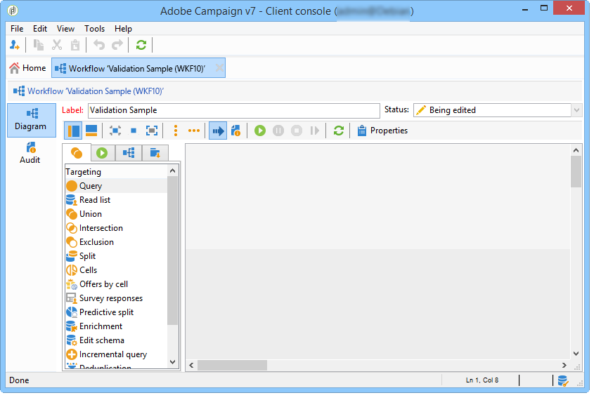
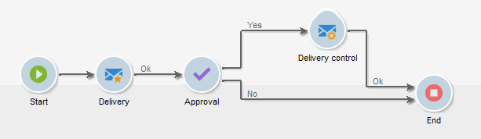

# 构建工作流 {#building-a-workflow}

本节详细介绍在Campaign中构建工作流的主要原则和最佳实践。

* 创建工作流，请参阅[创建新工作流](#creating-a-new-workflow)
* 设计工作流图，请参阅[添加和链接活动](#adding-and-linking-activities)
* 访问活动的参数和属性，请参阅[配置活动](#configuring-activities)
* 设计定位工作流，请参阅[定位工作流](#targeting-workflows)
* 使用工作流执行营销活动，请参阅[营销活动工作流](#campaign-workflows)
* 访问和创建技术工作流，请参阅[技术工作流](#technical-workflows)
* 使用模板创建工作流，请参阅[工作流模板](#workflow-templates)

## 创建新工作流{#creating-a-new-workflow}

从&#x200B;**[!UICONTROL Explorer]**&#x200B;访问工作流文件夹。 默认情况下，您可以使用&#x200B;**[!UICONTROL Profiles and Targets]** > **[!UICONTROL Jobs]** > **[!UICONTROL Targeting workflows]**。

单击位于工作流列表上方的&#x200B;**[!UICONTROL New]**&#x200B;按钮。

或者，您也可以使用工作流概述（**[!UICONTROL Monitoring]** > **[!UICONTROL Workflow]**&#x200B;链接）中的&#x200B;**[!UICONTROL Create]**&#x200B;按钮。

输入标签并单击&#x200B;**[!UICONTROL Save]**。

>[!NOTE]
>
>修改工作流活动的内部名称或工作流本身时，请确保在关闭工作流之前保存该工作流，以便正确考虑新的内部名称。

## 添加和链接活动{#adding-and-linking-activities}

您现在必须定义各种活动，并在图表中将它们链接到一起。在此配置阶段，我们可以看到图表标签和工作流状态（正在编辑）。 窗口的下部仅用于编辑图表。 它包含工具栏、活动面板（左侧）和图表本身（右侧）。

>[!NOTE]
>
>如果未显示面板，请单击工具栏上的第一个按钮以显示面板。

在面板的不同选项卡中，按类别对活动进行分组。 可用的选项卡和活动可能因工作流类型（技术、定位或营销活动工作流）而异。

* 第一个选项卡包含定位和数据处理活动。 [定位活动](../../workflow/using/about-targeting-activities.md)中详细介绍了这些活动。
* 第二个选项卡包含计划活动，主要用于协调其他活动。 [流量控制活动](../../workflow/using/about-flow-control-activities.md)中详细介绍了这些活动。
* 第三个选项卡包含可在工作流中使用的工具和操作。 [操作活动](../../workflow/using/about-action-activities.md)中详细介绍了这些活动。
* 第四个选项卡包含依赖于给定事件的活动，例如收到电子邮件或文件到达服务器。 [事件活动](../../workflow/using/about-event-activities.md)中详细介绍了这些活动。

创建图表

1. 添加活动，方法是在面板中选择活动，然后使用拖放操作将其移至图表。

   在图表上添加&#x200B;**开始**&#x200B;活动，然后添加&#x200B;**投放**&#x200B;活动。

   

1. 通过将&#x200B;**Start**&#x200B;活动过渡拖放到&#x200B;**Delivery**&#x200B;活动上，将活动链接在一起。

   

   您可以将新活动放在过渡的末尾，从而自动将活动与上一个活动链接起来。

1. 添加所需的活动并将它们链接在一起，如下图所示。

   

>[!CAUTION]
>
>您可以在同一工作流中复制并粘贴活动。 但是，我们不建议跨不同的工作流复制粘贴活动。 执行目标工作流时，附加到活动（如“投放”和“调度程序”）的某些设置可能会导致冲突和错误。 我们建议您改为&#x200B;**复制**&#x200B;工作流。 有关更多信息，请参阅[复制工作流](#duplicating-workflows)。

您可以使用以下元素更改图表的显示和布局：

* **使用工具栏**

   图表编辑工具栏允许您访问工作流的布局和执行功能。

   

   这可让您调整编辑工具的布局：面板的显示以及图形对象的概述、大小和对齐方式。

   

   此[部分](../../campaign/using/marketing-campaign-deliveries.md#creating-a-targeting-workflow)中详细描述了与跟踪和启动高级定位工作流相关的图标。

* **对象对齐**

   要对齐图标，请选择图标并单击&#x200B;**[!UICONTROL Align vertically]**&#x200B;或&#x200B;**[!UICONTROL Align horizontally]**&#x200B;图标。

   使用&#x200B;**CTRL**&#x200B;键选择多个分散的活动或取消选择一个或多个活动。 单击图表背景可取消选择所有内容。

* **映像管理**

   您可以自定义图表的背景图像以及与各种活动相关的背景图像。 请参阅[管理活动图像](../../workflow/using/managing-activity-images.md)。

## 配置活动{#configuring-activities}

双击某个活动以对其进行配置，或右键单击并选择&#x200B;**[!UICONTROL Open...]**。

>[!NOTE]
>
>[此部分](../../workflow/using/about-activities.md)中详细介绍了营销活动工作流活动。

第一个选项卡包含基本配置。 **[!UICONTROL Advanced]**&#x200B;选项卡包含附加参数，这些参数专门用于定义遇到错误时的行为、指定活动的执行持续时间以及输入初始化脚本。

为了更好地了解活动并提高工作流的可读性，您可以在活动中输入注释：当运算符滚动到活动上方时，将自动显示这些内容。

## 定位工作流{#targeting-workflows}

定位工作流允许您构建多个投放目标。 借助工作流活动，您可以创建查询、根据特定条件定义联合或排除、添加计划。 此定位的结果可自动转移到列表中，该列表可用作投放操作的目标

除了这些活动之外，数据管理选项还允许您处理数据并访问高级功能以满足复杂的定位问题。 有关更多信息，请参阅[数据管理](../../workflow/using/targeting-data.md#data-management)。

所有这些活动都可以在第一个工作流选项卡中找到。

>[!NOTE]
>
>[此部分](../../workflow/using/about-activities.md)中详细介绍了定位活动。

可以通过Adobe Campaign树的&#x200B;**[!UICONTROL Profiles and Targets > Jobs > Targeting workflows]**&#x200B;节点或通过主页的&#x200B;**[!UICONTROL Profiles and Targets > Targeting workflows]**&#x200B;菜单创建和编辑定位工作流。

营销活动框架内的定位工作流与所有营销活动工作流一起存储。

### 创建定位工作流{#implementation-steps-}的关键步骤

有关创建定位工作流的详细步骤，请参阅以下章节：

1. **** 数据库中的标识数据 — 请参阅 [创建查询](../../workflow/using/targeting-data.md#creating-queries)
1. **** 为满足投放需求而准备数据 — 请参阅 [扩充和修改数据](../../workflow/using/targeting-data.md#enriching-and-modifying-data)
1. **** 使用数据执行更新或在投放中 — 请参阅 [更新数据库](../../workflow/using/how-to-use-workflow-data.md#updating-the-database)

定位期间执行的所有扩充和所有处理的结果都存储在个性化字段中并可访问，特别是在创建个性化消息时使用。 有关更多信息，请参阅[Target数据](../../workflow/using/data-life-cycle.md#target-data)

### 定向和筛选维度{#targeting-and-filtering-dimensions}

在数据分段操作期间，定向键值会映射到过滤维度。 利用定向维度，可定义操作所定向的群体：收件人、合同受益人、操作员、订阅者等 通过筛选维度，您可以根据特定条件选择群体：合同持有者、新闻稿订阅者等

例如，要选择拥有寿险保单超过5年的客户，请选择以下定向维度：**Clients**&#x200B;和以下筛选维度：**合同持有人**。 然后，您可以在查询活动中定义筛选条件

在定向维度选择阶段，界面中仅提供兼容的过滤维度。

这两个维度必须相关。 因此，**[!UICONTROL Filtering dimension]**&#x200B;列表的内容取决于在第一个字段中指定的定向维度。

例如，对于收件人(**recipient**)，将提供以下过滤维度：

而对于&#x200B;**Web应用程序**，列表将包含以下过滤维度：

## 营销活动工作流{#campaign-workflows}

对于每个营销活动，您可以从&#x200B;**[!UICONTROL Targeting and workflows]**&#x200B;选项卡创建要执行的工作流。 这些工作流专门用于营销活动。

此选项卡包含与所有工作流相同的活动。 [了解详情](#implementation-steps-)

除了定位营销活动之外，营销活动工作流还允许您为所有可用渠道创建和配置投放。 在工作流中创建后，这些投放即可从营销策划的仪表板中获取。 [了解详情](../../campaign/using/marketing-campaign-deliveries.md)

所有营销活动工作流都集中在&#x200B;**[!UICONTROL Administration > Production > Objects created automatically > Campaign workflows]**&#x200B;节点下。

[本页](../../campaign/using/marketing-campaign-deliveries.md#building-the-main-target-in-a-workflow)中详细介绍了营销活动工作流和实施示例。

## 技术工作流 {#technical-workflows}

技术工作流是随Adobe Campaign提供的现成工作流。 它们是计划在服务器上定期执行的操作或作业。 利用这些功能，可对数据库进行维护、转发投放的跟踪信息以及设置投放的临时进程。 通过&#x200B;**[!UICONTROL Administration > Production > Technical workflows]**&#x200B;节点配置技术工作流。

本机模板可用于创建技术工作流。 可以根据您的需求配置它们。

**[!UICONTROL Campaign process]**&#x200B;子文件夹集中了执行营销活动中的进程所需的工作流：任务通知、库存管理、成本计算等

>[!NOTE]
>
>[专用部分](../../workflow/using/about-technical-workflows.md)中提供了随每个模块一起安装的技术工作流的列表。

您可以在树结构的&#x200B;**[!UICONTROL Administration > Production > Technical workflows]**&#x200B;节点中创建其他技术工作流。 但是，此过程仅供专家用户使用。

提供的活动与定位工作流相同。 [了解详情](#implementation-steps-)

## 工作流模板{#workflow-templates}

工作流模板包含属性的整体配置，以及可能在图中连接的一系列活动。 此配置可重复用于创建包含特定数量的预配置元素的新工作流

您可以基于现有模板创建新的工作流模板，也可以直接将工作流更改为模板。

工作流模板存储在Adobe Campaign树的&#x200B;**[!UICONTROL Resources > Templates > Workflow templates]**&#x200B;节点中。

除了常规的工作流属性之外，模板属性还允许您为基于此模板创建的工作流指定执行文件。

## 复制工作流 {#duplicating-workflows}

您可以复制不同类型的工作流。 复制后，对于原工作流的修改不会被应用到该工作流的副本。

>[!CAUTION]
>
>复制粘贴功能在工作流中可用，但我们建议您使用&#x200B;**复制**。 复制活动后，将保留其整个配置。 对于投放活动（电子邮件、短信、推送通知……），还会复制附加到活动的投放对象，这可能会导致崩溃。

1. 右键单击工作流。
1. 单击&#x200B;**复制**。

   

1. 在工作流窗口中，更改工作流标签。
1. 单击&#x200B;**保存**。

复制功能不能直接在营销活动视图中提供。

但是，您可以创建一个视图来显示实例上的所有工作流。 在此视图中，您可以使用&#x200B;**复制到**&#x200B;来复制工作流。

**首先，让我们创建一个视图：**

1. 在&#x200B;**Explorer**&#x200B;中，转到在中创建视图所需的文件夹。
1. 右键单击并转到&#x200B;**添加新文件夹** > **进程**，选择&#x200B;**工作流**。

   

将创建新文件夹&#x200B;**工作流**。

1. 右键单击并选择&#x200B;**属性**。
1. 在&#x200B;**限制**&#x200B;中，选中&#x200B;**文件夹是视图**，然后单击&#x200B;**保存**。

   

现在，文件夹中已填充实例的所有工作流。

**复制营销活动工作流**

1. 在工作流视图中选择营销活动工作流。
1. 右键单击&#x200B;**复制到**。
   
1. 更改其标签。
1. 单击&#x200B;**保存**。

您可以在工作流视图中查看重复的工作流。
