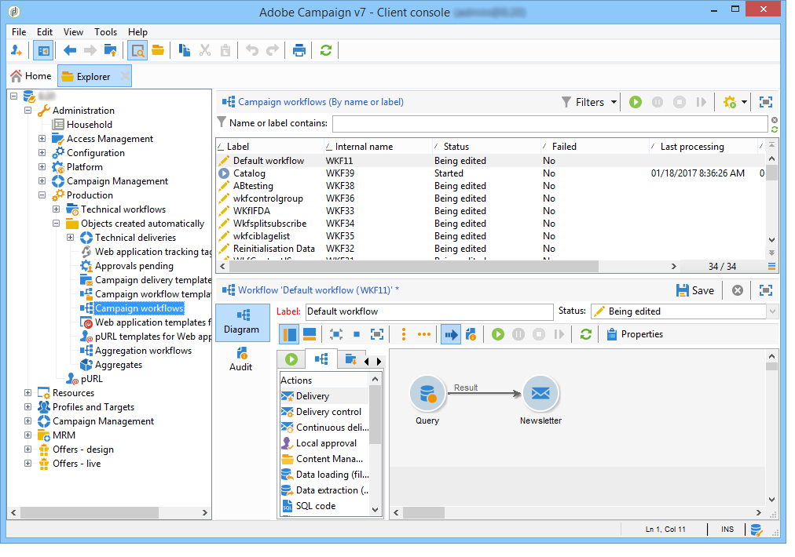

# 构建工作流 {#building-a-workflow}

本节详细介绍了在Campaign中构建工作流的主要原则和最佳实践。

* 创建工作流，请参阅 [创建新工作流](#creating-a-new-workflow)
* 设计工作流图，请参阅添 [加和链接活动](#adding-and-linking-activities)
* 访问活动的参数和属性，请参阅配 [置活动](#configuring-activities)
* 设计定位工作流，请参阅定 [位工作流](#targeting-workflows)
* 使用工作流执行营销活动，请参阅营 [销活动工作流](#campaign-workflows)
* 访问和创建技术工作流，请参阅技 [术工作流](#technical-workflows)
* 使用模板创建工作流，请参阅工 [作流模板](#workflow-templates)

## 创建新工作流 {#creating-a-new-workflow}

从中访 **[!UICONTROL Explorer]**&#x200B;问工作流文件夹。 默认情况下，您可以使用 **[!UICONTROL Profiles and Targets]** > **[!UICONTROL Jobs]** > **[!UICONTROL Targeting workflows]**。

单击位 **[!UICONTROL New]** 于工作流列表上方的按钮。

或者，您也可以使用工作流 **[!UICONTROL Create]** 概述(**[!UICONTROL Monitoring]** >链 **[!UICONTROL Workflow]** 接)中的按钮。

输入标签，然后单击 **[!UICONTROL Save]**。

>[!NOTE]
>
>修改工作流活动的内部名称或工作流本身时，请确保在关闭工作流之前保存该工作流，以便正确考虑新的内部名称。

## 添加和链接活动 {#adding-and-linking-activities}

您现在必须定义各种活动，并在图中将它们链接在一起。 在此配置阶段，我们可以看到图标签和工作流状态（正在编辑）。 窗口的下部仅用于编辑图。 它包含工具栏、活动调板（左侧）和图本身（右侧）。

>[!NOTE]
>
>如果未显示调色板，请单击工具栏上的第一个按钮以显示它。

活动按类别分组在调色板的不同选项卡中。 可用的选项卡和活动可能因工作流类型（技术、定位或营销活动工作流）而异。

* 第一个选项卡包含定位和数据处理活动。 定位活动中详细介绍了这 [些活动](../../workflow/using/about-targeting-activities.md)。
* 第二个选项卡包含计划活动，这些活动主要用于协调其他活动。 这些活动在流量控制活 [动中有详细说明](../../workflow/using/about-flow-control-activities.md)。
* 第三个选项卡包含可在工作流中使用的工具和操作。 这些活动在“操作”活 [动中详细介绍](../../workflow/using/about-action-activities.md)。
* 第四个选项卡包含取决于给定事件的活动，如收到电子邮件或到达服务器上的文件。 这些活动在活动活动中 [有详细说明](../../workflow/using/about-event-activities.md)。

创建图

1. 通过在调色板中选择某个活动，然后使用拖放操作将其移至图中，来添加该活动。

   在图中 **添加** “开始”活 **动** ，然后添加“交付”活动。

   

1. 将“开始”活动过渡拖放到“交 **付** ”活动中，将活动链接到 **一起** 。

   

   通过在过渡结束时放置新活动，可以自动将活动链接到上一个活动。

1. 添加所需的活动，并将它们链接在一起，如下图所示。

   

>[!CAUTION]
>
>您可以在同一工作流中复制和粘贴活动。 但是，我们不建议跨不同的工作流复制粘贴活动。 在执行目标工作流时，某些附加到活动（如“提交”和“调度程序”）的设置可能会导致冲突和错误。 我们建议您复制工 **作流** 。 有关详细信息，请参阅复 [制工作流](#duplicating-workflows)。

### 其他布局选项 {#additional-layout-options}

您可以使用以下元素更改图表的显示和布局：

* **使用工具栏**

   图编辑工具栏允许您访问工作流的布局和执行功能。

   

   这样，您就可以调整编辑工具的布局：调色板的显示以及图形对象的概述、大小和对齐方式。

   

   与跟踪和启动高级定位工作流相关的图标在本节中有详细 [介绍](../../campaign/using/marketing-campaign-deliveries.md#creating-a-targeting-workflow)。

* **对象对齐**

   要对齐图标，请选择图标，然后单击 **[!UICONTROL Align vertically]** 或图 **[!UICONTROL Align horizontally]** 标。

   使用 **CTRL** 键选择多个分散的活动或取消选择一个或多个活动。 单击图背景可取消选择所有内容。

* **图像管理**

   您可以自定义图的背景图像以及与各种活动相关的背景图像。 请参阅管 [理活动图像](../../workflow/using/managing-activity-images.md)。

## 配置活动 {#configuring-activities}

双击某个活动以对其进行配置，或右键单击并选择 **[!UICONTROL Open...]**。

>[!NOTE]
>
>此部分详细介绍了营销活 [动工作流活动](../../workflow/using/about-activities.md)。

第一个选项卡包含基本配置。 该选 **[!UICONTROL Advanced]** 项卡包含其他参数，这些参数尤其用于在遇到错误时定义行为、指定活动的执行持续时间以及输入初始化脚本。

为了更好地了解活动并提高工作流的易读性，您可以在活动中输入注释：操作符滚动到活动上时，这些属性将自动显示。

## 定位工作流 {#targeting-workflows}

定位工作流程使您能够构建多个交付目标。 由于工作流活动，您可以创建查询、根据特定条件定义工会或排除、添加计划。 此定位的结果可以自动传输到可作为交付操作目标的列表

除了这些活动之外，“数据管理”选项还允许您处理数据和访问高级功能，以满足复杂的定位问题。 For more on this, refer to [Data Management](../../workflow/using/targeting-data.md#data-management).

所有这些活动都可以在第一个工作流选项卡中找到。

>[!NOTE]
>
>定位活动详见 [此部分](../../workflow/using/about-activities.md)。

定位工作流可通过Adobe Campaign树的 **[!UICONTROL Profiles and Targets > Jobs > Targeting workflows]** 节点或主页的菜单 **[!UICONTROL Profiles and Targets > Targeting workflows]** 创建和编辑。

营销活动框架中的定位工作流与所有营销活动工作流一起存储。

### 实施步骤 {#implementation-steps-}

定位数据构建阶段如下：

1. 有关标识数据库中的数据，请参阅创 [建查询](../../workflow/using/targeting-data.md#creating-queries)。
1. 要准备满足交付需求的数据，请参 [阅丰富和修改数据](../../workflow/using/targeting-data.md#enriching-and-modifying-data)。
1. 有关使用数据执行更新或在分发中执行更新的信息，请参 [阅更新数据库](../../workflow/using/how-to-use-workflow-data.md#updating-the-database)。

在定位期间执行的所有丰富和所有处理的结果都存储在个性化字段中并可访问，尤其用于创建个性化消息。 For more on this, refer to [Target data](../../workflow/using/executing-a-workflow.md#target-data)

### 定位和筛选维度 {#targeting-and-filtering-dimensions}

在数据分段操作期间，定位密钥被映射到过滤维度。 通过定位维，您可以定义工序所定位的人群：收件人、合同受益人、经营者、订阅者等。 过滤维允许您根据特定条件选择人群：合同持有人、新闻稿订阅者等。

例如，要选择拥有5年以上人寿保险单的客户，请选择以下定位维度：客 **户端** ，以及以下筛选维：合 **同持有人**。 然后，您可以在查询活动中定义筛选条件

在定位维选择阶段，界面中仅提供兼容的筛选维。

这两个维必须是相关的。 因此，列表的内容取 **[!UICONTROL Filtering dimension]** 决于在第一个字段中指定的定位维。

例如，对于收件人(收&#x200B;**件人**)，将提供以下筛选维度：

对于 **Web应用程序**，列表将包含以下筛选维：

## 营销活动工作流程 {#campaign-workflows}

对于每个营销活动，您都可以从选项卡创建要执行的工 **[!UICONTROL Targeting and workflows]** 作流。 这些工作流特定于营销活动。

此选项卡包含的活动与所有工作流的活动相同。 这些内容在实施步 [骤部分中介绍](#implementation-steps-) 。

除了定位营销活动之外，营销活动工作流还允许您为所有可用渠道创建和配置分发。 在工作流中创建后，这些提交便可从营销活动的功能板中访问。

所有营销活动工作流都集中在该节 **[!UICONTROL Administration > Production > Objects created automatically > Campaign workflows]** 点下。

本页详细介绍了营销活动工作流程和实施 [示例](../../campaign/using/marketing-campaign-deliveries.md#building-the-main-target-in-a-workflow)。

## 技术工作流 {#technical-workflows}

Adobe Campaign附带现成的技术工作流程。 它们是计划在服务器上定期执行的操作或作业。 它们允许您对数据库进行维护，转发有关交付的跟踪信息，并设置交付的临时流程。 通过节点配置技术工作 **[!UICONTROL Administration > Production > Technical workflows]** 流。

本机模板可用于创建技术工作流。 可以根据您的需求配置这些组件。

子文 **[!UICONTROL Campaign process]** 件夹集中了在营销活动中执行进程所需的工作流：任务通知、库存管理、成本计算等。

>[!NOTE]
>
>随每个模块一起安装的技术工作流列表位于专 [用部分中](../../workflow/using/about-technical-workflows.md)。

您可以在树结构的节点中创建 **[!UICONTROL Administration > Production > Technical workflows]** 其他技术工作流。 但是，此过程是专家用户专用的。

提供的活动与定位工作流的活动相同。 For more on this, refer to [Implementation steps](#implementation-steps-).

## 工作流模板 {#workflow-templates}

工作流模板包含属性的总体配置，以及可能在图中连接的一系列活动。 此配置可用于创建包含特定数量的预配置元素的新工作流

您可以基于现有模板创建新的工作流模板，也可以直接将工作流更改为模板。

工作流模板存储在Adobe **[!UICONTROL Resources > Templates > Workflow templates]** Campaign树的节点中。

除了常见的工作流属性之外，模板属性还允许您为基于此模板创建的工作流指定执行文件。

## 复制工作流 {#duplicating-workflows}

您可以复制不同类型的工作流。 复制后，工作流的修改不会转移到工作流的副本中。

>[!CAUTION]
>
>复制粘贴功能在工作流中可用，但我们建议您使用复 **制**。 复制活动后，将保留其整个配置。 对于交付活动（电子邮件、短信、推送通知……），也会复制附加到该活动的交付对象，这会导致崩溃。

1. 右键单击工作流。
1. 单击“ **复制**”。

   

1. 在工作流窗口中，更改工作流标签。
1. 单击“ **保存**”。

复制功能在营销活动视图中不直接可用。

但是，您可以创建一个视图来显示实例上的所有工作流。 在此视图中，您可以使用“复制到”复制工 **作流**。

**首先，让我们创建一个视图：**

1. 在 **Explorer中**，转到在中创建视图所需的文件夹。
1. 右键单击并转到添加新 **文件夹** >流程 **，选择工**&#x200B;作流 ****。

   

将创建新的 **文件夹** “工作流”。

1. Right-click and select **Properties**.
1. 在“限 **制**”中，选 **中“文件夹”是视图** ，然后单击“ **保存**”。

   

现在，文件夹中填充了实例的所有工作流。

**复制营销活动工作流**

1. 在工作流视图中选择营销活动工作流。
1. 右键单击“复 **制到”**。
   
1. 更改其标签。
1. 单击“ **保存**”。

您可以在工作流视图中查看重复的工作流。
