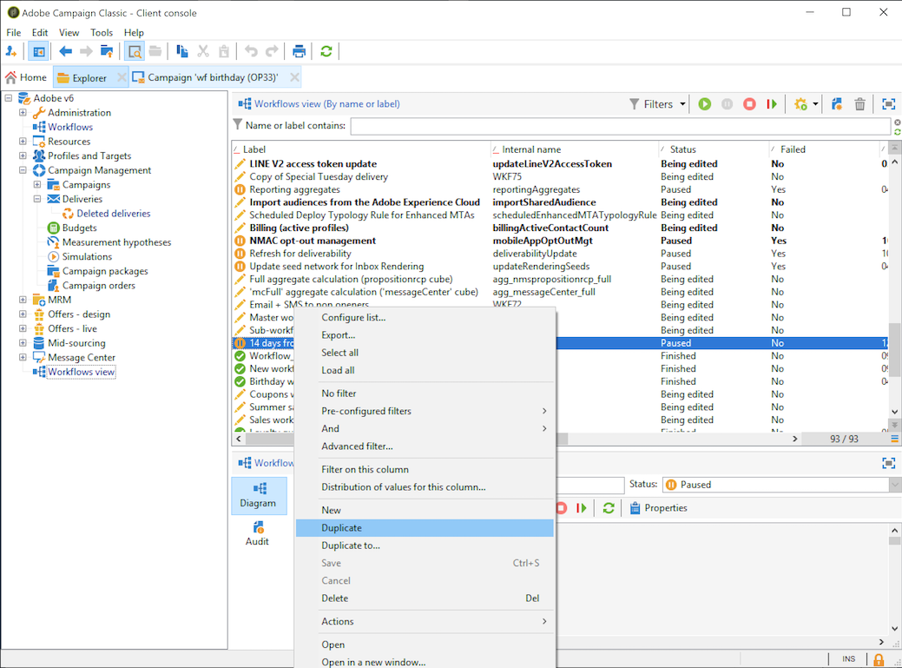

# 构建工作流 {#building-a-workflow}

此部分详细介绍在Campaign中构建工作流的主要原则和最佳实践。

* 创建工作流，请参见 [创建新工作流](#creating-a-new-workflow)
* 设计工作流图，请参见 [添加和链接活动](#adding-and-linking-activities)
* 访问活动的参数和属性，请参阅 [配置活动](#configuring-activities)
* 设计定位工作流，请参阅 [定位工作流](#targeting-workflows)
* 使用工作流执行活动，请参阅 [活动工作流](#campaign-workflows)
* 访问和创建技术工作流，请参阅 [技术工作流](#technical-workflows)
* 使用模板创建工作流，请参阅 [工作流模板](#workflow-templates)

## 创建新工作流 {#creating-a-new-workflow}

从 **[!UICONTROL Explorer]**，访问工作流文件夹。 默认情况下，您可以使用 **[!UICONTROL Profiles and Targets]** > **[!UICONTROL Jobs]** > **[!UICONTROL Targeting workflows]**.

单击 **[!UICONTROL New]** 按钮时，单击此按钮可访问工作流列表。

或者，您也可以使用 **[!UICONTROL Create]** 按钮(**[!UICONTROL Monitoring]** > **[!UICONTROL Workflow]** 链接)。

输入标签并单击 **[!UICONTROL Save]**.

>[!NOTE]
>
>修改工作流活动的内部名称或工作流本身时，请确保在关闭工作流之前先保存该工作流，以便正确考虑新的内部名称。

## 添加和链接活动 {#adding-and-linking-activities}

您现在必须定义各种活动，并在图表中将它们链接在一起。 在配置的此阶段，我们可以看到图标签和工作流状态（正在编辑）。 窗口的下部仅用于编辑图。 它包含一个工具栏、活动面板（位于左侧）以及图表本身（位于右侧）。

>[!NOTE]
>
>如果未显示面板，请单击工具栏上的第一个按钮以显示面板。

活动按类别分组到了面板的不同选项卡中。 可用选项卡和活动会因工作流类型（技术、定位或活动工作流）而异。

* 第一个选项卡包含定位和数据操作活动。 有关这些活动的详情，请参见 [定位活动](about-targeting-activities.md).
* 第二个选项卡包含计划活动，主要用于协调其他活动。 有关这些活动的详情，请参见 [流量控制活动](about-flow-control-activities.md).
* 第三个选项卡包含可在工作流中使用的工具和操作。 有关这些活动的详情，请参见 [操作活动](about-action-activities.md).
* 第四个选项卡包含依赖于给定事件的活动，如接收电子邮件或文件到达服务器。 有关这些活动的详情，请参见 [事件活动](about-event-activities.md).

创建图

1. 通过在面板中选择某个活动并使用拖放操作将其移至图表中来添加该活动。

   添加 **开始** 活动，然后是 **投放** 活动图。

   

1. 通过拖动 **开始** 活动过渡并将其放置到 **投放** 活动。

   

   通过将新活动放在过渡的末尾，您可以自动将活动链接到上一个活动。

1. 添加所需的活动并将它们链接在一起，如下图所示。

   

>[!CAUTION]
>
>您可以在同一工作流中复制并粘贴活动。 但是，我们不建议跨不同的工作流复制并粘贴活动。 某些附加到活动（如投放和计划程序）的设置可能会导致执行目标工作流时出现冲突和错误。 为此，我们建议您  **复制** 工作流。 有关更多信息，请参阅 [复制工作流](#duplicating-workflows).

您可以使用以下元素更改图表的显示和布局：

* **使用工具栏**

  通过图编辑工具栏，您可以访问工作流的布局和执行功能。

  

  这使您可以调整编辑工具的布局：面板的显示以及图形对象的概述、大小和对齐方式。

  

  以下各节详细介绍了与进度和日志显示相关的图标：

   * [显示进度](../../workflow/using/monitoring-workflow-execution.md#displaying-progress)
   * [显示日志](../../workflow/using/monitoring-workflow-execution.md#displaying-logs)

* **对象对齐方式**

  要对齐图标，请选择图标并单击 **[!UICONTROL Align vertically]** 或 **[!UICONTROL Align horizontally]** 图标。

  使用 **CTRL** 键可选择多个分散的活动，或取消选择一个或多个活动。 单击图表背景取消选择所有内容。

* **映像管理**

  您可以自定义图表的背景图像以及与各种活动相关的图像。 请参阅 [更改活动图像](managing-activity-images.md).

## 配置活动 {#configuring-activities}

双击某个活动以进行配置，或右键单击并选择 **[!UICONTROL Open...]**.

>[!NOTE]
>
>中详细介绍了活动工作流活动 [本节](about-activities.md).

第一个选项卡包含基本配置。 此 **[!UICONTROL Advanced]** 选项卡包含其他参数，专门用于定义遇到错误时的行为、指定活动的执行持续时间以及输入初始化脚本。

为了更好地了解活动并提高工作流的清晰度，您可以在活动中输入注释：当操作员滚动到活动上时，会自动显示这些注释。

## 定位工作流 {#targeting-workflows}

定向工作流使您能够构建多个投放目标。 您可以通过工作流活动创建查询、根据特定标准定义联合或排除项、添加计划。 此定位的结果可自动传输到充当投放操作目标的列表中

除了这些活动之外，数据管理选项还允许您处理数据和访问高级功能，以满足复杂的定位问题。 有关详细信息，请参见 [数据管理](targeting-data.md#data-management).

所有这些活动都可以在第一个工作流选项卡中找到。

>[!NOTE]
>
>有关定位活动的详情，请参见 [本节](about-activities.md).

可以通过创建和编辑定位工作流 **[!UICONTROL Profiles and Targets > Jobs > Targeting workflows]** Adobe Campaign节点，或者通过 **[!UICONTROL Profiles and Targets > Targeting workflows]** 主页的菜单。

营销活动框架中的定位工作流存储在所有营销活动工作流中。

### 创建定位工作流程的关键步骤 {#implementation-steps-}

以下各节详细介绍了创建定位工作流的步骤：

1. **识别** 数据库中的数据 — 请参阅 [创建查询](targeting-data.md#creating-queries)
1. **准备** 数据以满足交付需求 — 请参阅 [丰富和修改数据](targeting-data.md#enriching-and-modifying-data)
1. **使用** 要执行更新或在投放中执行更新的数据 — 请参阅 [更新数据库](how-to-use-workflow-data.md#updating-the-database)

定位期间执行的所有扩充和所有处理的结果在个性化字段中存储和访问，尤其是在创建个性化消息时使用。 有关详细信息，请参见 [目标数据](data-life-cycle.md#target-data)

### 定位和筛选维度 {#targeting-and-filtering-dimensions}

在数据分段操作过程中，定位键将映射到筛选维度。定位维度可让您定义操作的目标人群：收件人、合同受益人、操作人员、订阅者等。筛选维度可让您根据特定标准选择人群：合同持有人、时事通讯订阅者等。

例如，要选择投保人寿保险单时间超过5年的客户，请选择以下目标维度： **客户端** 和以下过滤维度： **合同持有人**. 然后，您可以在查询活动中定义筛选条件

在定位维度选择阶段，界面中仅提供兼容的筛选维度。

这两个维度必须相关。 因此， **[!UICONTROL Filtering dimension]** 列表取决于在第一个字段中指定的定向维度。

例如，对于收件人(**收件人**)，则以下筛选维度将可用：

而为 **Web应用程序**，该列表将包含以下过滤维度：

## 活动工作流 {#campaign-workflows}

对于每个营销策划，您可以创建要从其中执行的工作流。 **[!UICONTROL Targeting and workflows]** 选项卡。 这些工作流特定于营销活动。

此选项卡包含与所有工作流相同的活动。 [了解详情](#implementation-steps-)

除了定位活动之外，通过活动工作流还可完全为所有可用渠道创建和配置投放。 在工作流中创建后，即可从营销策划的仪表板中访问这些投放。 [了解详情](../../campaign/using/marketing-campaign-deliveries.md)

所有活动工作流都集中在 **[!UICONTROL Administration > Production > Objects created automatically > Campaign workflows]** 节点。

中详细介绍了活动工作流和实施示例 [此页面](../../campaign/using/marketing-campaign-deliveries.md#building-the-main-target-in-a-workflow).

## 技术工作流 {#technical-workflows}

Adobe Campaign中提供了现成的技术工作流。 它们是计划在服务器上定期执行的操作或作业。 它们允许您对数据库进行维护，转发有关投放的跟踪信息，以及设置投放的临时流程。 技术工作流可通过进行配置 **[!UICONTROL Administration > Production > Technical workflows]** 节点。

本机模板可用于创建技术工作流。 它们可以根据您的需求进行配置。

此 **[!UICONTROL Campaign process]** 子文件夹集中了执行活动内流程所需的工作流：任务通知、库存管理、成本计算等。

>[!NOTE]
>
>随每个模块一起安装的技术工作流列表可在 [专用部分](about-technical-workflows.md).

您可以在中创建其他技术工作流 **[!UICONTROL Administration > Production > Technical workflows]** 树结构的节点。 但是，此过程是为专家用户保留的。

提供的活动与定位工作流相同。 [了解详情](#implementation-steps-)

## 工作流模板 {#workflow-templates}

工作流模板包含属性的整体配置，还可能包含图表中连接的一系列活动。 此配置可重复用于创建包含一定数量预配置元素的新工作流

您可以基于现有模板创建新工作流模板，或直接将工作流更改为模板。

工作流模板存储在中 **[!UICONTROL Resources > Templates > Workflow templates]** Adobe Campaign树的节点。

除了常规工作流属性之外，模板属性还允许您为基于此模板创建的工作流指定执行文件。

## 复制工作流 {#duplicating-workflows}

您可以复制不同类型的工作流。 复制后，对工作流的修改不会转移到工作流的副本中。

>[!CAUTION]
>
>可在工作流中使用复制粘贴功能，但我们建议您使用 **复制**. 复制活动后，将保留其整个配置。 对于投放活动（电子邮件、短信、推送通知……），还会复制附加到活动的投放对象，这可能会导致崩溃。

1. 右键单击工作流。
1. 单击 **复制**.

   

1. 在工作流窗口中，更改工作流标签。
1. 单击&#x200B;**保存**。

复制功能无法直接在营销活动视图中可用。

但是，您可以创建一个视图以显示实例上的所有工作流。 在此视图中，您可以使用以下方式复制工作流 **复制到**.

**创建视图**

1. 在 **资源管理器**，转到在其中创建视图所需的文件夹。
1. 右键单击并转到 **添加新文件夹** > **进程**，选择 **工作流**.

   

新文件夹 **工作流** 创建。

1. 右键单击并选择 **属性**.
1. 在 **限制**，检查 **文件夹是一个视图** 并单击 **保存**.

   

该文件夹现在已填充了实例的所有工作流。

**复制营销活动工作流**

1. 在工作流视图中选择营销活动工作流。
1. 右键单击 **复制到**.
   
1. 更改其标签。
1. 单击&#x200B;**保存**。

您可以在工作流视图中查看重复的工作流。
