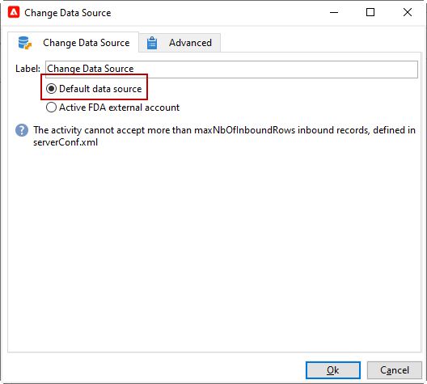

# 更改数据源 {#change-data-source}

>[!NOTE]
>
> 此 **[!UICONTROL Change data source]** 活动仅适用于 **[!UICONTROL Access to external data (Federated Data Access)]** 包。 有关Adobe Campaign Classic内置软件包的更多信息，请参阅此 [页面](../../installation/using/installing-campaign-standard-packages.md).

此 **[!UICONTROL Change data source]** 活动允许您更改工作流的数据源 **[!UICONTROL Working table]**. 这为跨不同数据源（如FDA、FFDA和本地数据库）管理数据提供了更大的灵活性。

此 **[!UICONTROL Working table]** 允许Adobe Campaign Classic工作流处理数据并与工作流活动共享数据。
默认情况下， **[!UICONTROL Working table]** 是在与我们查询的数据源相同的数据库中创建的。

例如，在查询 **[!UICONTROL Profiles]** 表，存储在云数据库中，您将创建 **[!UICONTROL Working table]** 在同一云数据库上。
要更改此项，您可以添加 **[!UICONTROL Change Data Source]** 活动，为您的选择其他数据源 **[!UICONTROL Working table]**.

请注意，在使用时 **[!UICONTROL Change Data Source]** 活动，则需要切换回云数据库才能继续执行工作流。

要使用 **[!UICONTROL Change Data Source]** 活动：

1. 创建工作流.

1. 使用查询定向收件人 **[!UICONTROL Query]** 活动。

   欲知关于 **[!UICONTROL Query]** 活动，请参阅此 [页面](../../workflow/using/query.md#creating-a-query).

1. 从 **[!UICONTROL Targeting]** 选项卡，添加 **[!UICONTROL Change data source]** 活动。

   

1. 双击 **[!UICONTROL Change data source]** 要选择的活动 **[!UICONTROL Default data source]**.

   然后，包含查询结果的工作表将移至默认的PostgreSQL数据库。

   

1. 从 **[!UICONTROL Actions]** 选项卡，拖放 **[!UICONTROL JavaScript code]** 对工作表执行单一操作的活动。

   欲知关于 **[!UICONTROL JavaScript code]** 活动，请参阅 [JavaScript代码和高级JavaScript代码](../../workflow/using/sql-code-and-javascript-code.md#javascript-code) 页面。

1. 添加另一个 **[!UICONTROL Change data source]** 活动以切换回云数据库。

1. 双击活动并选择 **[!UICONTROL Active FDA external account]** 则相应的 **[!UICONTROL External database]** 外部帐户。

   

1. 您现在可以启动工作流。
