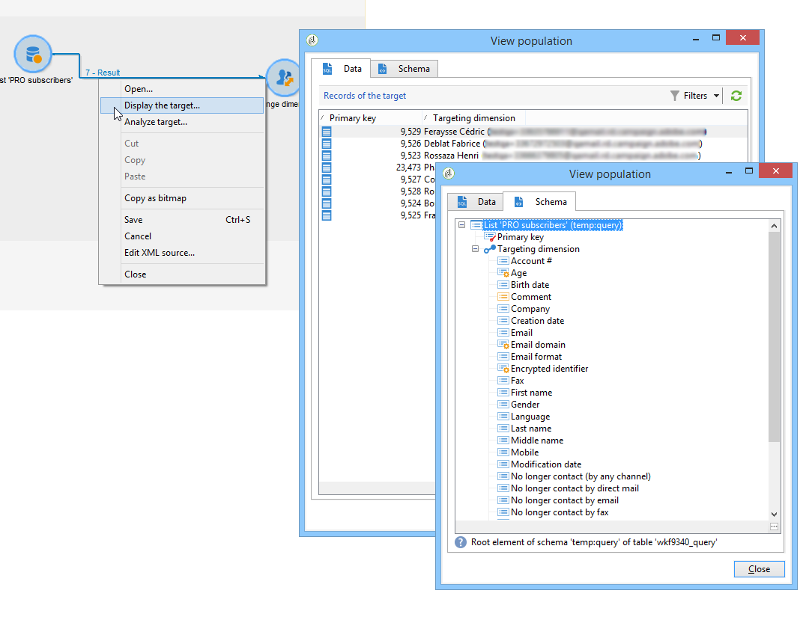

# 更改维度{#change-dimension}

通过更改维活动，您可以在目标构建周期中更改定位维。 轴偏移取决于数据模板和输入维度。 这允许您从“合同”维切换到“客户”维。

您还可以使用此活动定义新目标的其他列。

可以定义重复数据消除标准。

## 配置模式 {#configuration-mode}

要配置更改维活动，请应用以下步骤：

1. 通过字段选择新的定位 **[!UICONTROL Change dimension]** 维。

   

1. 在尺寸更改过程中，您可以保留所有元素或选择要保留在输出中的元素。 在以下示例中，最大值。 重复项数设置为2。

   

   当您选择仅保留一条记录时，工作架构中会显示一个集合：此集合表示在最终结果中不会定位的所有记录（因为只保留一个记录）。 与所有其他集合一样，此集合允许您计算列中的聚合或恢复信息。

   例如，如果将维更 **[!UICONTROL Customers]** 改为维， **[!UICONTROL Recipients]** 则可以在添加购买次数的同时瞄准特定商店的客户。

1. 如果选择不保留所有这些信息，则可以配置复制管理模式。

   

   蓝色箭头允许您定义重复的处理优先级。

   在上例中，收件人将首先在其电子邮件地址上删除重复项，然后根据需要在其帐户号码上删除重复项。

1. 该选 **[!UICONTROL Result]** 项卡允许您添加其他信息。

   例如，您可以使用子字符串类型函数根据邮政编码恢 **复县** 。 操作步骤：

   * 单击链 **[!UICONTROL Add data...]** 接并选择 **[!UICONTROL Data linked to the filtering dimension]**。

      

      >[!NOTE]
      >
      >有关创建和管理其他列的信息，请参阅添 [加数据](../../workflow/using/query.md#adding-data)。

   * 选择上一个定位维（在轴切换之前），在收 **[!UICONTROL Zip Code]** 件人的子树中 **[!UICONTROL Location]** 选择，然后单击 **[!UICONTROL Edit expression]**。

      

   * 单击 **[!UICONTROL Advanced selection]** 并选择 **[!UICONTROL Edit the formula using an expression]**。

      

   * 使用列表中提供的函数并指定要执行的计算。

      

   * 最后，输入刚刚创建的列的标签。

      

1. 执行工作流以查看此配置的结果。 比较更改维活动前后表中的数据，并比较工作流表的结构，如下例所示：

   

   

