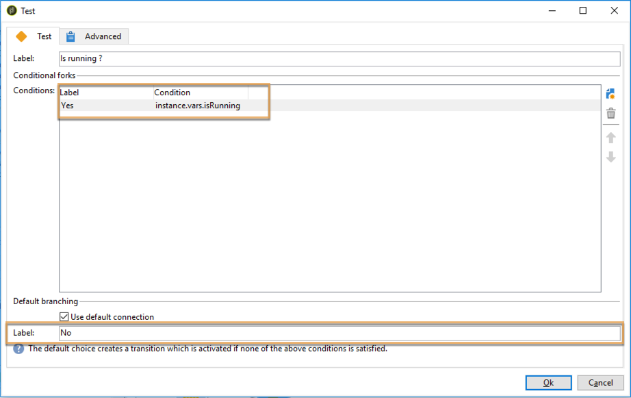

# 协调数据更新{#coordinating-data-updates}

此用例详细介绍了如何创建工作流，利用该工作流，您可以在使用工作流的多次执行时管理伴随的更新。

目的是在执行另一更新操作之前检查更新过程是否已结束。 为此，我们将设置一个实例变量，并让工作流测试实例是否正在运行，以确定是否继续执行工作流并执行更新。

此工作流由以下部分组成：

* **调度程序**&#x200B;活动，该活动在特定频率上执行工作流。
* **测试**&#x200B;活动，用于检查工作流是否已执行。
* **** 查询并 **更** 新数据活动，以防工作流尚未执行，然后返回一个结束活动， **** 该活动将工作流实例变量重新初始化为false。
* 如果工作流已在执行，则&#x200B;**结束**&#x200B;活动。

要构建工作流，请执行以下步骤：

1. 添加&#x200B;**调度程序**&#x200B;活动，然后根据需要配置其频率。
1. 添加&#x200B;**Test**&#x200B;活动以检查工作流是否已执行，然后按照以下方式对其进行配置。

   >[!NOTE]
   >
   >“isRunning”是我们为此示例选择的实例变量名称。 这不是内置变量。

   

1. 将&#x200B;**End**&#x200B;活动添加到&#x200B;**No**&#x200B;分支中。 这样，如果工作流已在执行，则不会执行任何操作。
1. 将所需的活动添加到&#x200B;**Yes**&#x200B;分支中。 在本例中， **Query**&#x200B;和&#x200B;**更新数据**&#x200B;活动。
1. 打开第一个活动，然后在&#x200B;**[!UICONTROL Advanced]**&#x200B;选项卡中添加&#x200B;**instance.vars.isRunning = true**&#x200B;命令。 这样，实例变量将设置为正在运行。

   

1. 在&#x200B;**[!UICONTROL Yes]**&#x200B;分支的末尾添加&#x200B;**End**&#x200B;活动，然后在&#x200B;**[!UICONTROL Advanced]**&#x200B;选项卡中添加&#x200B;**instance.vars.isRunning = false**&#x200B;命令。

   这样，只要执行工作流，就不会执行任何操作。

   

**相关主题：**

* [防止同时执行多次](monitoring-workflow-execution.md#preventing-simultaneous-multiple-executions)
* [更新数据活动](update-data.md)
