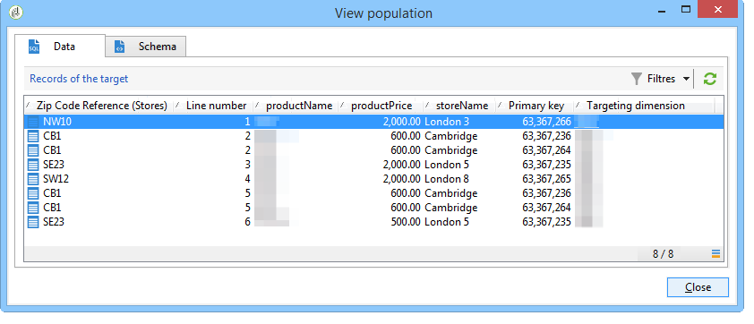

# 创建摘要列表{#creating-a-summary-list}

此用例详细介绍了工作流的创建过程，在收集文件并遵循多个扩充后，您可以创建摘要列表。 此示例基于在商店购买的联系人列表。


使用以下数据结构：


其目的是：

* 使用扩充活动的各种选项
* 在对帐之后更新数据库中的数据
* 创建丰富数据的全球“视图”

要创建摘要列表，您需要执行以下步骤：

1. 在工作流的工作表中收集和加载“购买”文件
1. 通过创建指向引用表的链接来丰富导入的数据
1. 使用丰富的数据更新“购买”表
1. 用“采购”表中的聚合计算丰富“联系人”数据
1. 创建摘要列表

## 第1步：加载文件并协调导入的数据 {#step-1--loading-the-file-and-reconciling-the-imported-data}

要加载的数据是与“购买”相关的数据，其格式如下：

```
Product Name;Product price;Store
Computer;2000;London 3
Tablet;600;Cambridge
Computer;2000;London 5
Comptuer;2000;London 8
Tablet;600;Cambridge
Phone;500;London 5
```

此数据包含在“Purchases.txt”文本文件中。

1. 将文件收集器 **和** 数 **据加载（文件）** 活动添加到工作流。

   通过 **文件收集器** 活动，您可以收集文件并将文件从Adobe Campaign服务器发送到服务器。

   通过 **数据加载（文件）活动** ，您可以使用收集的数据丰富工作流的工作表。

   有关此活动的详细信息，请 [参阅从文件加载数据](../../workflow/using/importing-data.md#loading-data-from-a-file)。

1. 配置 **文件收集器** 活动，从所选目录收集文本(*.txt)类型文件。

   

   通过 **文件收集器** 活动，可以管理源目录中文件的缺失情况。 要执行此操作，请选中 **[!UICONTROL Process file nonexistence]** 选项。 在此工作流中，如果 **在收集时** ，该目录中缺少一个等待活动，则已添加该以尝试其他文件集合。

1. 使用与 **要导入的活动格式相同的示例文件** ，配置数据加载（文件）。

   

   单击链 **[!UICONTROL Click here to change the file format...]** 接以使用“购买”表的内部名称和标签重命名这些列。

   

导入数据后，通过创建与“商店”扩充匹配的引用表的链接来执行模式。

添加扩充活动并按如下方式进行配置：

1. 从“数据加载（文件）”活动 **中选择由组成的主集** 。

   

1. 单击 **[!UICONTROL Add data]**，然后选择 **[!UICONTROL A link]** 选项。

   

1. 选择选 **[!UICONTROL Define a collection]** 项。
1. 选择“商店”模式作为目标。

   

有关各种链接的详细信息，请参 [阅丰富和修改数据](../../workflow/using/targeting-data.md#enriching-and-modifying-data)。

在以下窗口中，您需要通过选择源字段（在主集中）和目标字段(属于“商店”模式)来创建连接条件，以配置数据协调。


现在链接已创建，我们将从“商店”模式向工作流的工作表中添加一列：“ZipCode Reference”字段。

1. 打开扩充活动。
1. 单击 **[!UICONTROL Edit additional data]**.
1. 将“ZipCode Reference”字段添加到 **[!UICONTROL Output columns]**。


此扩充后，工作流的工作表中的数据将如下：



## 第2步：将丰富数据写入“购买”表 {#step-2--writing-enriched-data-to-the--purchases--table}

此步骤详细说明如何将导入的和丰富的数据写入“购买”表。 为此，我们需要使用更新 **数据活动** 。

在更新“购买”(Purchases)表中的数据之前，必须对工作流的工作 **表中的定位维度** 和“购买”(Purchases)之 **间进** 行协调。

1. 单击扩充 **[!UICONTROL Reconciliation]** 活动的选项卡。
1. 选择定位维度，在此例中为“购买”模式。
1. 为工作流表中的数据选择“源表达式”（本例中为“storeName”字段）。
1. 在“购买”表（本例中为“storename”字段）中为表达式选择“目标”。
1. 勾选 **[!UICONTROL Keep unreconciled data coming from the work table]** 选项。


在“更 **新活动** ”中，需要以下配置：

1. 在字段 **[!UICONTROL Insert or update]** 中选择选 **[!UICONTROL Operation type]** 项，以避免每次收集文件时创建新记录。
1. 选择 **[!UICONTROL By directly using the targeting dimension]** 选项的 **[!UICONTROL Record identification]** 值。
1. 选择“购买”模式作为 **[!UICONTROL Document type]**。
1. 指定要更新的字段的列表。 该 **[!UICONTROL Destination]** 列允许您定义“购买”模式的字段。 该 **[!UICONTROL Expression]** 列允许您选择工作表中的字段以执行映射。
1. 单击选 **[!UICONTROL Generate an outbound transition]** 项。


## 第3步：丰富“联系人”数据 {#step-3--enriching--contact--data-}

“联系人”模式实际上与“购买”模式关联。 这意味着您可以使用“扩充”选项的其他选项：添加链接到过滤维度的数据。

此第二个扩充的目的是为购买模式创建一个聚合，以计算每个已识别联系人的总购买量。

1. 添加 **查询** 类型活动，可恢复存储的 **所有联系** 人。
1. 添加 **扩充** 活动，然后选择前一个查询生成的主集。
1. 单击“添加 **[!UICONTROL Data]**”。
1. 单击选 **[!UICONTROL Data linked to the targeting dimension]** 项。
1. 单击窗 **[!UICONTROL Data linked to the filtering dimension]** 口中的选 **[!UICONTROL Select fields to add]** 项。
1. Select the **[!UICONTROL Purchases]** node then click **[!UICONTROL Next]**.

   

1. 通过选 **[!UICONTROL Collected data]** 择选项更改字 **[!UICONTROL Aggregates]** 段。

   

1. 单击 **[!UICONTROL Next]**.
1. 添加以下表达式以计算每个联系人的购买总额：&quot;Sum(@prodprice)&quot;。

   

要准备摘要列表，您需要从“购买”字段和第一个扩充添加字段：“ZipCode Reference”字段。

1. 单击扩充 **[!UICONTROL Edit additional data...]** 活动中的链接。
1. 添加“商店名称”和“购买／邮政编码引用”字段。

   

1. 单击选 **[!UICONTROL Properties]** 项卡。
1. 更改第二个链接以仅创建一行。

   

## 第4步：创建和添加到摘要列表 {#step-4--creating-and-adding-to-a-summary-list}

最后一步是将所有丰富的数据写入列表。

1. 将列表 **更新** 活动添加到工作流。 此活动必须链接到第二个扩充活动的出站过渡。
1. 选择选 **[!UICONTROL Create the list if necessary (Calculated name)]** 项。
1. 为计算的名称选择一个值。 为列表选择的标签是当前日期：&lt;%= formatDate(new Date(), &quot;%2D/%2M/%2Y&quot;)%>。

执行工作流后，列表将包括：

* 一列表联系人，
* “购买总数”列，
* “商店名称”列，
* 为包含在商店引用模式中的所有商店输入“邮政编码引用”列。


