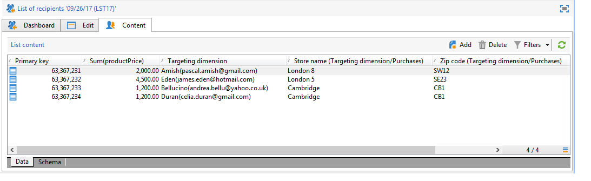

# 创建摘要列表{#creating-a-summary-list}

此用例详细介绍了如何创建工作流，在收集文件并进行多项扩充后，您可以创建摘要列表。 此示例基于在商店中购物的联系人列表。


使用以下数据结构：


其目的是：

* 使用扩充活动的各种选项
* 在协调之后更新数据库中的数据
* 创建扩充数据的全局“视图”

要创建摘要列表，您需要执行以下步骤：

1. 在工作流的工作表中收集和加载“购买”文件
1. 通过创建指向参考表的链接来扩充导入的数据
1. 使用扩充的数据更新“购买”表
1. 从“购买”表中用聚合计算扩充“联系人”数据
1. 创建摘要列表

## 步骤1:加载文件并协调导入的数据{#step-1--loading-the-file-and-reconciling-the-imported-data}

要加载的数据是与“Purchase”相关的数据，其格式如下：

```
Product Name;Product price;Store
Computer;2000;London 3
Tablet;600;Cambridge
Computer;2000;London 5
Comptuer;2000;London 8
Tablet;600;Cambridge
Phone;500;London 5
```

此数据包含在“Purchases.txt”文本文件中。

1. 将&#x200B;**文件收集器**&#x200B;和&#x200B;**数据加载（文件）**&#x200B;活动添加到工作流中。

   通过&#x200B;**文件收集器**&#x200B;活动，您可以从Adobe Campaign服务器收集文件并将其发送到File服务器。

   **数据加载（文件）**&#x200B;活动允许您使用收集的数据扩充工作流的工作表。

   有关此活动的更多信息，请参阅[从文件](../../platform/using/import-export-workflows.md#loading-data-from-a-file)加载数据。

1. 配置&#x200B;**文件收集器**&#x200B;活动，以从选定目录收集文本(*.txt)类型文件。

   

   通过&#x200B;**文件收集器**&#x200B;活动，可以管理源目录中缺少文件的情况。 要执行此操作，请选中&#x200B;**[!UICONTROL Process file nonexistence]**&#x200B;选项。 在此工作流中，添加了&#x200B;**Wait**&#x200B;活动，以尝试其他文件集合（如果在收集时目录中缺少该文件集合）。

1. 使用与要导入的数据格式相同的样例文件配置&#x200B;**数据加载（文件）**&#x200B;活动。

   

   单击&#x200B;**[!UICONTROL Click here to change the file format...]**&#x200B;链接，以使用“购买”表的内部名称和标签重命名列。

   

导入数据后，通过创建指向与“存储”模式匹配的参考表的链接来进行扩充。

添加扩充活动并按如下方式对其进行配置：

1. 从&#x200B;**数据加载（文件）**&#x200B;活动中选择由数据组成的主集。

   

1. 单击&#x200B;**[!UICONTROL Add data]**，然后选择&#x200B;**[!UICONTROL A link]**&#x200B;选项。

   

1. 选择&#x200B;**[!UICONTROL Define a collection]**&#x200B;选项。
1. 选择“存储”架构作为目标。

   

有关各种类型链接的更多信息，请参阅[扩充和修改数据](../../workflow/using/targeting-data.md#enriching-and-modifying-data)。

在以下窗口中，您需要通过选择源字段（在主集中）和目标字段（属于“存储”架构）来创建连接条件，以配置数据协调。


现在，链接已创建，接下来我们将从“存储”架构向工作流的工作表添加一列：“邮政编码参考”字段。

1. 打开扩充活动。
1. 单击 **[!UICONTROL Edit additional data]**。
1. 在&#x200B;**[!UICONTROL Output columns]**&#x200B;中添加“ZipCode引用”字段。


此扩充后工作流工作表中的数据将如下所示：


## 步骤2:将扩充数据写入“购买”表{#step-2--writing-enriched-data-to-the--purchases--table}

此步骤详细介绍如何将导入和扩充的数据写入“购买”表。 为此，我们需要使用&#x200B;**更新数据**&#x200B;活动。

在更新&#x200B;**Purchases**&#x200B;表中的数据之前，必须对工作流工作表中的数据与&#x200B;**Purchases**&#x200B;定向维度进行协调。

1. 单击扩充活动的&#x200B;**[!UICONTROL Reconciliation]**&#x200B;选项卡。
1. 选择定向维度，在此例中为“购买”架构。
1. 为工作流表中的数据选择“源表达式”（在本例中为“storeName”字段）。
1. 在“购买”表中为数据选择“目标表达式”（在本例中为“存储重命名”字段）。
1. 勾选 **[!UICONTROL Keep unreconciled data coming from the work table]** 选项。


在&#x200B;**更新数据**&#x200B;活动中，需要以下配置：

1. 在&#x200B;**[!UICONTROL Operation type]**&#x200B;字段中选择&#x200B;**[!UICONTROL Insert or update]**&#x200B;选项，以避免在每次收集文件时创建新记录。
1. 为&#x200B;**[!UICONTROL Record identification]**&#x200B;选项选择&#x200B;**[!UICONTROL By directly using the targeting dimension]**&#x200B;值。
1. 选择“购买”架构作为&#x200B;**[!UICONTROL Document type]**。
1. 指定要更新的字段列表。 **[!UICONTROL Destination]**&#x200B;列允许您定义“购买”架构的字段。 **[!UICONTROL Expression]**&#x200B;列允许您选择工作表中的字段以执行映射。
1. 单击&#x200B;**[!UICONTROL Generate an outbound transition]**&#x200B;选项。


## 步骤3:扩充“联系人”数据{#step-3--enriching--contact--data-}

“联系人”架构实际上已链接到“购买”架构。 这意味着您可以使用“扩充”选项的其他选项：添加链接到过滤维度的数据。

第二次扩充的目的是在购买架构上创建聚合，以计算每个已识别联系人的总购买量。

1. 添加&#x200B;**查询**&#x200B;类型活动，以便恢复所有存储的&#x200B;**联系人**。
1. 添加&#x200B;**扩充**&#x200B;活动，然后选择从上一个查询生成的主集。
1. 单击添加&#x200B;**[!UICONTROL Data]**。
1. 单击&#x200B;**[!UICONTROL Data linked to the targeting dimension]**&#x200B;选项。
1. 单击&#x200B;**[!UICONTROL Select fields to add]**&#x200B;窗口中的&#x200B;**[!UICONTROL Data linked to the filtering dimension]**&#x200B;选项。
1. 选择&#x200B;**[!UICONTROL Purchases]**&#x200B;节点，然后单击&#x200B;**[!UICONTROL Next]**。

   

1. 选择&#x200B;**[!UICONTROL Aggregates]**&#x200B;选项以更改&#x200B;**[!UICONTROL Collected data]**&#x200B;字段。

   

1. 单击 **[!UICONTROL Next]**。
1. 添加以下表达式以计算每个联系人的购买总数：&quot;Sum(@prodprice)&quot;。

   

要准备摘要列表，您需要添加“购买”字段和第一个扩充中的字段：“邮政编码参考”字段。

1. 单击扩充活动中的&#x200B;**[!UICONTROL Edit additional data...]**&#x200B;链接。
1. 添加“商店名称”和“购买/邮政编码参考”字段。

   

1. 单击&#x200B;**[!UICONTROL Properties]**&#x200B;选项卡。
1. 更改第二个链接以仅创建一行。

   

## 步骤4:创建摘要列表并将其添加到{#step-4--creating-and-adding-to-a-summary-list}

最后一步是将所有扩充数据写入列表。

1. 向工作流中添加&#x200B;**List update**&#x200B;活动。 此活动必须链接到第二个扩充活动的叫客过渡。
1. 选择&#x200B;**[!UICONTROL Create the list if necessary (Calculated name)]**&#x200B;选项。
1. 为计算名称选择一个值。 为列表选择的标签是当前日期：&lt;%= formatDate(new Date(), &quot;%2D/%2M/%2Y&quot;)%>。

执行工作流后，列表将包括：

* 联系人名单，
* “总购买”栏，
* “商店名称”列，
* 为存储引用架构中包含的所有存储输入“邮政编码引用”列。


