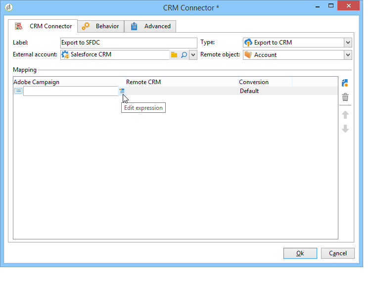

# CRM Connector{#crm-connector}

通过 **CRM连接** ，您可以在Adobe Campaign和CRM之间配置数据同步。

有关Adobe Campaign中CRM连接器的详细信息，请参阅此 [部分](../../platform/using/crm-connectors.md)。

这意味着您可以：

* 从CRM导入(请参 [阅从CRM导入](#importing-from-the-crm)),
* 导出到CRM(请参 [阅导出到CRM](#exporting-to-the-crm)),
* 导入在CRM中删除的对象(请参 [阅在CRM中删除的导入对象](#importing-objects-deleted-in-the-crm)),
* 删除CRM中的对象(请参 [阅删除CRM中的对象](#deleting-objects-in-the-crm))。


选择与要配置同步的CRM匹配的外部帐户，然后选择要同步的对象（帐户、业务机会、联系人等）。


此活动的配置取决于要执行的过程。 下面详细介绍了各种配置。

## 从CRM导入 {#importing-from-the-crm}

要在Adobe Campaign中通过CRM导入数据，您需要创建以下类型的工作流：


对于导入活动,CRM **连接器活动配** 置步骤：

1. 选择一个 **[!UICONTROL Import from the CRM]** 操作。
1. 转到下 **[!UICONTROL Remote object]** 拉列表，选择进程所关注的对象。 此对象与连接器配置期间在Adobe Campaign中创建的一个表重合。
1. 转到部 **[!UICONTROL Remote fields]** 分并输入要导入的字段。

   要添加字段，请单击工 **[!UICONTROL Add]** 具栏中的按钮，然后单击 **[!UICONTROL Edit expression]** 图标。

   

   如有必要，可通过列的下拉列表更改数据格 **[!UICONTROL Conversion]** 式。 本页详细介绍了可能的转 [化类型](../../platform/using/crm-connectors.md#data-format)。

   >[!CAUTION]
   >
   >对于在CRM中和在Adobe Campaign中链接对象，CRM中记录的标识符是必需的。 活动获得批准后，系统会自动添加该组件。
   > 
   >对于增量数据导入，CRM端的上次修改日期也是必需的。

1. 您还可以根据需要过滤要导入的数据。 为此，请单击链 **[!UICONTROL Edit the filter...]** 接。

   在以下示例中，Adobe Campaign将仅导入自2012年7月31日以来已记录某些活动的联系人。

   

   与数据过滤模式链接的限制在数据过滤 [部分中有详细](#filter-on-data) 说明。

1. 通过 **[!UICONTROL Use automatic index]** 此选项，您可以根据日期和Adobe Campaign的上次修改情况，自动管理CRM和客户之间的增量对象同步。

   For more on this, refer to [Variable management](#variable-management).

## 变量管理 {#variable-management}

启用该 **[!UICONTROL Automatic index]** 选项后，您只能收集自上次导入以来修改的对象。


上次同步的日期默认存储在配置窗口中指定的选项中：

```
LASTIMPORT_<%=instance.internalName%>_<%=activityName%>
```

您可以指定要考虑的远程CRM字段，以标识最新更改。

默认情况下，将使用以下字段（按指定顺序）:

* 对于Microsoft Dynamics: **修改**,
* 对于Oracle On Demand: **LastUpdated**、 **ModifiedDate**、 **LastLoggedIn**、
* 对于Salesforce.com: **LastModifiedDate**、 **SystemModstamp**。

激活选 **[!UICONTROL Automatic index]** 项可生成三个变量，这些变量可通过类型活动在同步工作流 **[!UICONTROL JavaScript code]** 中使用。 这些活动是：

* **varscrmOptionName**:表示包含上次导入日期的选项的名称。
* **vars.crmStartImport**:表示上次开始恢复的日期（包括）。
* **vars.crmEndDate**:表示上次数据恢复的结束日期（已排除）。

   这些日期以下列格式显示： **yyyy/MM/dd hh:mm:ss**。

## 筛选数据 {#filter-on-data}

要确保使用各种CRM进行高效操作，需要使用以下规则创建过滤器:

* 每个过滤级别只能使用一种类型的逻辑运算符。
* 不支持EXCEPT(AND NOT)运算符。
* 比较只能涉及null值(&#39;is empty&#39;/&#39;is not empty&#39; type)或数字。 这意味着，一旦评 **[!UICONTROL Value]** 估了列（右侧列），此评估的结果必须是数字。
* 列中的数 **[!UICONTROL Value]** 据将用JavaScript进行评估。
* 不支持JOIN比较。
* 左栏中的表达式必须是字段。 它不能是多个表达式、数字等的组合。

例如，下面所示的过滤条件对CRM导入无效，因为：

* OR运算符与AND运算符位于同一级别。
* 对文本字符串进行比较。


## 订购依据 {#order-by}

在Microsoft Dynamics和Salesforce.com中，可以按升序或降序对要导入的远程字段进行排序。

为此，请单击链 **[!UICONTROL Order by]** 接并向列表添加列。

列表中的列顺序是排序顺序：


## 记录标识 {#record-identification}

您可以使用在工作流中预先计算的填充，而不是导入CRM中包含（可能已过滤）的元素。

为此，请选择选 **[!UICONTROL Use the population calculated upstream]** 项并指定包含远程标识符的字段。

然后选择要导入的入站人口的字段，如下所示：


## 导出到CRM {#exporting-to-the-crm}

将Adobe Campaign数据导出到CRM中，可将整个内容复制到CRM数据库。

要向CRM导出数据，您需要创建以下类型的工作流：


要进行导出，请将以下配置应用于 **CRM连接器** 活动:

1. 选择一个 **[!UICONTROL Export to CRM]** 操作。
1. 转到下 **[!UICONTROL Remote object]** 拉列表，选择进程所关注的对象。 此对象与连接器配置期间在Adobe Campaign中创建的一个表重合。

   >[!CAUTION]
   >
   >CRM连接器活动的 **导出功能** ，可以在CRM端插入或更新字段。 要在CRM中启用字段更新，您需要指定远程表的主键。 如果缺少密钥，则将插入数据（而不是更新）。

1. 在部 **[!UICONTROL Mapping]** 分中，指定要导出的字段及其在CRM中的映射。

   

   要添加字段，请单击工 **[!UICONTROL Add]** 具栏中的按钮，然后单击 **[!UICONTROL Edit expression]** 图标。

   对于给定字段，如果CRM端未定义匹配项，则无法更新这些值：它们直接插入到CRM中。

   如有必要，可通过列的下拉列表更改数据格 **[!UICONTROL Conversion]** 式。 本节详细介绍了可能的转 [换类型](../../platform/using/crm-connectors.md#data-format)。

   要导出的记录的列表和导出结果将保存在临时文件中，该临时文件在完成或重新启动工作流之前一直可供访问。 这使您能够在出错时再次开始该过程，而不会冒多次导出相同记录或丢失数据的风险。

## 数据格式和错误处理 {#data-format-and-error-processing}

在将数据格式导入CRM或从CRM导入数据格式时，可以立即转换它们。

为此，请选择要在匹配列中应用的转换。


该模 **[!UICONTROL Default]** 式应用自动数据转换，在大多数情况下，这等于数据的复制／粘贴。 但是，时区管理被应用。

其他可能的转换包括：

* **[!UICONTROL Date only]**:此模式将删除“日期+时间”类型字段。
* **[!UICONTROL Without time offset]**:此模式取消在默认模式下应用的时区管理。
* **[!UICONTROL Copy/Paste]**:此模式使用字符串等原始数据（无转换）。


在数据导入或导出框架中，可以对错误和拒绝应用特定流程。 为此，请选择选 **[!UICONTROL Process rejects]** 项 **[!UICONTROL Process errors]** 卡中的和 **[!UICONTROL Behavior]** 选项。

这些选项会放置匹配的出站过渡。


然后，放置与要应用的流程相关的活动。

要处理实例的错误，您可以添加等待活动和计划工作流重试。

拒绝会收集到其错误代码和相关消息，这意味着您可以设置拒绝跟踪以优化同步过程。

即使未启 **[!UICONTROL Process rejects]** 用该选项，也会为每个被拒绝的列生成警告，并显示错误代码和消息。

出站 **[!UICONTROL Reject]** 过渡允许您访问包含与错误消息和代码相关的特定列的输出模式。 以下列为：

* 对于Oracle On Demand: **errorLogFilename** （Oracle端的日志文件名）、 **errorCode** （错误代码）、 **errorSymbol** （错误符号，不同于错误代码）、 **errorMessage** （错误上下文的说明）。
* 对于Salesforce.com: **errorSymbol** （错误符号，与错误代码不同）, **errorMessage** （错误上下文的描述）。

## 导入在CRM中删除的对象 {#importing-objects-deleted-in-the-crm}

要启用广泛的数据同步过程的设置，您可以将CRM中删除的对象导入Adobe Campaign。

为此，请应用以下步骤：

1. 选择一个 **[!UICONTROL Import objects deleted in the CRM]** 操作。
1. 转到下 **[!UICONTROL Remote object]** 拉列表，选择进程所关注的对象。 此对象与连接器配置期间在Adobe Campaign中创建的一个表重合。
1. 在和字段中指定要考虑的删 **[!UICONTROL Start date]** 除期 **[!UICONTROL End date]** 间。 这些日期将包括在该期间内。

   

   >[!CAUTION]
   >
   >元素删除期间必须与CRM特定的限制一致。 这意味着对于Salesforce.com，例如，30天前删除的元素无法恢复。

## 在CRM中删除对象 {#deleting-objects-in-the-crm}

要删除CRM端的对象，您需要指定要删除的远程元素的主键。


通过 **[!UICONTROL Behavior]** 该选项卡可以启用拒绝的处理。 此选项为该过渡生成第二个输出 **[!UICONTROL CRM connector]** 活动。 有关更多信息，请参阅此](../../platform/using/crm-connectors.md#error-processing)章节[。

即使禁用 **[!UICONTROL Process rejects]** 了该选项，也会为每个被拒绝的列生成警告。

## 如何配置联系人导入的示例 {#example-of-how-to-configure-a-contact-import}

在以下示例中，活动配置为从Oracle On Demand CRM导入联系人。 在导入之前，将以某种方式选择CRM字段，使其与Adobe Campaign库中已存在的字段保持一致。


