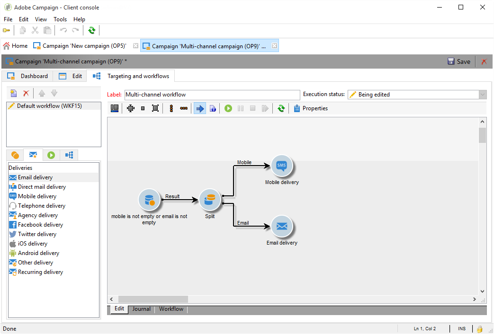

# 跨渠道投放{#cross-channel-deliveries}

跨渠道投放位于活动工作流 **[!UICONTROL Deliveries]** 活动的选项卡中。

它们允许您创建特定投放。 您可以按与经典投放相同的方式指定要基于其的投放向导及其内容。

可用的各种渠道包括：

* [电子邮件](../../delivery/using/about-email-channel.md)
* [直邮](../../delivery/using/about-direct-mail-channel.md)
* [手机](../../delivery/using/sms-channel.md)
* [Twitter](../../social/using/publishing-on-twitter.md)
* [Facebook](../../social/using/publishing-on-facebook.md)
* [iOS](../../delivery/using/creating-notifications.md#sending-notifications-on-ios)
* [Android](../../delivery/using/creating-notifications.md#sending-notifications-on-android)

您可以使用不同的定位目标为工作流上游的投放指定一个活动。

例如，我们将创建一个工作流，在一周后为推送通知订户发送电子邮件或SMS，然后发送推送通知。 操作步骤：

1. 创建营销策划.
1. 在活动 **[!UICONTROL Targeting and workflows]** 的选项卡中，向工作流 **[!UICONTROL Query]** 中添加一个。
1. 配置查询。 例如，在此我们选择订阅推送通知的收件人作为目标维。

   >[!NOTE]
   >
   >对于推送通知，请记住使用订阅 **者应用程序** 目标维。

   

1. 将筛选条件添加到查询。 在这种情况下，我们将选择具有移动号码或电子邮件地址的收件人。

   

1. 在您的 **[!UICONTROL Split]** 工作流中添加活动，将具有移动号码的收件人和具有电子邮件地址的分开。
1. 在选 **[!UICONTROL Delivery]** 项卡中，为每个目标选择一个投放。

   通过在工作流中多次单击投放活动，以与经典投放向导相同的方式创建投放。 有关详细信息，请参见此 [ 页面](../../delivery/using/about-email-channel.md)。

   

1. 添加和配 **[!UICONTROL Wait]** 置活动，以便收件人一次不接收过多投放。
1. 添加一 **[!UICONTROL Split]** 个活动以划分iOS或Android移动应用程序的订阅者。

   为每个操作系统选择一项服务。 For more on service creation, refer to this [page](../../delivery/using/configuring-the-mobile-application.md).

   

1. 为每个操作系统选择并配置移动应用程序投放。

   
