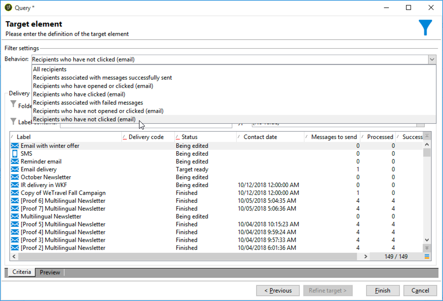

# 跨渠道投放工作流{#cross-channel-delivery-workflow}

此用例展示了一个涉及跨渠道投放工作流的示例。 在[本节](../../workflow/using/cross-channel-deliveries.md)中介绍了跨渠道投放的一般概念。

目标是将受众从收件人库的细分到不同的组，以便向组发送电子邮件，向另一个组发送SMS消息。

此用例的主要实施步骤如下：

1. 创建&#x200B;**[!UICONTROL Query]**&#x200B;活动以目标受众。
1. 创建&#x200B;**[!UICONTROL Email delivery]**&#x200B;活动，其中包含指向优惠的链接。
1. 使用&#x200B;**[!UICONTROL Split]**&#x200B;活动执行以下操作：

   * 向未打开第一封电子邮件的收件人发送另一封电子邮件。
   * 向打开电子邮件但未单击指向优惠的链接的收件人发送短信。
   * 将打开电子邮件并单击链接的收件人添加到数据库。

## 第1步：定位受众{#step-1--targeting-the-audience}

要定义目标，请创建一个查询以标识收件人。

1. 创建营销策划. 如需详细信息，请参阅[此部分](../../campaign/using/setting-up-marketing-campaigns.md#creating-a-campaign)。
1. 在活动的&#x200B;**[!UICONTROL Targeting and workflows]**&#x200B;选项卡中，向工作流中添加&#x200B;**查询**&#x200B;活动。 有关使用此活动的详细信息，请参阅[此部分](../../workflow/using/query.md)。
1. 定义将接收您的投放的收件人。 例如，选择“Gold”成员作为目标维。
1. 为查询添加过滤条件。 在此示例中，选择具有电子邮件地址和移动号码的收件人。

   

1. 保存更改。

## 第2步：创建包含优惠{#step-2--creating-an-email-including-an-offer}的电子邮件

1. 创建&#x200B;**[!UICONTROL Email delivery]**&#x200B;活动，然后在工作流中按住多次单击它进行编辑。 有关创建电子邮件的详细信息，请参阅[此部分](../../delivery/using/about-email-channel.md)。
1. 设计消息并在内容中插入包含优惠的链接。

   

   有关将优惠集成到邮件正文的详细信息，请参阅[本节](../../interaction/using/integrating-an-offer-via-the-wizard.md#delivering-with-a-call-to-the-offer-engine)。

1. 保存更改。
1. 右键单击&#x200B;**[!UICONTROL Email delivery]**&#x200B;活动以打开它。
1. 选择&#x200B;**[!UICONTROL Generate an outbound transition]**&#x200B;选项以恢复人口和跟踪日志。

   

   这样，您就可以使用此信息发送其他投放，具体取决于收件人在收到第一封电子邮件时的行为。

1. 添加&#x200B;**[!UICONTROL Wait]**&#x200B;活动，让收件人几天时间打开电子邮件。

   

## 第3步：对生成的受众{#step-3--segmenting-the-resulting-audience}进行分段

在识别目标并创建第一个投放后，您需要使用过滤条件将目标细分为不同的群体。

1. 将&#x200B;**Split**&#x200B;活动添加到工作流并打开它。 有关使用此活动的详细信息，请参阅[此部分](../../workflow/using/split.md)。
1. 从在查询上游计算的人口创建三个区段。

   

1. 对于第一个子集，选择&#x200B;**[!UICONTROL Add a filtering condition on the inbound population]**&#x200B;选项，然后单击&#x200B;**[!UICONTROL Edit]**。

   

1. 选择&#x200B;**[!UICONTROL Recipients of a delivery]**&#x200B;作为限制过滤器，然后单击&#x200B;**[!UICONTROL Next]**。

   

1. 在过滤器设置中，从&#x200B;**[!UICONTROL Behavior]**&#x200B;下拉列表中选择&#x200B;**[!UICONTROL Recipients who have not opened or clicked (email)]**，然后选择包含要从投放列表发送的优惠的电子邮件。 单击 **[!UICONTROL Finish]**.

   

1. 以同样方式继续第二个子集，并从&#x200B;**[!UICONTROL Behavior]**&#x200B;下拉列表中选择&#x200B;**[!UICONTROL Recipients who have not clicked (email)]**。

   

1. 对于第三个子集，在选择&#x200B;**[!UICONTROL Add a filtering condition on the inbound population]**&#x200B;并单击&#x200B;**[!UICONTROL Edit]**&#x200B;后，选择&#x200B;**[!UICONTROL Use a specific filtering dimension]**&#x200B;选项。
1. 从&#x200B;**[!UICONTROL Filtering dimension]**&#x200B;下拉列表中选择&#x200B;**[!UICONTROL Recipient tracking log]**，从&#x200B;**[!UICONTROL List of restriction filters]**&#x200B;中突出显示&#x200B;**[!UICONTROL Filtering conditions]**&#x200B;并单击&#x200B;**[!UICONTROL Next]**。

   

1. 按如下方式选择筛选条件：

   

1. 单击&#x200B;**[!UICONTROL Finish]**&#x200B;保存更改。

## 第4步：正在完成工作流{#step-4--finalizing-the-workflow}

1. 在由&#x200B;**[!UICONTROL Split]**&#x200B;活动生成的三个子集之后，将相关活动添加到您的工作流中：

   * 添加&#x200B;**[!UICONTROL Email delivery]**&#x200B;活动以向第一个子集发送提醒电子邮件。
   * 添加&#x200B;**[!UICONTROL Mobile delivery]**&#x200B;活动以将SMS消息发送到第二子集。
   * 添加&#x200B;**[!UICONTROL List update]**&#x200B;活动，将相应收件人添加到数据库。

1. 多次 — 单击工作流中的投放活动以进行编辑。 有关创建电子邮件和SMS的详细信息，请参阅[电子邮件渠道](../../delivery/using/about-email-channel.md)和[SMS渠道](../../delivery/using/sms-channel.md)。
1. 多次 — 单击&#x200B;**[!UICONTROL List update]**&#x200B;活动，然后选择&#x200B;**[!UICONTROL Generate an outbound transition]**&#x200B;选项。

   然后，您可以将生成的收件人从Adobe Campaign导出到Adobe Experience Cloud。 例如，您可以在Adobe Target中通过向工作流中添加&#x200B;**[!UICONTROL Update shared audience]**&#x200B;受众来使用该活动。 有关详细信息，请参阅[导出受众](../../integrations/using/importing-and-exporting-audiences.md#exporting-an-audience)。

1. 单击操作栏中的&#x200B;**开始**&#x200B;按钮以执行工作流。

根据收件人的行为，对由&#x200B;**查询**&#x200B;活动所针对的群体进行分段以接收电子邮件或SMS投放。 剩余人口将使用&#x200B;**[!UICONTROL List update]**&#x200B;活动添加到数据库。
