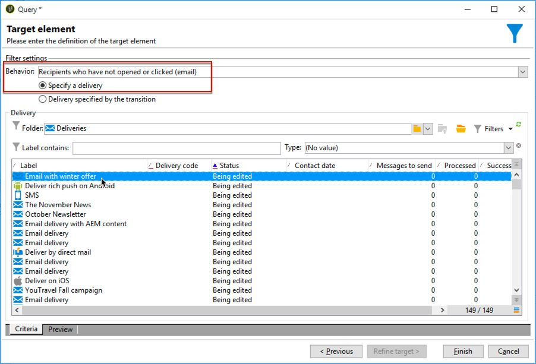

# 跨渠道投放工作流{#cross-channel-delivery-workflow}

此用例展示了一个涉及跨渠道投放工作流的示例。 本节介绍了跨渠道投放的 [概念](../../workflow/using/cross-channel-deliveries.md)。

目标是将受众从收件人库的细分到不同的组，以向组发送电子邮件，并向另一个组发送SMS消息。

此用例的主要实施步骤如下：

1. 创建 **[!UICONTROL Query]** 活动以目标受众。
1. 创建包 **[!UICONTROL Email delivery]** 含指向活动的链接的优惠。
1. 使用 **[!UICONTROL Split]** 活动:

   * 向未打开第一封电子邮件的收件人发送另一封电子邮件。
   * 向打开电子邮件但未单击指向收件人的链接的优惠发送短信。
   * 将打开电子邮件并单击链接的收件人添加到数据库。

## 第1步：定位受众 {#step-1--targeting-the-audience}

要定义目标，请创建查询以标识收件人。

1. 创建营销策划. 如需详细信息，请参阅[此部分](../../campaign/using/setting-up-marketing-campaigns.md#creating-a-campaign)。
1. 在活动 **[!UICONTROL Targeting and workflows]** 的选项卡中，将查询 **活动** 添加到工作流。 For more on using this activity, refer to [this section](../../workflow/using/query.md).
1. 定义将接收您的收件人的投放。 例如，选择“Gold”成员作为目标维。
1. 为查询添加筛选条件。 在此示例中，选择具有电子邮件地址和移动号码的收件人。

   

1. 保存更改。

## 第2步：创建包含优惠的电子邮件 {#step-2--creating-an-email-including-an-offer}

1. 创建活动 **[!UICONTROL Email delivery]** 并在工作流程中多次单击它进行编辑。 有关创建电子邮件的详细信息，请参 [阅此部分](../../delivery/using/about-email-channel.md)。
1. 设计消息并在内容中插入包含优惠的链接。

   

   有关将优惠集成到邮件正文中的详细信息，请参 [阅本节](../../interaction/using/integrating-an-offer-via-the-wizard.md#delivering-with-a-call-to-the-offer-engine)。

1. 保存更改。
1. 右键单击 **[!UICONTROL Email delivery]** 活动以打开它。
1. 选择 **[!UICONTROL Generate an outbound transition]** 选项以恢复人口和跟踪日志。

   

   这样，您就可以根据收到第一封电子邮件时收件人的行为，使用此信息发送其他投放。

1. 添加 **[!UICONTROL Wait]** 活动，让收件人花几天时间打开电子邮件。

   

## 第3步：对生成的受众进行细分 {#step-3--segmenting-the-resulting-audience}

识别目标并创建第一个投放后，您需要使用过滤条件将目标细分为不同人群。

1. 向工作 **流中添加** “拆分”活动并将其打开。 For more on using this activity, refer to [this section](../../workflow/using/split.md).
1. 从查询上游计算的人口创建三个区段。

   

1. 对于第一个子集，选择选 **[!UICONTROL Add a filtering condition on the inbound population]** 项并单击 **[!UICONTROL Edit]**。

   

1. 选择 **[!UICONTROL Recipients of a delivery]** 作为限制过滤器，然后单击 **[!UICONTROL Next]**。

   

1. 在筛选器设置中， **[!UICONTROL Recipients who have not opened or clicked (email)]** 从下拉 **[!UICONTROL Behavior]** 列表中进行选择，然后选择电子邮件，其中包括您要从投放列表发送的优惠。 单击 **[!UICONTROL Finish]**.

   

1. 以同样方式继续第二个子集， **[!UICONTROL Recipients who have not clicked (email)]** 然后从 **[!UICONTROL Behavior]** 下拉列表中进行选择。

   

1. 对于第三个子集，在选择并单 **[!UICONTROL Add a filtering condition on the inbound population]** 击后 **[!UICONTROL Edit]**，选择 **[!UICONTROL Use a specific filtering dimension]** 选项。
1. 从下 **[!UICONTROL Recipient tracking log]** 拉列表 **[!UICONTROL Filtering dimension]** 中进行选择，从中 **[!UICONTROL Filtering conditions]** 高亮显 **[!UICONTROL List of restriction filters]** 示并单击 **[!UICONTROL Next]**。

   

1. 按如下方式选择筛选条件：

   

1. Click **[!UICONTROL Finish]** to save your changes.

## 第4步：最终确定工作流 {#step-4--finalizing-the-workflow}

1. 将相关活动添加到由活动生成的三个子集之后的工作流 **[!UICONTROL Split]** 中：

   * 添加活动 **[!UICONTROL Email delivery]** 以向第一个子集发送提醒电子邮件。
   * 添加 **[!UICONTROL Mobile delivery]** 活动以将SMS消息发送到第二个子集。
   * 添加活动 **[!UICONTROL List update]** 以将相应的收件人添加到数据库。

1. 多次-单击工作流中的投放活动进行编辑。 有关创建电子邮件和短信的详细信息，请参 [阅电子邮件渠道](../../delivery/using/about-email-channel.md)[和短信渠道](../../delivery/using/sms-channel.md)。
1. 多次-单击 **[!UICONTROL List update]** 活动并选择 **[!UICONTROL Generate an outbound transition]** 选项。

   然后，您可以将生成的收件人从Adobe Campaign导出到Adobe Experience Cloud。 例如，您可以通过向工作流中添加受众来使 **[!UICONTROL Update shared audience]** 用Adobe Target的活动。 有关详细信息，请参阅 [导出受众](../../integrations/using/importing-and-exporting-audiences.md#exporting-an-audience)。

1. 单击操 **作栏** 中的“开始”按钮以执行工作流。

根据查询 **收件人** ,活动所针对的群体将被分段，以接收电子邮件或SMS投放。 剩余人口将使用活动添加到数据 **[!UICONTROL List update]** 库。
