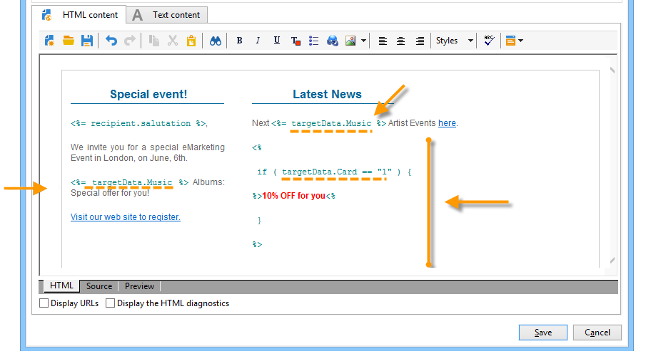

# 数据生命周期 {#data-life-cycle}


## 工作表 {#work-table}

在工作流中，从一个活动传输到另一个活动的数据存储在临时工作表中。

通过右键单击相应的过渡，可以显示和分析此数据。


要实现此目的，请选择相关菜单：

* 显示目标

  此菜单显示目标群体的可用数据以及工作表的结构(**[!UICONTROL Schema]** 选项卡)。

  

  有关详细信息，请参见 [工作表和工作流模式](monitoring-workflow-execution.md#worktables-and-workflow-schema).

* 分析目标

  通过此菜单，您可以访问描述性分析向导，该向导允许您生成有关过渡数据的统计和报告。

  有关更多信息，请参阅此](../../reporting/using/using-the-descriptive-analysis-wizard.md)章节[。

在执行工作流时清除目标数据。 只能访问最后一个工作表。 您可以配置工作流，使所有工作表保持可访问状态：选中 **[!UICONTROL Keep the result of interim populations between two executions]** 选项。

但是，我们建议您避免在出现大量数据时激活此选项。


## Target 数据 {#target-data}

存储在工作流工作表中的数据可在个性化字段中访问。

这样，您便可以使用通过列表收集的数据，或基于投放中调查的回答收集的数据。 为此，请使用以下语法：

```
%= targetData.FIELD %
```

**[!UICONTROL Target extension]** (targetData)类型个性化元素不适用于定位工作流。 必须在工作流中构建投放目标，并在投放的集客过渡中指定。

如果要创建投放验证，则需要基于构建验证目标 **[!UICONTROL Address substitution]** 模式，以便输入个性化数据。 有关更多信息，请参阅此](../../delivery/using/steps-defining-the-target-population.md#using-address-substitution-in-proof)章节[。

在以下示例中，我们将收集客户信息列表，以便在个性化电子邮件中使用。

应用以下步骤：

1. 创建工作流以收集信息，将其与数据库中已有的数据相协调，然后开始投放。

   

   在我们的示例中，文件内容如下所示：

   ```
   Music,First name,Last name,Account,CD/DVD,Card
   Pop,David,BLAIR,4323,CD,0
   Rock,Daniel,ARCARI,3222,DVD,1
   Disco,Uma,ALTON,0488,DVD,0
   Jazz,Paul,BOLES,6475,CD,1
   Jazz,David,BOUKHARI,0841,DVD,1
   [...]
   ```

   要加载文件，请应用以下步骤：

   

1. 配置 **[!UICONTROL Enrichment]** 键入activity ，将收集的数据与Adobe Campaign数据库中已有的数据进行协调。

   在此，对帐密钥是帐号：

   

1. 然后配置 **[!UICONTROL Delivery]**：工作流基于模板创建，收件人由集客过渡指定。

   

   >[!CAUTION]
   >
   >只能使用过渡中包含的数据来个性化投放。 **targetdata** 类型个性化字段仅适用于的集客群体 **[!UICONTROL Delivery]** 活动。

1. 在投放模板中，使用在工作流中收集的字段。

   要执行此操作，请插入 **[!UICONTROL Target extension]** 键入个性化字段。

   

   在此，我们要插入客户最喜爱的音乐流派和媒体类型（CD或DVD），如工作流收集的文件中所述。

   此外，我们将为会员卡持有者（即“卡”值等于1的收件人）添加优惠券。

   

   **[!UICONTROL Target extension]** (targetData)类型数据使用与所有个性化字段相同的特性插入投放。 它们还可以在主题、链接标签或链接本身中使用。

   发送给所收集收件人的邮件将包含以下数据：

   
