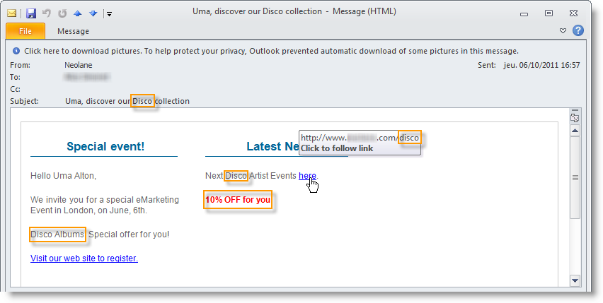

# 数据生命周期 {#data-life-cycle}

## 工作表{#work-table}

在工作流中，从一个活动传输到另一个活动的数据存储在临时工作表中。

可通过右键单击相应的过渡来显示和分析此数据。


要执行此操作，请选择相关菜单：

* 显示目标

   此菜单显示目标群体的可用数据以及工作表的结构（**[!UICONTROL Schema]**&#x200B;选项卡）。

   

   有关更多信息，请参阅[工作表和工作流架构](../../workflow/using/monitoring-workflow-execution.md#worktables-and-workflow-schema)。

* 分析目标

   利用此菜单，可访问描述性分析向导，该向导可生成有关过渡数据的统计信息和报告。

   有关更多信息，请参阅此](../../reporting/using/using-the-descriptive-analysis-wizard.md)章节[。

在执行工作流时会清除目标数据。 只能访问最后一个工作表。 您可以配置工作流，以便所有工作表都保持可访问状态：选中工作流属性中的&#x200B;**[!UICONTROL Keep the result of interim populations between two executions]**&#x200B;选项。

但是，我们建议您在出现大量数据时避免激活此选项。


## Target 数据 {#target-data}

可在个性化字段中访问存储在工作流工作表中的数据。

这样，您就可以使用通过列表收集的数据或基于投放中调查答案的数据。 要实现此目的，请使用以下语法：

```
%= targetData.FIELD %
```

**[!UICONTROL Target extension]** (targetData)类型个性化元素不适用于定位工作流。必须在工作流中构建投放目标，并在投放的集客过渡中指定该目标。

如果要创建投放校样，则需要基于&#x200B;**[!UICONTROL Address substitution]**&#x200B;模式构建校样目标，以便输入个性化数据。 有关更多信息，请参阅此](../../delivery/using/steps-defining-the-target-population.md#using-address-substitution-in-proof)章节[。

在以下示例中，我们将收集有关客户的信息列表，并将其用在个性化电子邮件中。

应用以下步骤：

1. 创建用于收集信息的工作流，将其与数据库中已有的数据进行协调，然后开始投放。

   

   在本例中，文件内容如下所示：

   ```
   Music,First name,Last name,Account,CD/DVD,Card
   Pop,David,BLAIR,4323,CD,0
   Rock,Daniel,ARCARI,3222,DVD,1
   Disco,Uma,ALTON,0488,DVD,0
   Jazz,Paul,BOLES,6475,CD,1
   Jazz,David,BOUKHARI,0841,DVD,1
   [...]
   ```

   要加载文件，请应用以下步骤：

   

1. 配置&#x200B;**[!UICONTROL Enrichment]**&#x200B;类型活动，以将收集的数据与Adobe Campaign数据库中已有的数据进行协调。

   在此，对帐密钥是帐号：

   

1. 然后，配置&#x200B;**[!UICONTROL Delivery]**:它基于模板创建，且收件人由集客过渡指定。

   

   >[!CAUTION]
   >
   >只能使用过渡中包含的数据来个性化投放。 **** targetDatatype个性化字段仅可用于活动的集客群 **[!UICONTROL Delivery]** 体。

1. 在投放模板中，使用工作流中收集的字段。

   为此，请插入&#x200B;**[!UICONTROL Target extension]**&#x200B;类型个性化字段。

   

   在此，我们希望按照工作流收集的文件中所述插入客户最喜爱的音乐流派和媒体类型（CD或DVD）。

   作为加号，我们将为忠诚卡持有者（即“卡”值等于1的收件人）添加优惠券。

   

   **[!UICONTROL Target extension]** (targetData)类型数据会使用与所有个性化字段相同的特征插入到投放中。它们也可用于主题、链接标签或链接本身。

   发送给收件人的消息将包含以下数据：

   
