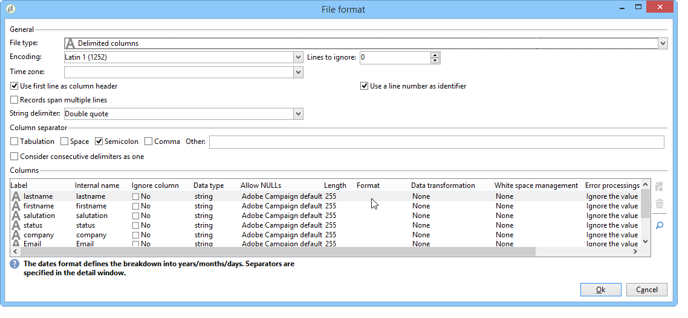
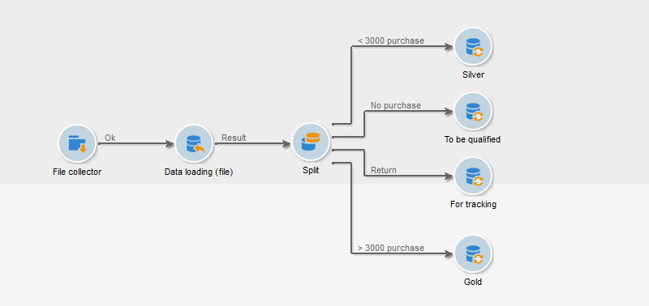

# 数据加载（文件）{#data-loading-file}

## 使用{#use}

**[!UICONTROL Data loading (File)]**&#x200B;活动允许您直接访问外部数据源并在Adobe Campaign中使用它。 事实上，定位操作所需的所有数据并不总是在Adobe Campaign数据库中找到：可在外部文件中使用。

要加载的文件可由过渡指定或在执行此活动时计算。 例如，它可以是客户端10个最喜爱产品的列表，这些产品的购买在外部数据库中进行管理。

通过此活动的配置窗口的上半部分，可以定义文件格式。 为此，请使用与要导入的文件格式相同的示例文件。 此文件可以存储在本地或服务器上。

>[!CAUTION]
>
>仅支持“平面”结构文件（例如CSV、TXT等）。 不建议使用XML格式。

您可以定义要在文件导入期间执行的预处理，例如，这样不必将文件解压缩到服务器上（因此为解压缩文件节省空间），而是在文件处理中包括解压缩。 选择&#x200B;**[!UICONTROL Pre-process the file]**&#x200B;选项，并从以下3个选项中选择一个：**[!UICONTROL None]**、**[!UICONTROL Decompression]**(zcat)或&#x200B;**[!UICONTROL Decrypt]**(gpg)。

有关此内容的详细信息，请参阅此部分：[在处理](../../platform/using/unzip-decrypt.md)之前解压缩或解密文件。

## 定义文件格式{#defining-the-file-format}

加载文件时，系统会自动检测列格式，并使用每种数据类型的默认参数。 您可以修改这些默认参数，以指定要应用于数据的特定进程，尤其是当存在错误或空值时。

要执行此操作，请在&#x200B;**[!UICONTROL Data loading (file)]**&#x200B;活动的主窗口中选择&#x200B;**[!UICONTROL Click here to change the file format...]**。 随后将打开格式详细信息窗口。

然后，您可以修改文件的常规格式以及每列的格式。

常规文件格式允许您定义列的识别方式（文件编码、使用分隔符等）。

利用列格式，可定义每个列的值处理：

* **[!UICONTROL Ignore column]**：在数据加载过程中不处理此列。
* **[!UICONTROL Data type]**：指定每个列所需的数据类型。
* **[!UICONTROL Allow NULLs]**:指定如何管理空值。

   * **[!UICONTROL Adobe Campaign default]**：仅为数字字段生成错误，否则插入 NULL 值。
   * **[!UICONTROL Empty value allowed]**：授权空值。因此，会插入 NULL 值。
   * **[!UICONTROL Always populated]**：如果值为空，则生成错误。

* **[!UICONTROL Length]**:指定字符串数据类型的最 **** 大字符数。
* **[!UICONTROL Format]**:定义时间和日期格式。
* **[!UICONTROL Data transformation]**:定义是否需要对字符串应用字符大小写 **过程**。

   * **[!UICONTROL None]**:导入的字符串未被修改。
   * **[!UICONTROL First letter in upper case]**:带大写的字符串开始的每个字的第一个字母。
   * **[!UICONTROL Upper case]**:字符串中的所有字符均为大写。
   * **[!UICONTROL Lower case]**:字符串中的所有字符都采用小写字母形式。

* **[!UICONTROL White space management]**:指定字符串中是否需要忽略某些空格。**[!UICONTROL Ignore spaces]**&#x200B;值仅允许忽略字符串开头和结尾的空格。
* **[!UICONTROL Error processings]**：定义遇到错误时的行为。

   * **[!UICONTROL Ignore the value]**：忽略值。工作流执行日志中会生成警告。
   * **[!UICONTROL Reject line]**：不处理整个行。
   * **[!UICONTROL Use a default value in case of error]**：将导致错误的值替换为在 **[!UICONTROL Default value]** 字段中定义的默认值。
   * **[!UICONTROL Reject the line when there is no remapping value]**:除非为错误值定义了映射，否则不处理整行(请参阅下 **[!UICONTROL Mapping]** 面的选项)。
   * **[!UICONTROL Use a default value in case the value is not remapped]**:将导致错误的值替换为默认值(在字段中定 **[!UICONTROL Default value]** 义)，除非为错误值定义了映射(请参 **[!UICONTROL Mapping]** 阅下面的选项)。

* **[!UICONTROL Default value]**：根据所选的错误处理指定默认值。
* **[!UICONTROL Mapping]**:此字段仅在列详细信息配置中可用(通过多次单击或列列表右侧的选项访问)。这会在导入某些值时转换它们。 例如，您可以将“three”转换为“3”。

## 示例：收集数据并将其加载到数据库{#example--collecting-data-and-loading-it-in-the-database}中

下面的示例允许您每天在服务器上收集一个文件，加载其内容并根据它包含的信息更新数据库中的数据。 要收集的文件包含客户的信息，这些客户可能已购买（价格不超过3000欧元）、要求购买时退款或者未购买任何商品就去商店。 根据此信息，各种进程将应用于数据库中的用户档案。

1. 文件收集器允许您恢复存储在目录中的文件，具体取决于给定的频率。

   **[!UICONTROL Directory]**&#x200B;选项卡包含有关要恢复的文件的信息。 在我们的示例中，将恢复名称包含单词“customers”且存储在服务器tmp/Adobe/Data/files目录中的所有文本格式的文件。

   使用&#x200B;**[!UICONTROL File collector]**&#x200B;在[文件收集器](../../workflow/using/file-collector.md)部分中有详细说明。

   

   使用&#x200B;**[!UICONTROL Schedule]**&#x200B;选项卡可以计划收集器的执行，即指定检查这些文件存在的频率。

   这里，我们希望每个工作日晚9点触发收集器。

   

   要执行此操作，请单击编辑工具右下方的&#x200B;**[!UICONTROL Change...]**&#x200B;按钮并配置计划。

   有关详细信息，请参阅[调度程序](../../workflow/using/scheduler.md)。

1. 然后，配置数据加载（文件）活动，以指示如何读取所收集的文件。 为此，请选择一个与要加载的文件结构相同的示例文件。

   

   此处，文件包含五列：

   * 第一列包含与事件一致的代码：购买（多于或少于3,000欧元），不购买或退款一次或多次购买。
   * 以下四列包含客户端的名、姓、电子邮件和帐号。

   要加载的文件的格式配置与在Adobe Campaign中导入数据时定义的格式配置一致。 有关更多信息，请参阅此](../../platform/using/executing-import-jobs.md#step-2---source-file-selection)章节[。

1. 在拆分活动中，根据&#x200B;**事件**&#x200B;列值指定要创建的子集。

   “拆分”活动详见一节。

   

   对于每个子集，在&#x200B;**事件**&#x200B;列中指定一个值。

   

   因此，**[!UICONTROL Split]**&#x200B;活动将包含以下信息：

   

1. 然后指定要针对每种类型的人口执行的进程。 在我们的示例中，我们将在数据库中访问&#x200B;**[!UICONTROL Update the data]**。 为此，请将&#x200B;**[!UICONTROL Update data]**&#x200B;活动放在拆分活动中每个出站过渡的末尾。

   **[!UICONTROL Update data]**&#x200B;活动详见[更新数据](../../workflow/using/update-data.md)部分。

