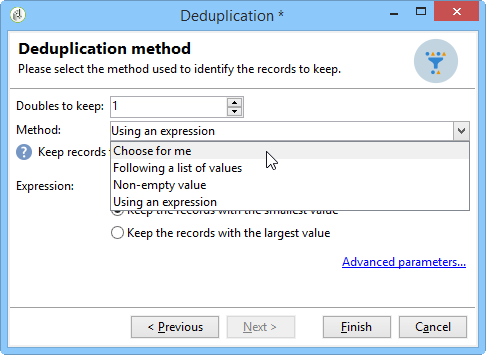
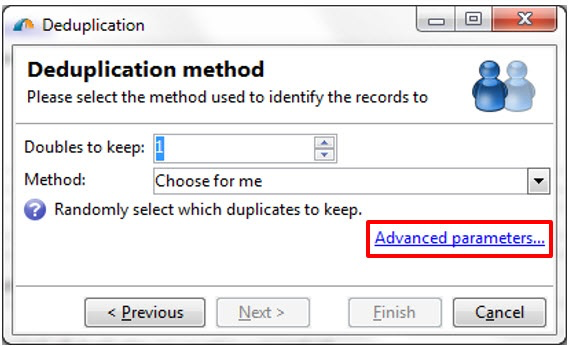
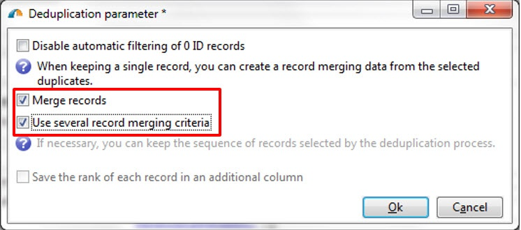

# 重复数据删除{#deduplication}

外部重复数据删除从入站活动结果中删除重复。 外部重复数据删除可以在电子邮件地址、电话号码或其他字段上执行。

**[!UICONTROL Deduplication]**&#x200B;活动用于从重复集中删除数据行。 例如，以下记录可被视为重复，因为它们具有相同的电子邮件地址和相同的移动和/或家庭电话。

| 上次修改日期 | 名字 | 姓氏 | 电子邮件 | 手机 | 电话 |
-----|------------|-----------|-------|--------------|------
| 02/03/2020 | Bob | 蒂斯纳 | bob@mycompany.com | 444-444-4444 | 888-888-8888 |
| 05/19/2020 | 罗伯特 | 蒂斯纳 | bob@mycompany.com | 444-444-4444 | 777-777-7777 |
| 07/22/2020 | 鲍比 | 蒂斯纳 | bob@mycompany.com | 444-444-4444 | 777-777-7777 |

**[!UICONTROL Deduplication]**&#x200B;活动能够在识别重复后将整行保留为唯一记录。 例如，在上述用例中，如果将活动配置为仅保留最早&#x200B;**[!UICONTROL Date]**&#x200B;的记录，则结果将为：

| 日期 | 名字 | 姓氏 | 电子邮件 | 手机 | 电话 |
-----|----------|------------|-------|--------------|------
| 02/03/2020 | Bob | 蒂斯纳 | bob@mycompany.com | 444-444-4444 | 888-888-8888 |

所选的主控记录将继承数据，而不将字段数据与重复行中的其他相关数据合并。

补充：

| 日期 | 名字 | 姓氏 | 电子邮件 | 手机 | 电话 |
-----|------------|-----------|-------|--------------|------
| 05/19/2020 | 罗伯特 | 蒂斯纳 | bob@mycompany.com | 444-444-4444 | 777-777-7777 |
| 07/22/2020 | 鲍比 | 蒂斯纳 | bob@mycompany.com | 444-444-4444 | 777-777-7777 |

## 最佳做法 {#best-practices}

在外部重复数据删除期间，将单独处理入站流。 例如，如果在查询1的结果和查询2的结果中找到收件人A，则不会消除它们的重复。

需要解决以下问题：

* 创建&#x200B;**合并**&#x200B;活动以统一每个入站流。
* 在&#x200B;**外部重复数据删除**&#x200B;活动之后创建&#x200B;**合并**&#x200B;活动。

## 配置{#configuration}

要配置外部重复数据删除，请输入其标签、方法、外部重复数据删除标准以及与结果相关的选项。

1. 单击&#x200B;**[!UICONTROL Edit configuration...]**&#x200B;链接以定义外部重复数据删除模式。

   

1. 选择此活动的目标类型(默认情况下，外部重复数据删除链接到收件人)和要使用的标准，即相同值允许您标识重复的字段。

   >[!NOTE]
   >
   >如果使用外部数据作为输入，例如从外部文件输入，请确保选择&#x200B;**[!UICONTROL Temporary schema]**&#x200B;选项。
   >
   >在下一步中，**[!UICONTROL Other]**&#x200B;选项允许您选择要使用的标准或标准：

   

1. 在下一步中，**[!UICONTROL Other]**&#x200B;选项允许您选择要在相同值情况下使用的标准或标准。

   

1. 从下拉列表中，选择要使用的外部重复数据删除方法，然后输入要保留的重复数。

   

   可以使用以下方法：

   * **[!UICONTROL Choose for me]**：随机选择要保留的重复项记录。
   * **[!UICONTROL Following a list of values]**：用于为一个或多个字段定义值优先级。要定义该值，请选择一个字段或创建表达式，然后将值添加到相应的表格中。要定义新字段，请单击位于值列表上方的 **[!UICONTROL Add]** 按钮。

      

   * **[!UICONTROL Non-empty value]**：利用此选项可优先保留选定表达式的值不为空的记录。

      

   * **[!UICONTROL Using an expression]**:允许您使用给定表达式的最低（或最高）值保留记录。

      
   >[!NOTE]
   >
   >可通过&#x200B;**[!UICONTROL Advanced parameters]**&#x200B;链接访问的&#x200B;**[!UICONTROL Merge]**&#x200B;功能允许您配置一组规则，以便将一个字段或一组字段合并到一个生成的数据记录中。 有关详细信息，请参阅[将字段合并到单个记录](#merging-fields-into-single-record)。

1. 单击&#x200B;**[!UICONTROL Finish]**&#x200B;以批准选定的外部重复数据删除方法。

   窗口的中间部分汇总了定义的配置。

   在活动编辑器窗口的下半部分，您可以修改图形对象的出站过渡的标签，并输入将与活动结果关联的段代码。 此代码稍后可用作定位标准。

   

1. 如果希望利用剩余人口，请选中&#x200B;**[!UICONTROL Generate complement]**&#x200B;选项。 补码由所有重复组成。 随后将向该活动添加一个额外过渡，如下所示：

   

## 示例：在投放{#example--identify-the-duplicates-before-a-delivery}之前识别重复

在以下示例中，外部重复数据删除涉及三个查询的合并。

工作流的目的是通过排除重复来定义投放的目标，以避免多次将发送到同一收件人。

所识别的重复也将集成到专用重复列表中，如有必要，可重用该。

1. 添加并链接工作流操作所需的各种活动，如上所示。

   此处使用合并活动将三个查询“统一”为一个过渡。 因此，外部重复数据删除不会单独适用于每个查询，而是适用于整个查询。 有关此主题的详细信息，请参阅[最佳实践](#best-practices)。

1. 打开外部重复数据删除活动，然后单击&#x200B;**[!UICONTROL Edit configuration...]**&#x200B;链接以定义外部重复数据删除模式。
1. 在新窗口中，选择&#x200B;**[!UICONTROL Database schema]**。
1. 选择&#x200B;**收件人**&#x200B;作为定位和过滤维度。
1. 选择&#x200B;**[!UICONTROL Email]**&#x200B;重复的ID字段，将投放仅发送一次到每个电子邮件地址，然后单击&#x200B;**[!UICONTROL Next]**。

   如果您希望将重复ID基于特定字段，请选择&#x200B;**[!UICONTROL Other]**&#x200B;以访问可用字段的列表。

1. 当为多个收件人标识了同一电子邮件地址时，选择只保留一个条目。
1. 选择&#x200B;**[!UICONTROL Choose for me]**&#x200B;外部重复数据删除模式，以便随机选择在识别重复时保存的记录，然后单击&#x200B;**[!UICONTROL Finish]**。

运行工作流时，所有标识为重复的收件人都将从结果中排除(因此也排除投放)并添加到重复列表。 此列表可以再次使用，而不必重新标识重复。

## 将字段合并到单个数据记录{#merging-fields-into-single-record}

**[!UICONTROL Merge]**&#x200B;功能允许您为外部重复数据删除配置一组规则，以定义要合并到单个结果数据记录中的字段或字段组。

例如，使用一组重复记录，您可以选择保留最旧的电话号码或最新的姓名。

[本节](../../workflow/using/deduplication-merge.md)中提供了利用此功能的用例。

为此，请执行以下步骤：

1. 在&#x200B;**[!UICONTROL Deduplication method]**&#x200B;选择步骤中，单击&#x200B;**[!UICONTROL Advanced Parameters]**&#x200B;链接。

   

1. 选择&#x200B;**[!UICONTROL Merge records]**&#x200B;选项以激活该功能。

   如果要在每个合并条件中对多个数据字段进行分组，请激活&#x200B;**[!UICONTROL Use several record merging criteria]**&#x200B;选项。

   

1. 激活该功能后，**[!UICONTROL Deduplication]**&#x200B;活动中会添加一个&#x200B;**[!UICONTROL Merge]**&#x200B;选项卡。 它允许您定义要合并的字段组及其关联规则。

   有关详细信息，请参阅[本节](../../workflow/using/deduplication-merge.md)中提供的专用用例。

   

## 输入参数{#input-parameters}

* tableName
* 模式

每个入站事件都必须指定由这些参数定义的目标。

## 输出参数{#output-parameters}

* tableName
* 模式
* recCount

这三个值集标识由外部重复数据删除产生的目标。 **[!UICONTROL tableName]** 是保存目标标识符的表的名 **[!UICONTROL schema]** 称，是人口的模式(通常是nms: **[!UICONTROL recCount]** 收件人)，是表中元素的数量。

与补码相关的过渡具有相同的参数。
