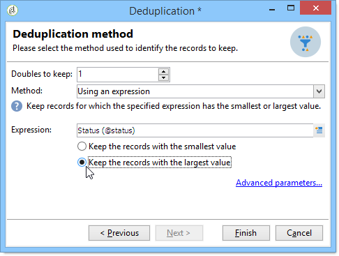

# 重复数据删除{#deduplication}

外部重复数据删除从入站活动结果中删除重复。 外部重复数据删除可以在电子邮件地址、电话号码或其他字段上执行。

## 最佳做法 {#best-practices}

在外部重复数据删除期间，将单独处理入站流。 例如，如果在收件人1的结果和查询2的结果中都找到查询A，则不会消除重复。

此问题需要解决：

* 创建&#x200B;**合并**&#x200B;活动以统一每个入站流。
* 在&#x200B;**外部重复数据删除**&#x200B;活动之后创建&#x200B;**合并**&#x200B;活动。

## 配置{#configuration}

要配置外部重复数据删除，请输入其标签、方法、外部重复数据删除标准以及与结果相关的选项。

单击&#x200B;**[!UICONTROL Edit configuration...]**&#x200B;链接以定义外部重复数据删除模式。

1. 目标选择

   选择此活动的目标类型(默认情况下，外部重复数据删除与收件人相关)和要使用的标准，即相同值允许您标识重复的字段：电子邮件地址、手机或电话号码、传真号码或直邮地址。

   

   >[!NOTE]
   >
   >如果使用外部数据作为输入，例如从外部文件输入，请确保选择&#x200B;**[!UICONTROL Temporary schema]**&#x200B;选项。
   >
   >在下一步中，使用&#x200B;**[!UICONTROL Other]**&#x200B;选项可以选择要使用的标准：

   

1. 外部重复数据删除方法

   从下拉列表中，选择要使用的外部重复数据删除方法，然后输入要保留的重复数。

   

   可以使用以下方法：

   * **[!UICONTROL Choose for me]**：随机选择要保留的重复项记录。
   * **[!UICONTROL Following a list of values]**：用于为一个或多个字段定义值优先级。要定义该值，请选择一个字段或创建表达式，然后将值添加到相应的表格中。要定义新字段，请单击位于值列表上方的 **[!UICONTROL Add]** 按钮。

      

   * **[!UICONTROL Non-empty value]**：利用此选项可优先保留选定表达式的值不为空的记录。

      

   * **[!UICONTROL Using an expression]**:允许您使用给定表达式的最低（或最高）值保存记录。

      
   单击&#x200B;**[!UICONTROL Finish]**&#x200B;以批准所选外部重复数据删除方法。

   窗口的中间部分汇总定义的配置。

   在活动编辑器窗口的下半部分，您可以修改图形对象的出站过渡的标签，并输入将与活动结果关联的段代码。 此代码稍后可用作定位标准。

   

   如果要利用剩余人口，请选中&#x200B;**[!UICONTROL Generate complement]**&#x200B;选项。 补码由所有重复组成。 随后将向该过渡添加一个额外的活动，如下所示：

   

## 示例：识别投放{#example--identify-the-duplicates-before-a-delivery}之前的重复

在以下示例中，外部重复数据删除涉及三个查询的合并。

工作流的目的是通过排除目标来定义投放的重复，以避免多次将其发送到同一收件人。

标识的重复还将集成到专用的重复列表中，如有必要，可重用该。

1. 添加并链接工作流运行所需的各种活动，如上所示。

   合并活动用于将三个查询“统一”为一个过渡。 因此，外部重复数据删除不会单独适用于每个查询，而是适用于整个查询。 有关此主题的详细信息，请参阅[最佳实践](#best-practices)。

1. 打开外部重复数据删除活动，然后单击&#x200B;**[!UICONTROL Edit configuration...]**&#x200B;链接以定义外部重复数据删除模式。
1. 在新窗口中，选择&#x200B;**[!UICONTROL Database schema]**。
1. 选择&#x200B;**收件人**&#x200B;作为定位和过滤维度。
1. 选择&#x200B;**[!UICONTROL Email]**&#x200B;重复的ID字段，将投放仅发送一次到每个电子邮件地址，然后单击&#x200B;**[!UICONTROL Next]**。

   如果希望将重复ID基于特定字段，请选择&#x200B;**[!UICONTROL Other]**&#x200B;以访问可用字段的列表。

1. 当为多个收件人标识同一电子邮件地址时，选择只保留一个条目。
1. 选择&#x200B;**[!UICONTROL Choose for me]**&#x200B;外部重复数据删除模式，以随机选择在识别重复的情况下保存的记录，然后单击&#x200B;**[!UICONTROL Finish]**。

运行工作流时，所有标识为重复的收件人都将从结果中排除(因此也将排除投放)并添加到重复列表。 此列表可以再次使用，而不必重新标识重复。

## 输入参数{#input-parameters}

* tableName
* 模式

每个入站事件必须指定由这些参数定义的目标。

## 输出参数{#output-parameters}

* tableName
* 模式
* recCount

这三个值集标识由目标产生的外部重复数据删除。 **[!UICONTROL tableName]** 是保存目标标识符的表的名 **[!UICONTROL schema]** 称，是人口的模式(通 **[!UICONTROL recCount]** 常是nms:收件人)，是表中的元素数。

与补码关联的过渡具有相同的参数。
