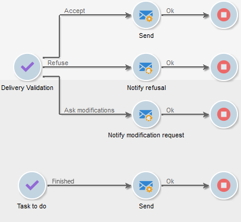

# 定义审批 {#defining-approvals}

通过批准，操作员可以做出管理工作流的决策或确认其继续执行。

消息将发送到操作员组，而工作流在恢复之前等待响应。 此工作流不会停止，并且可以执行其他操作。 例如，可能有多个并行审批待处理。

批准可以包含多个选项供操作员选择。 但是，可以将选择的数量限制为一个，以便将要执行的任务提交给操作员，例如执行定位。 然后，操作员可以在执行任务后做出响应（然后继续该过程）。 以下示例说明了这些类型的批准：



在运营中，所有需要批准的阶段都基于相同的原则。


可以在此[部分](../../campaign/using/marketing-campaign-approval.md#checking-and-approving-deliveries)中找到批准示例。

操作员可以通过以下两种方式之一进行响应：使用电子邮件中链接的网页或通过控制台进行验证。

>[!NOTE]
>
>保存响应后，不能对其进行修改。

## 发送电子邮件 {#sending-emails}

可以接收包含指向网页的链接的批准消息，通过该网页可以进行响应。 要使目标运营商接收批准电子邮件，运营商电子邮件地址必须完整。 如果不是这样，操作员必须使用控制台进行响应

此[部分](../../platform/using/access-management.md)中详细介绍了操作员管理。

批准电子邮件会持续发送。 默认投放模板为&#x200B;**[!UICONTROL notifyAssignee]**:它保存在&#x200B;**[!UICONTROL Administration > Campaign management > Technical delivery templates]**&#x200B;文件夹中。 可以自定义此方案，还建议制作副本并更改每个活动的模板。

通过此模板创建的投放存储在&#x200B;**[!UICONTROL Administration > Production > Objects created automatically > Technical deliveries > Workflow notifications]**&#x200B;文件夹中。

## 通过控制台{#approval-via-the-console}进行批准

在操作中，要批准的元素将显示在活动仪表板上。

对于技术工作流，用户可以从&#x200B;**[!UICONTROL Administration > Production > Objects created automatically > Pending approvals]**&#x200B;文件夹的树结构中访问用户可以批准的任务。


## 组{#groups}

将批准分配给操作员组、单个运算符或通过过滤条件选择的一组运算符。

1. 对于最简单的批准形式，任务在操作员做出响应后立即完成。 任何其他试图回复的运营商都会收到有人已经这样做的通知。
1. 有关多个批准，请参阅[多个批准](#multiple-approval)。

审批的运营者组应指定为角色或职能，而不是指定个人。 例如，“活动预算”组比“Harry&#39;s group”更好。 我们建议在一个小组中至少有两个人可以批准任务。 这样，如果一个缺席，另一个就能做出反应。

## 过期时间{#expirations}

过期是在不同类型的活动中使用的特定过渡，特别是在批准中。 您可以使用过期功能在指定时间后触发操作，而无需响应。 例如，还可以使用它来追踪工作流并将批准分配给其他组。

活动批准属性中的第二个选项卡允许您定义一个或多个过期时间。 事实上，您可以定义多个过期类型。


要添加新的过期，请单击&#x200B;**[!UICONTROL Add]**。 过渡将添加到创建的每个过期。 您可以：

* 通过单击列表中的单元格（或按F2）直接修改典型参数，
* 或单击&#x200B;**[!UICONTROL Detail...]**&#x200B;按钮编辑表达式。

>[!NOTE]
>
>不必指定到期顺序，因为按时间顺序处理它们。

当延迟超出时，**[!UICONTROL Do not terminate the task]**&#x200B;选项会使批准处于活动状态。 通过此模式，可以在保持审批处于活动状态时管理提醒：运营商仍然可以做出回应。 默认情况下，此选项处于禁用状态，这意味着任务在过期时被视为已完成，并且操作符可能不再响应。

您可以创建四种过期类型：

* **任务开始后延迟**:到期时间的计算方法是将指定的时间长度添加到激活批准的日期。
* **在指定日期后延迟**:过期时间是通过向指定的日期添加时间长度来计算的。
* **在指定日期之前延迟**:计算过期时间的方法是从您指定的日期减去一段时间。
* **由脚本计算的过期**:过期时间是使用JavaScript计算的。

   下面的示例计算在投放开始之日（由&#x200B;**vars.deliveryId**&#x200B;标识）之前24小时的过期时间：

   ```
   var delivery = nms.delivery.get(vars.deliveryId)
   var expiration = delivery.scheduling.contactDate
   var oneDay = 1000*60*60*24
   expiration.setTime(expiration.getTime() - oneDay)
   return expiration
   ```

## 多次批准{#multiple-approval}

多重批准是一种机制，使所有批准操作员都能做出响应。 将为每个响应激活过渡。

多项批准对投票或调查机制很有用。 您可以通过添加截止日期来计算答案并处理其在给定时间段后的结果。

## 所需权限{#required-rights}

要能够响应批准请求，群组中的运营商必须至少拥有以下权利：

* 工作流的写入权限。
* 包含要批准的任务的文件夹的读取和写入权限。

“工作流执行”组具有这些权限。 添加到此组的操作员有权响应批准请求。
