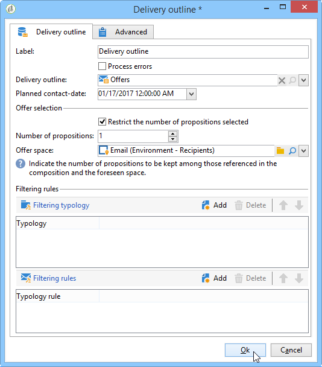

# 投放概要{#delivery-outline}

**投放概要**&#x200B;允许您在活动工作流中使用大纲。 大纲必须事先在活动中创建。

有关Adobe Campaign中投放概要的详细信息，请参阅此[部分](../../campaign/using/marketing-campaign-deliveries.md#associating-and-structuring-resources-linked-via-a-delivery-outline)。

要配置活动，您只需选择您喜欢的大纲以及计划的联系日期。 您可以通过添加类型或类型规则来添加筛选规则。

## 示例：通过投放概要{#example--inserting-an-offer-via-a-delivery-outline}插入优惠

活动工作流中提供的&#x200B;**投放概要**&#x200B;活动允许您显示当前活动中引用的投放概要。

>[!NOTE]
>
>必须安装&#x200B;**Interaction**&#x200B;包。

1. 在工作流中，添加投放概要活动后再添加投放活动。
1. 在“投放概要”活动中，指定要使用的轮廓。

   有关指定投放概要的详细信息，请参阅此[部分](../../campaign/using/marketing-campaign-deliveries.md#associating-and-structuring-resources-linked-via-a-delivery-outline)。

1. 根据您的投放填写可用字段。
1. 有两种可能的情况：

   * 如果要调用优惠引擎，请选中&#x200B;**[!UICONTROL Restrict the number of propositions selected]**&#x200B;框。 指定优惠空间和将在投放中显示的建议数。

      优惠权重和合格规则将由优惠引擎考虑。

   * 如果不选中此框，将在不调用优惠引擎的情况下显示投放概要中的所有优惠。

   预览会考虑在投放中指定的优惠数。 执行工作流时，它是在投放概要中指定的数字。

   

