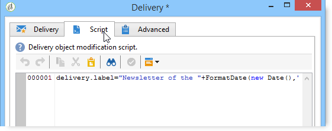

# 投放{#delivery}

**投放**&#x200B;类型活动允许您创建投放操作。 它可以用输入元素来构造。

要进行配置，请编辑活动并输入投放选项。


1. **投放**

   您可以：

   * 对入站投放中指定的过渡执行操作。 为此，请选择窗口&#x200B;**[!UICONTROL Delivery]**&#x200B;部分的第一个选项。

      当以前的工作流活动已创建或指定该投放时，可以使用此选项。 可以通过生成出站活动的相同类型的过渡执行此操作，如下例所示。

      在以下示例中，将首次创建投放。 以后将定义人口和内容。 接下来，使用入站投放将这三个元素的信息重新输入到新的活动过渡中，以便发送该信息。

      

   * 直接选择相关投放。 要执行此操作，请选择&#x200B;**[!UICONTROL Explicit]**&#x200B;选项，然后从&#x200B;**[!UICONTROL Delivery]**&#x200B;字段的下拉列表中选择投放。

      默认情况下，列表显示&#x200B;**投放**&#x200B;文件夹中包含的未完成投放。 要访问其他活动，请单击&#x200B;**[!UICONTROL Select link]**&#x200B;图标。

      

      从&#x200B;**[!UICONTROL Folder]**&#x200B;字段的下拉列表中选择活动，或单击&#x200B;**[!UICONTROL Display sub-levels]**&#x200B;以显示子文件夹中包含的所有投放:

      

      选择投放操作后，可以单击&#x200B;**[!UICONTROL Edit link]**&#x200B;图标来显示内容。

   * 创建一个脚本以计算投放。 要执行此操作，请选择&#x200B;**[!UICONTROL Computed by a script]**&#x200B;选项并输入脚本。 单击&#x200B;**[!UICONTROL Edit...]**&#x200B;选项可打开输入窗口。 下面的示例恢复投放的标识符：

      

   * 创建新投放。 要执行此操作，请选择&#x200B;**[!UICONTROL New, created from a template]**&#x200B;选项，然后选择投放将基于的投放模板。

      

      单击&#x200B;**[!UICONTROL Select link]**&#x200B;图标浏览文件夹，如果要视图选定模板的内容，则单击&#x200B;**[!UICONTROL Edit link]**&#x200B;图标。

1. **收件人**

   收件人可以由入站事件指定，例如在文件导入之后指定，或在投放操作中指定。 它们也可以存储在一个或多个文件中。

   

1. **内容**

   消息的内容可以在投放或入站事件中定义。

   

1. **要执行的操作**

   您可以创建投放、准备目标、开始、估计或发送验证。

   

   选择要执行的操作类型：

   * **[!UICONTROL Save]**:通过此选项，可创建并保存投放。它不会分析或提供它。
   * **[!UICONTROL Estimate the target]**:此选项允许您计算投放目标以评估其潜力(第一个分析阶段)。此操作等效于通过&#x200B;**投放**&#x200B;将投放发送到主目标时选择&#x200B;**[!UICONTROL Estimate the population to be targeted]**&#x200B;选项并单击&#x200B;**[!UICONTROL Analyze]**。
   * **[!UICONTROL Prepare]**:此选项允许您运行完整的分析过程(目标计算和内容准备)。投放未发送。 此操作等效于在将投放发送到具有&#x200B;**投放**&#x200B;的主目标时选择&#x200B;**[!UICONTROL Deliver as soon as possible]**&#x200B;选项并单击&#x200B;**[!UICONTROL Analyze]**。
   * **[!UICONTROL Send a proof]**:通过此选项，可以发送投放的验证。此操作等同于在具有&#x200B;**投放**&#x200B;的投放的工具栏中单击&#x200B;**[!UICONTROL Send a proof]**&#x200B;按钮
   * **[!UICONTROL Prepare and start]**:此选项启动完整的分析过程(目标计算和内容准备)并发送投放。此操作等同于在将投放发送到具有&#x200B;**投放**&#x200B;的主目标时单击&#x200B;**[!UICONTROL Deliver as soon as possible]**、**[!UICONTROL Analyze]**&#x200B;和&#x200B;**[!UICONTROL Confirm delivery]**&#x200B;选项。

   通过工作流中进一步使用的&#x200B;**[!UICONTROL Act on a delivery]**&#x200B;活动，可以启动启动投放所需的所有剩余步骤(目标计算、内容准备、投放)。 有关详细信息，请参阅[投放控件](../../workflow/using/delivery-control.md)。

   还提供以下选项：

   * **[!UICONTROL Generate an outbound transition]**

      创建将在执行结束时激活的出站过渡。 您可以选择是否检索出站投放的目标。

   * **[!UICONTROL Do not recover target]**

      不恢复传出投放操作的目标。

   * **[!UICONTROL Processing errors]**

      请参阅[投放控件](../../workflow/using/delivery-control.md)。
   使用&#x200B;**脚本**&#x200B;选项卡可以修改投放参数。

   

## 示例：投放工作流{#example--delivery-workflow}

创建新工作流并添加活动，如下图所示：


打开&#x200B;**投放**&#x200B;活动并定义以下属性：

* 在&#x200B;**[!UICONTROL Delivery]**&#x200B;部分，选择&#x200B;**[!UICONTROL New, created from a template]**&#x200B;并选择投放模板。
* 在&#x200B;**[!UICONTROL Recipients]**&#x200B;部分，选择&#x200B;**[!UICONTROL Specified in the delivery]**。
* 在&#x200B;**[!UICONTROL Action to execute]**&#x200B;部分，保留&#x200B;**[!UICONTROL Prepare]**&#x200B;选项。


单击&#x200B;**[!UICONTROL OK]**&#x200B;关闭属性窗口。 您刚刚配置了一个活动，它包括根据将在其中指定目标的投放模板创建和准备新投放。

打开&#x200B;**Approval**&#x200B;活动并定义以下属性：

1. 在&#x200B;**[!UICONTROL Assignment type]**&#x200B;字段中，选择您已注册的组。 如果您使用“admin”帐户连接，请选择“管理”组。
1. 然后，输入标题并在邮件正文中插入以下文本：

   ```
   Do you wish to approve delivery (<%= vars.recCount %> recipient(s))?
   ```

   这是一条消息，其中包含用JavaScript编写的表达式:**[!UICONTROL vars.recCount]**&#x200B;表示前一收件人的投放所针对的任务数。 有关JavaScript表达式的详细信息，请参阅[JavaScript脚本和模板](../../workflow/using/javascript-scripts-and-templates.md)。

   

   批准任务详见[批准](../../workflow/using/approval.md)。

## 输入参数{#input-parameters}

投放标识符，如果在&#x200B;**[!UICONTROL Delivery]**&#x200B;部分中选择了&#x200B;**[!UICONTROL Specified in the transition]**&#x200B;选项。

* deliveryId
* tableName
* 模式

每个入站事件都必须指定由这些参数定义的目标。

>[!NOTE]
>
>此参数仅在&#x200B;**[!UICONTROL Recipients]**&#x200B;部分中选择了&#x200B;**[!UICONTROL Specified by inbound event(s)]**&#x200B;选项时才显示。

* 文件名

   在&#x200B;**[!UICONTROL Recipients]**&#x200B;部分选择&#x200B;**[!UICONTROL File(s) specified by inbound event(s)]**&#x200B;选项时生成的文件的完整名称。

* contentId

   如果在&#x200B;**[!UICONTROL Content]**&#x200B;部分中选择了&#x200B;**[!UICONTROL Specified by inbound events]**&#x200B;选项，则内容标识符。

## 输出参数{#output-parameters}

* tableName
* 模式
* recCount

这三个值集标识由投放产生的目标。 **[!UICONTROL tableName]** 是存储目标标识符的表的名称，是 **[!UICONTROL schema]** 人口的模式(通常是nms: **[!UICONTROL recCount]** 收件人)，是表中元素的数量。

与补码相关的过渡具有相同的参数。

>[!NOTE]
>
>选择&#x200B;**[!UICONTROL Do not recover target]**&#x200B;选项时，没有输出参数。

