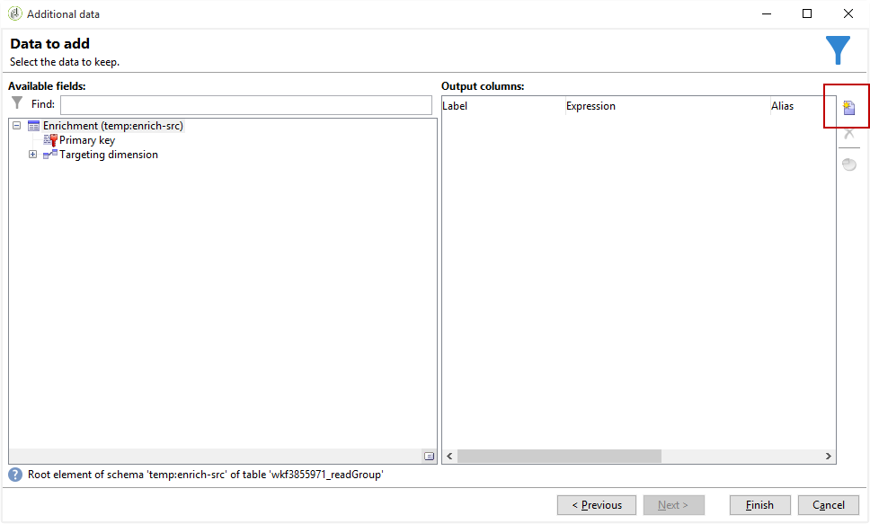
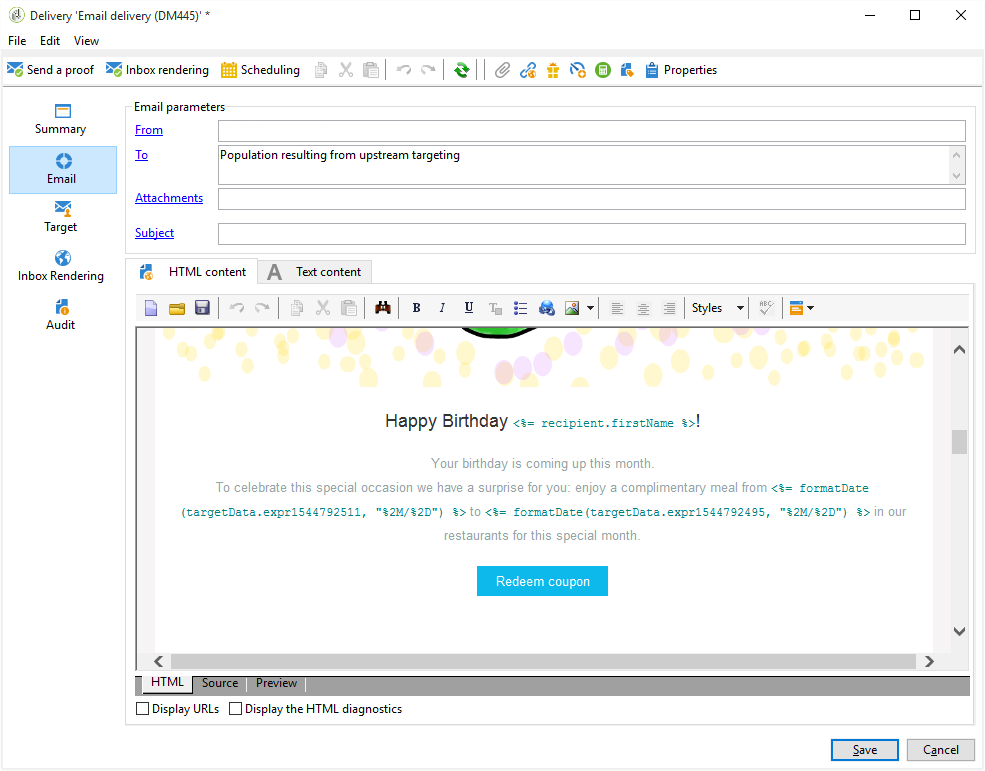

# 具有自定义日期字段的电子邮件扩充{#email-enrichment-with-custom-date-fields}

在此示例中，我们希望向本月庆祝生日的收件人发送一封包含自定义数据字段的电子邮件。 该电子邮件将包含一个优惠券，其有效期为生日前后一周。

我们需要目标列表的收件人，他们本月会用活动庆祝生日 **[!UICONTROL Split]** 。 然后，使用 **[!UICONTROL Enrichment]** 活动，自定义数据字段将作为客户特殊优惠的电子邮件的有效日期。


要创建此示例，请应用以下步骤：

1. 在活动 **[!UICONTROL Targeting and workflows]** 的选项卡中，拖放一个活动 **[!UICONTROL Read list]** 以目标您的收件人列表。
1. 要处理的列表可以显式指定，由脚本计算，也可以根据此处选择的选项和定义的参数动态本地化。

   

1. 添加活动 **[!UICONTROL Split]** 以区分本月将庆祝生日的收件人与其他收件人。
1. 要拆分列表，请在类别 **[!UICONTROL Filtering of selected records]** 中选择 **[!UICONTROL Add a filtering condition on the inbound population]**。 Then, click **[!UICONTROL Edit]**.

   

1. 选 **[!UICONTROL Filtering conditions]** 择，然 **[!UICONTROL Edit expression]** 后单击按钮以过滤收件人生日的月份。

   

1. 单 **[!UICONTROL Advanced Selection]** 击， **[!UICONTROL Edit the formula using an expression]** 然后添加以下表达式:Month(@birthDate)。
1. 在列 **[!UICONTROL Operator]** 中，选择 **[!UICONTROL equal to]**。
1. 通过添加当前日期的月份，进 **[!UICONTROL Value]** 一步过滤您的条件：Month(GetDate())。

   这将查询生日月份与当月相对应的收件人。

   

1. 单击 **[!UICONTROL Finish]**。然后，在活动 **[!UICONTROL General]** 的选项卡 **[!UICONTROL Split]** 中，单 **[!UICONTROL Generate complement]** 击类别中的 **[!UICONTROL Results]** 。

   结果 **[!UICONTROL Complement]** 是，您可以添加投放活动或更新列表。 这里，我们刚添加了 **[!UICONTROL End]** 活动。

   

您现在需要配置 **[!UICONTROL Enrichment]** 活动:

1. 在子集 **[!UICONTROL Enrichment]** 之后添加活动，以添加自定义日期字段。

   

1. 打开 **[!UICONTROL Enrichment]** 活动。 In the **[!UICONTROL Complementary information]** category, click **[!UICONTROL Add data]**.

   

1. 然后 **[!UICONTROL Data linked to the filtering dimension]** 选择 **[!UICONTROL Data of the filtering dimension]**。
1. 单击 **[!UICONTROL Add]** 按钮。

   

1. 添加 **[!UICONTROL Label]**。 然后，在列 **[!UICONTROL Expression]** 中单击 **[!UICONTROL Edit expression]**。

   

1. 首先，我们需要将出生日期前的一周目标为有效 **开始日期** ，具体如下 **[!UICONTROL Expression]**: `SubDays([target/@birthDate], 7)`.

   

1. 然后，要创建自定义日期字段 **有效期结束日期****[!UICONTROL Expression]**，您需要添加以下代码： `AddDays([target/@birthDate], 7)`.

   您可以向表达式添加标签。

   

1. 单击 **[!UICONTROL Ok]**。您的扩充已准备就绪。

活动 **[!UICONTROL Enrichment]** 后，可以添加投放。 在这种情况下，我们添加了电子邮件投放，以向收件人发送具有有效日期的特殊优惠，以便客户在本月庆祝他们的生日。

1. 在活动后拖 **[!UICONTROL Email delivery]** 放活动 **[!UICONTROL Enrichment]** 。

   

1. 多次-单击您的 **[!UICONTROL Email delivery]** 活动,开始个性化您的投放。
1. 向投放 **[!UICONTROL Label]** 中添加一个，然后单击 **[!UICONTROL Continue]**。
1. 单击 **[!UICONTROL Save]** 以创建电子邮件投放。
1. 签入已选 **[!UICONTROL Approval]** 中的电子邮件投放 **[!UICONTROL Properties]** 的选 **[!UICONTROL Confirm delivery before sending option]** 项卡。

   然后，开始您的工作流，以利用目标信息丰富您的出站过渡。

   

您现在可以开始设计电子邮件投放，并在活动中创建自定义日期 **[!UICONTROL Enrichment]** 字段。

1. 多次-单击您的 **[!UICONTROL Email delivery]** 活动。
1. 将目标扩展添加到电子邮件中。 它应位于以下表达式中，以配置有效日期的格式：

   ```
   <%=
           formatDate(targetData.alias of your expression,"%2D.%2M")  %>
   ```

1. 单击  . 选 **[!UICONTROL Target extension]** 择之前创建的具有活动的自定义 **[!UICONTROL Enrichment]** 有效性日期，将扩展添加到formatDate表达式。

   

1. 根据需要配置电子邮件内容。

   

1. 预览电子邮件以检查自定义日期字段是否配置正确

   

您的电子邮件现已准备就绪。 您可以开始发送验证并确认投放发送生日电子邮件。
