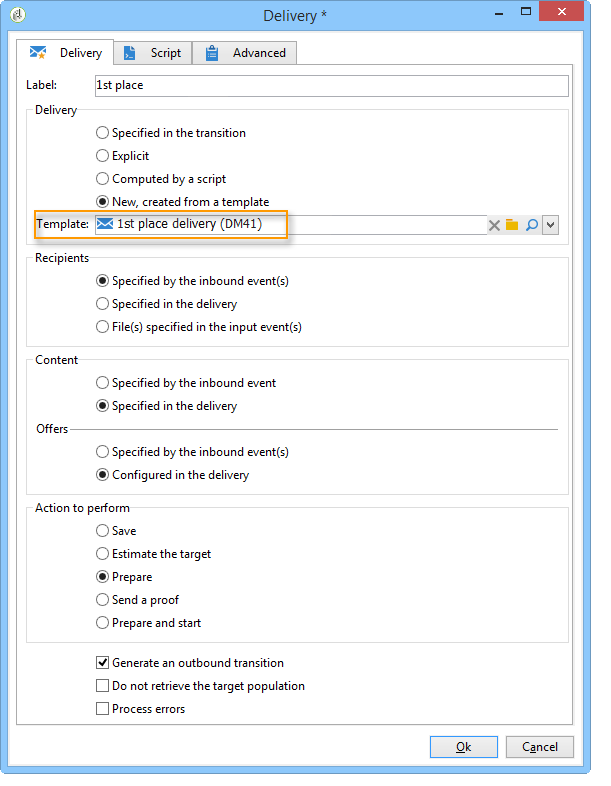

# 扩充数据{#enriching-data}

## 关于丰富数据{#about-enriching-data}

此用例详细信息可能用于定位工作流中&#x200B;**[!UICONTROL Enrichment]**&#x200B;活动的用途。 有关使用&#x200B;**[!UICONTROL Enrichment]**&#x200B;活动的详细信息，请参阅：[扩充](../../workflow/using/enrichment.md)。

[本节](../../workflow/using/email-enrichment-with-custom-date-fields.md)还提供了如何使用自定义日期丰富电子邮件投放的用例。

营销数据库中的联系人通过网络应用程序被发送参加比赛的邀请。 在&#x200B;**[!UICONTROL Competition results]**&#x200B;表中可以找到竞争结果。 此表链接到联系人表(**[!UICONTROL Recipients]**)。 **[!UICONTROL Competition results]**&#x200B;表包含以下字段：

* 竞赛名称(@game)
* 试用号(@trial)
* 得分(@score)

**[!UICONTROL Recipients]**&#x200B;表中的联系人可以链接到&#x200B;**[!UICONTROL Competition results]**&#x200B;表中的几行。 这两个表之间的关系为1-n类型。 以下是收件人的结果日志示例：

此用例的用途是根据最高分将个性化投放发送给参加最新竞争的人。 得分最高的收件人获得第一名，得分第二名的收件人获得安慰奖，其他所有人都得到一个信息，希望他们下次更好运。

要设置此用例，我们创建了以下定位工作流：

要创建工作流，请应用以下步骤：

1. 将两个&#x200B;**[!UICONTROL Query]**&#x200B;活动和一个&#x200B;**[!UICONTROL Intersection]**&#x200B;活动添加到上次参加比赛的目标新订阅者中。
1. **[!UICONTROL Enrichment]**&#x200B;活动允许我们添加存储在&#x200B;**[!UICONTROL Competition results]**&#x200B;表中的数据。 我们的投放个性化将进行的&#x200B;**[!UICONTROL Score]**&#x200B;字段将添加到工作流的工作表中。
1. **[!UICONTROL Split]**&#x200B;类型活动允许我们根据分数创建收件人子集。
1. 对于每个子集，将添加&#x200B;**[!UICONTROL Delivery]**&#x200B;类型活动。

## 第1步：定位{#step-1--targeting}

第一个查询使我们能够目标过去六个月内添加到数据库的收件人。

第二个查询使我们能够目标参加上次比赛的收件人。

然后，将添加&#x200B;**[!UICONTROL Intersection]**&#x200B;类型活动，以目标在过去六个月内添加到收件人库的以及参加最后一次竞争的人员。

## 第2步：扩充{#step-2--enrichment}

在此示例中，我们希望根据存储在&#x200B;**[!UICONTROL Competition results]**&#x200B;表中的&#x200B;**[!UICONTROL Score]**&#x200B;字段对投放进行个性化设置。 此表与收件人表具有1-n类型关系。 **[!UICONTROL Enrichment]**&#x200B;活动允许我们将链接到过滤维度的表中的数据添加到工作流的工作表中。

1. 在扩充活动的编辑屏幕中，选择&#x200B;**[!UICONTROL Add data]**，然后选择&#x200B;**[!UICONTROL Data linked to the filtering dimension]**&#x200B;并单击&#x200B;**[!UICONTROL Next]**。

   

1. 然后选择&#x200B;**[!UICONTROL Data linked to the filtering dimension]**&#x200B;选项，选择&#x200B;**[!UICONTROL Competition results]**&#x200B;表并单击&#x200B;**[!UICONTROL Next]**。

   

1. 输入ID和标签，然后在&#x200B;**[!UICONTROL Data collected]**&#x200B;字段中选择&#x200B;**[!UICONTROL Limit the line count]**&#x200B;选项。 在&#x200B;**[!UICONTROL Lines to retrieve]**&#x200B;字段中，选择“1”作为值。 对于每个收件人,扩充活动将从&#x200B;**[!UICONTROL Competition results]**&#x200B;表添加一行到工作流的工作表。 单击 **[!UICONTROL Next]**.

   

1. 在此示例中，我们希望恢复收件人的最高分，但仅为上次比赛。 为此，请向&#x200B;**[!UICONTROL Competition name]**&#x200B;字段添加一个过滤器，以排除与以前比赛相关的所有行。 单击 **[!UICONTROL Next]**.

   

1. 转到&#x200B;**[!UICONTROL Sort]**&#x200B;屏幕并单击&#x200B;**[!UICONTROL Add]**&#x200B;按钮，选择&#x200B;**[!UICONTROL Score]**&#x200B;字段并选中&#x200B;**[!UICONTROL descending]**&#x200B;列中的框，按降序对&#x200B;**[!UICONTROL Score]**&#x200B;字段的项进行排序。 对于每个收件人,扩充活动会添加一行，该行与上一个游戏的最高得分匹配。 单击 **[!UICONTROL Next]**.

   

1. 在&#x200B;**[!UICONTROL Data to add]**&#x200B;窗口中，多次单击&#x200B;**[!UICONTROL Score]**&#x200B;字段。 对于每个收件人,扩充活动将仅添加&#x200B;**[!UICONTROL Score]**&#x200B;字段。 单击 **[!UICONTROL Finish]**.

   

右键单击扩充活动的入站过渡，然后选择&#x200B;**[!UICONTROL Display the target]**。 工作表包含以下数据：

链接的模式是：

在扩充活动的出站过渡上续订此操作。 我们可以看到与收件人分数关联的数据已经添加。 已恢复每个收件人的最高分。

匹配模式也得到丰富。

## 第3步：拆分和投放{#step-3--split-and-delivery}

要根据收件人的得分对活动进行排序，将在扩充后添加&#x200B;**[!UICONTROL Split]**。

1. 已定义第一个（**入选方**）子集以包含得分最高的收件人。 为此，请定义记录数限制，对得分应用降序排序，并将记录数限制为1。

   

1. 第二（**第二位置**）子集包括具有第二最高得分的收件人。 配置与第一个子集的配置相同。

   

1. 第三个(**losers**)子集包含所有其他收件人。 转到&#x200B;**[!UICONTROL General]**&#x200B;选项卡并选中&#x200B;**[!UICONTROL Generate complement]**&#x200B;框，以目标未达到两个最高分的所有收件人。

   

1. 为每个子集添加&#x200B;**[!UICONTROL Delivery]**&#x200B;类型活动，为每个子集使用不同的投放模板。

   

