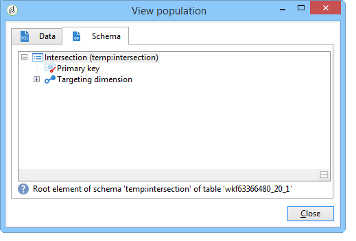

# 丰富数据{#enriching-data}

## 关于丰富数据 {#about-enriching-data}

此用例详细信息可用于定位工作 **[!UICONTROL Enrichment]** 流中活动的用途。 有关使用活动的详 **[!UICONTROL Enrichment]** 细信息，请参阅：丰 [富](../../workflow/using/enrichment.md)。

营销数据库中的联系人通过网络应用程序被发送参加比赛的邀请。 比赛结果见表 **[!UICONTROL Competition results]** 格。 此表链接到联系表(**[!UICONTROL Recipients]**)。 该表 **[!UICONTROL Competition results]** 包含以下字段：

* 竞赛名称(@game)
* 试用号(@trial)
* 得分(@score)

表中的联系人可 **[!UICONTROL Recipients]** 以链接到表中的几行联 **[!UICONTROL Competition results]** 系人。 这两个表之间的关系为1-n类型。 以下是收件人的结果日志示例：

此用例的用途是根据参加最新竞赛的人员的最高得分，将个性化的送货发送给他们。 得分最高的受奖者得到第一奖，得分第二高的受奖者获得安慰奖，其他所有人都收到一条消息，祝他们下次好运。

要设置此用例，我们创建了以下定位工作流：

要创建工作流，请应用以下步骤：

1. 将添 **[!UICONTROL Query]** 加两个活 **[!UICONTROL Intersection]** 动和一个活动，以定位上次参加比赛的新订阅者。
1. 通过 **[!UICONTROL Enrichment]** 该活动，我们可以添加存储在表中的 **[!UICONTROL Competition results]** 数据。 我们 **[!UICONTROL Score]** 的交付个性化将要进行的字段会添加到工作流的工作表中。
1. 通过 **[!UICONTROL Split]** 类型活动，我们可以根据分数创建收件人子集。
1. 对于每个子集，都 **[!UICONTROL Delivery]** 会添加类型活动。

## 第1步：定位 {#step-1--targeting}

第一个查询使我们能够定位在过去六个月内添加到数据库的收件人。

第二个查询使我们能够定位参加上次比赛的收件人。

然后 **[!UICONTROL Intersection]** 会添加一个类型活动，以定位在过去六个月内添加到数据库的收件人以及参加上次比赛的收件人。

## 第2步：丰富化 {#step-2--enrichment}

在此示例中，我们希望根据表中存储的字段 **[!UICONTROL Score]** 个性化交付 **[!UICONTROL Competition results]** 内容。 此表与收件人表具有1-n类型关系。 通过 **[!UICONTROL Enrichment]** 该活动，我们可以将链接到筛选维的表中的数据添加到工作流的工作表中。

1. 在丰富化活动的编辑屏幕中，选择， **[!UICONTROL Add data]**&#x200B;然后 **[!UICONTROL Data linked to the filtering dimension]** 单击 **[!UICONTROL Next]**。

   

1. 然后选择 **[!UICONTROL Data linked to the filtering dimension]** 选项，选择表 **[!UICONTROL Competition results]** 并单击 **[!UICONTROL Next]**。

   

1. 输入ID和标签，然后在字 **[!UICONTROL Limit the line count]** 段中选择选 **[!UICONTROL Data collected]** 项。 在字 **[!UICONTROL Lines to retrieve]** 段中，选择“1”作为值。 对于每个收件人，丰富化活动将从表格添加 **[!UICONTROL Competition results]** 一行到工作流的工作表。 单击 **[!UICONTROL Next]**.

   

1. 在此示例中，我们希望恢复收件人的最高分，但仅针对上一次比赛。 为此，请向字段添加一个过滤器， **[!UICONTROL Competition name]** 以排除与先前比赛相关的所有行。 单击 **[!UICONTROL Next]**.

   

1. 转到屏幕 **[!UICONTROL Sort]** 并单击按钮，选 **[!UICONTROL Add]** 择字段并选中列中的框，以 **[!UICONTROL Score]** 按降序对字段的项 **[!UICONTROL descending]****[!UICONTROL Score]** 目进行排序。 对于每个收件人，丰富化活动会添加一行，该行与上一游戏的最高得分匹配。 单击 **[!UICONTROL Next]**.

   

1. 在窗 **[!UICONTROL Data to add]** 口中，双击该字 **[!UICONTROL Score]** 段。 对于每个收件人，丰富化活动将仅添加字 **[!UICONTROL Score]** 段。 单击 **[!UICONTROL Finish]**.

   

右键单击富集活动的入站过渡，然后选择 **[!UICONTROL Display the target]**。 工作表包含以下数据：

链接的架构是：

在浓缩活动的对外转移中更新此操作。 我们可以看到链接到收件人得分的数据已添加。 已恢复每个收件人的最高分。

匹配架构也已丰富。

## 第3步：拆分和交付 {#step-3--split-and-delivery}

要根据收件人的得分对收件人进行排序， **[!UICONTROL Split]** 会在丰富后添加活动。

1. 已定义第一个(**入选方**)子集以包括得分最高的接收方。 为此，请定义记录数的限制，对得分应用降序排序，并将记录数限制为1。

   

1. 第二(第&#x200B;**二位**)子集包括具有第二最高得分的接收者。 配置与第一个子集的配置相同。

   

1. 第三个(输&#x200B;**出者**)子集包含所有其他收件人。 转到选项卡 **[!UICONTROL General]** 并选中该框，以 **[!UICONTROL Generate complement]** 定位所有未达到最高分的收件人。

   

1. 为每个子 **[!UICONTROL Delivery]** 集添加一个类型活动，为每个子集使用不同的交付模板。

   

