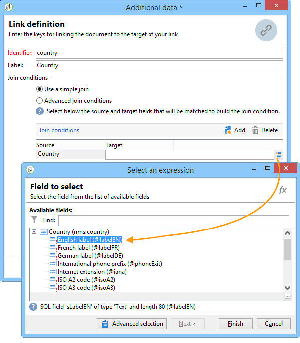
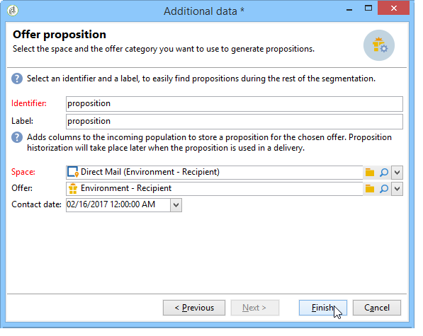

# 扩充{#enrichment}

活动 **[!UICONTROL Enrichment]** 允许您向用户档案列表添加信息，并链接到现有表（创建新连接）。 还可以定义用户档案库中的对帐标准。


## 定义 {#definitions}

要使用扩充活动，您需要熟悉添加数据时可用的各种选项。


该选 **[!UICONTROL Data linked to the filtering dimension]** 项允许您访问：

* 过滤维度数据：对工作表数据的访问
* 链接到过滤维度的数据：对链接到工作表的数据的访问


通过 **[!UICONTROL A link]** 此选项，可在数据库的任何表上创建连接。


链接有四种类型：

* **[!UICONTROL Define a collection]**:允许您定义表之间具有1-N基数的链接。
* **[!UICONTROL Define a link whose target is still available]**:允许您定义表之间具有1-1基数的链接。 连接条件必须由目标表中的单个记录定义。
* **[!UICONTROL Define a link whose target does not necessarily exist in the base]**:允许您定义表之间具有0-1基数的链接。 连接条件必须由0或1（最大）定义。 记录在目标表中。

   此选项在选项卡 **[!UICONTROL Simple Join]** 中配置，可通过活动 **[!UICONTROL Edit additional data]** 的链接访 **[!UICONTROL Enrichment]** 问。

* **[!UICONTROL Define a link by searching for a reference among several options]**:此类型的链接定义对唯一记录的协调。 Adobe Campaign通过在目标表中添加外键来创建指向目标表的链接，以存储对唯一记录的引用。

   此选项在选项卡 **[!UICONTROL Reconciliation and deduplication]** 中配置，可通过活动 **[!UICONTROL Edit additional data]** 的链接访 **[!UICONTROL Enrichment]** 问。

在以下各节中还提供详细说明扩充活动在其上下文中操作的使用案例：

* [具有自定义日期字段的电子邮件扩充](../../workflow/using/email-enrichment-with-custom-date-fields.md).
* [丰富数据](../../workflow/using/enriching-data.md)
* [创建摘要列表](../../workflow/using/creating-a-summary-list.md)

## 添加信息 {#adding-information}

使用 **[!UICONTROL Enrichment]** 活动向工作表添加列：此活动可用作查询活动的补充。

附加列的配置在添加数据中 [有详细介绍](../../workflow/using/query.md#adding-data)。

在字 **[!UICONTROL Primary set]** 段中，您可以选择入站过渡:丰富了活动工作台的数据。

单击链 **[!UICONTROL Add data]** 接，然后选择要添加的数据类型。 提供的列表类型取决于平台上安装的模块和选项。 在最小的配置中，您始终可以添加链接到过滤维度和链接的数据。


在以下示例中，出站过渡将丰富目标用户档案的年龄信息。


右键单击扩充活动的入站过渡，以在扩充阶段之前视图数据。


工作台包含以下数据和相关模式:


在扩充级输出中重复此操作。


您可以看到已添加与用户档案年龄相关的数据：


匹配模式也丰富了。

## 管理其他数据 {#managing-additional-data}

如果不 **[!UICONTROL Keep all additional data from the main set]** 想保留以前定义的其他数据，请取消选择此选项。 在这种情况下，将只向传出工作表中添加在扩充活动中选择的其他列。 将不保存添加到上游活动的其他信息。


扩充阶段输出的模式和数据将如下：


## 创建链接 {#creating-a-link}

您可以使用扩充活动创建工作数据与Adobe Campaign数据库之间的链接：这将是入站数据之间工作流的本地链接。

例如，如果加载包含收件人的帐号、国家／地区和电子邮件的文件的数据，则必须创建指向国家／地区表的链接，才能在其用户档案中更新此信息。

为此，请应用以下步骤：

1. 收集并加载以下类型的文件：

   ```
   Account number;Country;Email
   18D65;FRANCE;agnes@gmail.com
   243PP;RUSSIA;paul@gmail.com
   55H87;CROATIA;dave@gmail.com
   56U81;USA;susan@gmail.com
   853PI;ITALY;anna@gmail.com
   890LP;FRANCE;robert@gmail.com
   83TY2;SWITZERLAND;mike@gmail.com
   ```

1. 编辑扩充活动，并单 **击添加。.** .链接以创建与国家／地区表的连接。

   

1. 选择选 **[!UICONTROL Link definition]** 项并单击 **[!UICONTROL Next]** 按钮。 指定要创建的链接类型。 在此示例中，我们希望将文件收件人的国家与数据库专用表中可用国家列表的国家进行协调。 选择 **[!UICONTROL Define a link by searching for a reference among several options]** 选项。在字段中选择国家／地 **[!UICONTROL Target schema]** 区表。

   

1. 最后，选择允许您将源文件值链接到数据库中的值的字段。

   

在本扩充活动的输出中，临时模式将包含指向国家表的链接：


## 数据协调 {#data-reconciliation}

扩充活动可用于配置数据协调，包括数据加载到数据库后的数据协调。 在这种情况下，通 **[!UICONTROL Reconciliation]** 过选项卡可以定义Adobe Campaign库中数据与工作表中数据之间的链接。

选择选 **[!UICONTROL Identify the targeting document based on work data]** 项，指定要创建链接的模式并定义连接条件：为此，请在工作数据()和定位维度()中&#x200B;**[!UICONTROL Source expression]**&#x200B;选择要调节的字&#x200B;**[!UICONTROL Destination expression]**&#x200B;段。

您可以使用一个或多个对帐条件。


如果指定了多个连接条件，则必须验证所有条件，以便将数据链接到一起。

## 插入优惠建议 {#inserting-an-offer-proposition}

扩充活动允许您为投放添加优惠或指向优惠的链接。

For more information on the enrichment activity, refer to this [section](../../workflow/using/enrichment.md).

例如，您可以在收件人查询之前丰富数据。


配置查询后(请参阅此 [部分](../../workflow/using/query.md)):

1. 添加和打开扩充活动。
1. 在 **[!UICONTROL Enrichment]** 选项卡中，选择 **[!UICONTROL Add data]**。
1. 选择 **[!UICONTROL An offer proposition]** 要添加的数据类型。

   

1. 为要添加的命题指定标识符和标签。
1. 指定优惠选择。 这有两种可能的选项：

   * **[!UICONTROL Search for the best offer in a category]**:选中此选项并指定优惠引擎调用参数(优惠空间、类别或主题、联系日期、要保留的优惠数)。 引擎将根据这些参数自动计算要添加的优惠。 我们建议填写 **[!UICONTROL Category]** 或字 **[!UICONTROL Theme]** 段，而不是同时填写这两个字段。

      

   * **[!UICONTROL A predefined offer]**:选中此选项并指定优惠空间、特定优惠和联系日期，以直接配置要添加的优惠，无需调用优惠引擎。

      

1. 然后，配置与所选投放对应的活动渠道。 请参阅 [跨渠道投放](../../workflow/using/cross-channel-deliveries.md)。

   预览可用的建议数取决于在扩充活动中执行的配置，而不是直接在投放中执行的任何可能的配置。

要指定优惠建议，您还可以选择引用指向优惠的链接。 有关此内容的详细信息，请参阅以 [下引用指向优惠的链接](#referencing-a-link-to-an-offer)。

## 引用指向优惠的链接 {#referencing-a-link-to-an-offer}

您还可以引用指向优惠的链接(在扩充活动中)。

操作步骤：

1. 在活动 **[!UICONTROL Add data]** 的选项卡中 **[!UICONTROL Enrichment]** 选择。
1. 在选择要添加的数据类型的窗口中，选择 **[!UICONTROL A link]**。
1. 选择要建立的链接类型及其目标。 在这种情况下，目标是优惠模式。

   

1. 在扩充活动(此处为收件人表)中指定入站表数据与优惠表之间的连接。 例如，您可以将优惠代码链接到收件人。

   

1. 然后，配置与所选投放对应的活动渠道。 请参阅 [跨渠道投放](../../workflow/using/cross-channel-deliveries.md)。

   >[!NOTE]
   >
   >预览可用的建议数取决于投放中执行的配置。

## 存储优惠排名和权重 {#storing-offer-rankings-and-weights}

默认情况下，当扩充 **活动用于** 交付优惠时，其排名和权重不会存储在命题表中。

默认 **[!UICONTROL Offer engine]** 情况下，活动会存储此信息。

但是，您可以按如下方式存储此信息：

1. 在放置在优惠之后和扩充活动之前的查询活动中创建对投放引擎的调用。 Refer to this [section](../../interaction/using/integrating-an-offer-via-a-workflow.md#specifying-an-offer-or-a-call-to-the-offer-engine).
1. 在活动的主窗口中，选择 **[!UICONTROL Edit additional data...]**。

   

1. 为排名 **[!UICONTROL @rank]** 和优惠权重添 **[!UICONTROL @weight]** 加列。

   

1. 确认您的添加并保存您的工作流。

投放自动存储优惠的排名和权重。 此信息显示在投放的选项 **[!UICONTROL Offers]** 卡中。
