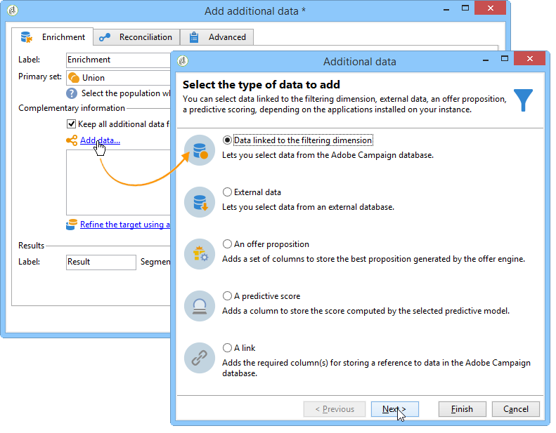
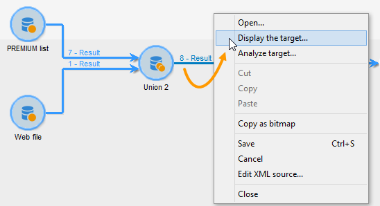
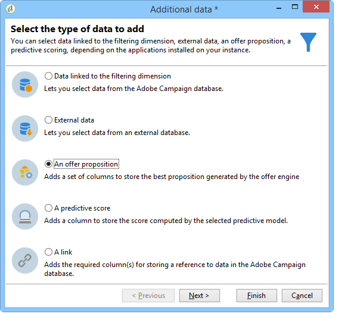
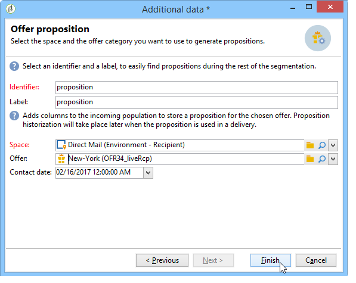

# 扩充{#enrichment}

通过 **[!UICONTROL Enrichment]** 该活动，您可以向配置文件列表添加信息，并链接到现有表（创建新加入）。 还可以定义数据库中配置文件的对帐标准。


## 定义 {#definitions}

要使用丰富化活动，您需要熟悉添加数据时可用的各种选项。



通过 **[!UICONTROL Data linked to the filtering dimension]** 此选项，您可以访问：

* 过滤维度的数据：访问工作表数据
* 链接到筛选维度的数据：访问链接到工作表的数据


通过 **[!UICONTROL A link]** 此选项可在数据库的任何表上创建连接。


有四种类型的链接：

* **[!UICONTROL Define a collection]**:允许您定义表之间具有1-N基数的链接。
* **[!UICONTROL Define a link whose target is still available]**:允许您定义表之间具有1-1基数的链接。 连接条件必须由目标表中的单个记录定义。
* **[!UICONTROL Define a link whose target does not necessarily exist in the base]**:允许您定义表之间具有0-1基数的链接。 连接条件必须由0或1（最大）定义。记录在目标表中。

   此选项在选项卡中配 **[!UICONTROL Simple Join]** 置，可通过活动的链 **[!UICONTROL Edit additional data]** 接访问该选 **[!UICONTROL Enrichment]** 项。

* **[!UICONTROL Define a link by searching for a reference among several options]**:此类型的链接定义对唯一记录的协调。 Adobe Campaign通过在目标表中添加外键来存储对唯一记录的引用，从而创建指向目标表的链接。

   此选项在选项卡中配 **[!UICONTROL Reconciliation and deduplication]** 置，可通过活动的链 **[!UICONTROL Edit additional data]** 接访问该选 **[!UICONTROL Enrichment]** 项。

“丰 [富数据](../../workflow/using/enriching-data.md) ”和“ [](../../workflow/using/creating-a-summary-list.md) 创建摘要列表”使用案例详细介绍了丰富活动在其上下文中的操作情况。

## 添加信息 {#adding-information}

使用活 **[!UICONTROL Enrichment]** 动向工作表添加列：此活动可用作查询活动的补充。

添加数据中详细介绍了其他列 [的配置](../../workflow/using/query.md#adding-data)。

在字 **[!UICONTROL Primary set]** 段中，您可以选择入站过渡：将丰富该活动工作台的数据。

单击链 **[!UICONTROL Add data]** 接，然后选择要添加的数据类型。 提供的数据类型列表取决于平台上安装的模块和选项。 在最小的配置中，您始终可以添加链接到筛选维度和链接的数据。


在以下示例中，出站过渡将丰富目标配置文件的年龄信息。


右键单击浓缩活动的入站过渡，以查看浓缩阶段之前的数据。



工作台包含以下数据和关联的架构：


在富化阶段输出重复此操作。


您可以看到与配置文件页面相关的数据已添加：


匹配架构也已丰富。

## 管理其他数据 {#managing-additional-data}

如果不 **[!UICONTROL Keep all additional data from the main set]** 想保留先前定义的其他数据，请取消选择此选项。 在这种情况下，只有在浓缩活动中选择的其他列才会添加到传出工作表中。 不会保存添加到上游活动的其他信息。


富集阶段输出的数据和模式如下：


## 创建链接 {#creating-a-link}

您可以使用丰富化活动在工作数据与Adobe Campaign数据库之间创建链接：这将是入站数据之间工作流的本地链接。

例如，如果加载包含收件人的帐号、国家／地区和电子邮件的文件的数据，则必须创建指向国家／地区表的链接，才能更新其配置文件中的此信息。

为此，请应用以下步骤：

1. 收集并加载以下类型的文件：

   ```
   Account number;Country;Email
   18D65;FRANCE;agnes@gmail.com
   243PP;RUSSIA;paul@gmail.com
   55H87;CROATIA;dave@gmail.com
   56U81;USA;susan@gmail.com
   853PI;ITALY;anna@gmail.com
   890LP;FRANCE;robert@gmail.com
   83TY2;SWITZERLAND;mike@gmail.com
   ```

1. **编辑丰富化活动，然后单击**&#x200B;添加数据……链接以创建与国家／地区表的连接。

   

1. 选择选 **[!UICONTROL Link definition]** 项，然后单击按 **[!UICONTROL Next]** 钮。 指定要创建的链接类型。 在此示例中，我们希望将文件收件人的国家／地区与数据库专用表中可用国家／地区列表中的国家／地区进行协调。 选择选 **[!UICONTROL Define a link by searching for a reference among several options]** 项。 在字段中选择国家／地区 **[!UICONTROL Target schema]** 表。

   

1. 最后，选择字段，该字段允许您将源文件值链接到数据库中的值。

   

在此次浓缩活动的输出中，临时方案将包含指向国家表的链接：


## 数据协调 {#data-reconciliation}

该丰富化活动可用于配置数据协调，包括将数据加载到数据库之后。 在这种情况下，通 **[!UICONTROL Reconciliation]** 过选项卡可定义Adobe Campaign数据库中的数据与工作表中的数据之间的链接。

选择 **[!UICONTROL Identify the targeting document based on work data]** 选项，指定要创建链接的架构并定义加入条件：为此，请在工作数据()和定位维()中&#x200B;**[!UICONTROL Source expression]**&#x200B;选择要协调的字段&#x200B;**[!UICONTROL Destination expression]**。

您可以使用一个或多个对帐条件。


如果指定了多个连接条件，则必须验证所有条件，以便将数据链接在一起。

## 插入优惠建议 {#inserting-an-offer-proposition}

通过丰富化活动，您可以为交付收件人添加选件或指向选件的链接。

有关丰富化活动的详细信息，请参阅此 [部分](../../workflow/using/enrichment.md)。

例如，您可以在分发之前为收件人查询丰富数据。


配置查询后(请参阅此 [部分](../../workflow/using/query.md)):

1. 添加和开展丰富化活动。
1. 在选项卡 **[!UICONTROL Enrichment]** 中，选择 **[!UICONTROL Add data]**。
1. 在要 **[!UICONTROL An offer proposition]** 添加的数据类型中进行选择。

   

1. 为将添加的主张指定标识符和标签。
1. 指定选件选择。 这有两个可能的选项：

   * **[!UICONTROL Search for the best offer in a category]**:选中此选项并指定选件引擎调用参数（选件空间、类别或主题、联系日期、要保留的选件数量）。 引擎将根据这些参数自动计算要添加的选件。 我们建议填写 **[!UICONTROL Category]** 或字 **[!UICONTROL Theme]** 段，而不是同时填写两者。

      

   * **[!UICONTROL A predefined offer]**:选中此选项并指定选件空间、特定选件和联系日期，以直接配置要添加的选件，而无需调用选件引擎。

      

1. 然后，配置与所选渠道对应的交付活动。 请参阅 [跨渠道交付](../../workflow/using/cross-channel-deliveries.md)。

   可用于预览的建议的数量取决于在富集活动中执行的配置，而不是直接在交付中执行的任何可能的配置。

要指定选件命题，您还可以选择引用指向选件的链接。 有关详细信息，请参阅以下部分引 [用指向选件的链接](#referencing-a-link-to-an-offer)。

## 引用指向选件的链接 {#referencing-a-link-to-an-offer}

您还可以在丰富化活动中引用选件的链接。

操作步骤：

1. 在活 **[!UICONTROL Add data]** 动的选项卡中进行 **[!UICONTROL Enrichment]** 选择。
1. 在选择要添加的数据类型的窗口中，选择 **[!UICONTROL A link]**。
1. 选择要建立的链接类型及其目标。 在这种情况下，目标是选件架构。

   

1. 指定丰富化活动（此处为收件人表）中的入站表数据与选件表之间的连接。 例如，您可以将选件代码链接到收件人。

   

1. 然后，配置与所选渠道对应的交付活动。 请参阅 [跨渠道交付](../../workflow/using/cross-channel-deliveries.md)。

   >[!NOTE]
   >
   >预览可用的建议数取决于交付中执行的配置。

## 存储优惠排名和权重 {#storing-offer-rankings-and-weights}

默认情况下，当利用丰 **富活动** 来提供优惠时，其排名和权重不会存储在命题表中。

默认 **[!UICONTROL Offer engine]** 情况下，活动确实会存储此信息。

但是，您可以按如下方式存储此信息：

1. 在查询之后和交付活动之前放置的丰富化活动中创建对选件引擎的调用。 请参阅此 [部分](../../interaction/using/integrating-an-offer-via-a-workflow.md#specifying-an-offer-or-a-call-to-the-offer-engine)。
1. 在活动的主窗口中，选择 **[!UICONTROL Edit additional data...]**。

   

1. 添加 **[!UICONTROL @rank]** 排名列和选 **[!UICONTROL @weight]** 件权重列。

   

1. 确认您的添加并保存您的工作流。

交付自动存储选件的排名和权重。 此信息显示在分发的选项卡 **[!UICONTROL Offers]** 中。
