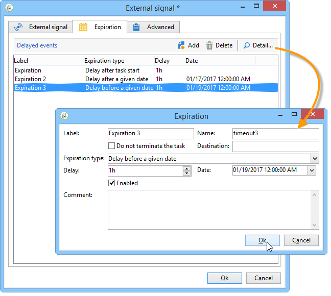

# 外部信号{#external-signal}

此 **外部信号** 活动允许您在工作流中向计划触发一组任务的执行。

激活“外部信号”任务时，该任务会无限期暂停或一直暂停到指定的时间段结束。 其过渡由SOAP调用激活 **PostEvent(sessionToken， workflowId， activity， transition， parameters， complete)。** 此 **[!UICONTROL complete]** 参数允许任务完成，因此不会对后续调用做出反应。

有关PostEvent函数的更多信息，请参阅有关SOAP调用的联机文档。

您可以配置此活动，以便在未收到信号时定义事件。 要执行此操作，请编辑活动并单击 **[!UICONTROL Expiration]** 选项卡。 单击 **[!UICONTROL Insert]** 按钮创建和配置事件。

有关过期配置的详情，请参见 [过期时间](defining-approvals.md).

此 **延迟** 字段可让您以所选择的单位指定过期延迟。 参见 [等待](wait.md).

每行表示一种到期类型，并与过渡重合。

