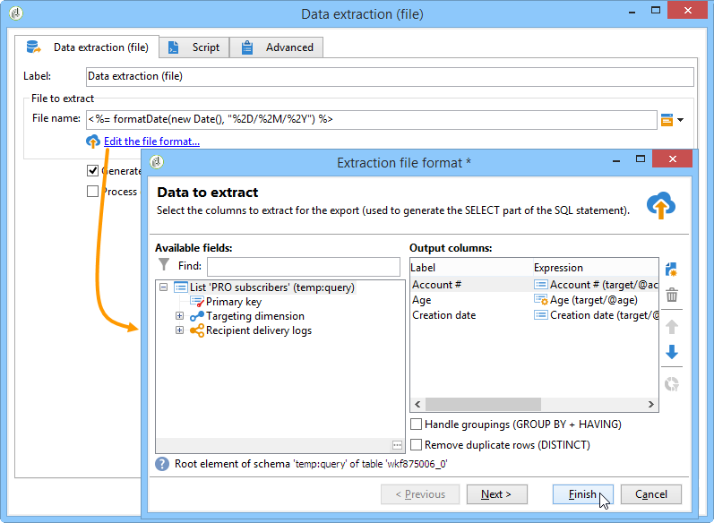
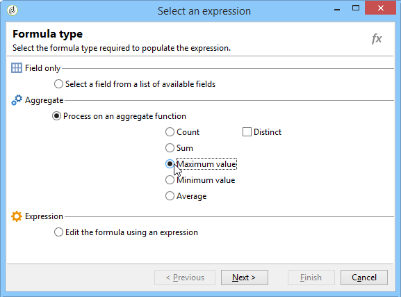

# 数据提取（文件）{#extraction-file}

可以使用&#x200B;**[!UICONTROL Data extraction (file)]**&#x200B;活动从外部文件的工作流表中提取数据。

>[!CAUTION]
>
>此活动必须始终具有包含要提取的数据的入站过渡。

要配置数据提取，请应用以下步骤：

1. 指定输出文件的名称：此名称可包含变量，这些变量通过字段右侧的个性化按钮插入。
1. 单击&#x200B;**[!UICONTROL Edit the file format...]**&#x200B;以选择要提取的数据。

   

   **[!UICONTROL Handle groupings (GROUP BY + HAVING)]**&#x200B;选项会添加额外的步骤来筛选聚合的最终结果，例如，在给定的采购订单类型、订购次数超过10次的客户等。

1. 如有必要，可向输出文件添加新列，例如计算或处理结果。 要执行此操作，请单击&#x200B;**[!UICONTROL Add]**&#x200B;图标。

   

   在附加行中，单击&#x200B;**[!UICONTROL Edit expression]**&#x200B;图标以定义新列的内容。

   

   然后，您将访问选择窗口。 单击&#x200B;**[!UICONTROL Advanced selection]**&#x200B;以选择要应用于数据的进程。

   

   从列表中选择所需的公式。

   

您可以定义要在数据提取期间执行的后期进程，以便压缩或加密文件。 为此，必须在活动的&#x200B;**[!UICONTROL Script]**&#x200B;选项卡中添加所需的命令。

有关此内容的详细信息，请参阅此部分：[压缩或加密文件](../../workflow/using/how-to-use-workflow-data.md#zipping-or-encrypting-a-file)。

## 列表聚合函数{#list-of-aggregate-functions}

以下是可用聚合函数的列表:

* **[!UICONTROL Count]** 计算要聚集的字段的所有非空值，包括(聚集字段的重复值),

   **[!UICONTROL Distinct]** 要计算要聚合的字段的不同值和非空值的总数(在计算之前排除重复值),

* **[!UICONTROL Sum]** 计算数值域的值和，
* **[!UICONTROL Minimum value]** 要计算字段的最小值（数值或其他值），
* **[!UICONTROL Maximum value]** 计算字段的最大值（数值或其他值），
* **[!UICONTROL Average]** 来计算数值字段的平均值。

