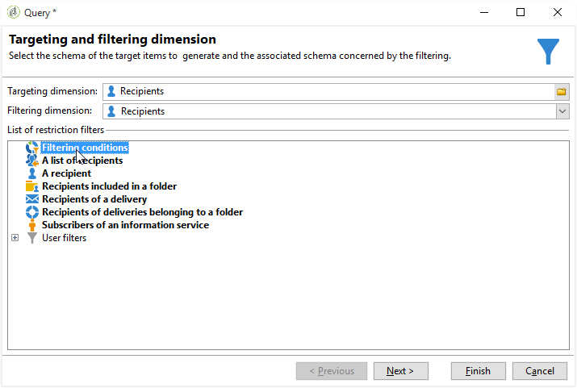

# 筛选重复的收件人 {#filtering-duplicated-recipients}

在本例中，我们要筛选在投放中出现两次或更多次的收件人，以恢复重复的用户档案。

要创建此示例，请应用以下步骤：

1. 在工作流中拖放&#x200B;**[!UICONTROL Query]**&#x200B;活动并打开该活动。
1. 单击&#x200B;**[!UICONTROL Edit query]**&#x200B;并将目标和筛选维度设置为&#x200B;**[!UICONTROL Recipients]**。

   

1. 定义以下筛选条件，以定向投放日志中存在的收件人。 在&#x200B;**表达式**&#x200B;列中选择&#x200B;**收件人投放日志(broadlog)**，在&#x200B;**运算符**&#x200B;列中选择&#x200B;**存在，如**。

   

1. 定义以下筛选条件以定向投放。 在表达式列中选择&#x200B;**[!UICONTROL Internal name]**，在运算符列中选择&#x200B;**[!UICONTROL equal to]**。
1. 在值列中，添加目标投放的内部名称。

   

1. 使用&#x200B;**[!UICONTROL AND]**&#x200B;运算符，重复相同的操作以定位其他投放。

   

叫客过渡包含投放中定向的重复收件人。
