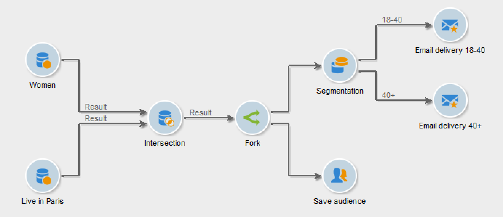

# 分叉{#fork}

您可以使用&#x200B;**[!UICONTROL Fork]**&#x200B;活动创建多个叫客过渡，并在同一工作流中独立运行多个活动。

>[!IMPORTANT]
>
>您在&#x200B;**[!UICONTROL Fork]**&#x200B;活动后添加的叫客过渡不会同时运行。 此行为可能会影响工作流性能。 如果需要独立运行多个活动，请使用&#x200B;**[!UICONTROL Fork]**&#x200B;活动。 （可选）您可以在工作流的后续部分之前加入叫客活动。

要配置&#x200B;**[!UICONTROL Fork]**&#x200B;活动及其相关活动，请执行以下步骤：

1. 打开&#x200B;**[!UICONTROL Fork]**&#x200B;活动并定义叫客过渡的名称和标签。

   

1. 打开每个叫客过渡并进行配置。
1. （可选）要加入叫客过渡，请添加AND加入活动。 [了解详情](and-join.md)。

   工作流的后续部分仅在联接的叫客过渡完成后运行。

## 示例：分段

在本例中，不同的电子邮件被发送到不同的群体。 查询后使用了&#x200B;**[!UICONTROL Fork]**&#x200B;活动，以并行执行两个操作：

* 保存查询结果
* 对发送多个投放的结果进行分段

  

工作流包含以下活动：

1. **[!UICONTROL Query]**&#x200B;活动

   选定了两个人口群体：妇女和巴黎人。

1. **[!UICONTROL Intersection]**&#x200B;活动

   查询结果的交集（即巴黎女性）被选中。

1. **[!UICONTROL Fork]**&#x200B;活动

   这将保存计算出的群体，并会同时将其分为两组：

   1. 18至40岁的巴黎妇女
   1. 40岁以上的巴黎妇女

1. **[!UICONTROL Delivery]**&#x200B;活动

   向每个群体组发送不同的电子邮件。

## 用例：发送生日电子邮件

定期电子邮件会在收件人的生日当天发送给收件人列表。 **[!UICONTROL Fork]**&#x200B;活动用于包含闰年2月29日出生的收件人。 [了解有关此用例的更多信息](sending-a-birthday-email.md)。

## 用例：通过工作流自动提供内容

内容块的创建和投放实现了自动化。 **[!UICONTROL Fork]**&#x200B;活动用于计算目标，同时用于创建内容。 [了解有关此用例的更多信息](../../delivery/using/automating-via-workflows.md#creating-the-delivery-and-its-content)。

然后，您可以配置每个叫客过渡，然后根据需要使用[AND-join](and-join.md)活动将它们连接在一起。 这样，工作流的其余部分将只在&#x200B;**[!UICONTROL Fork]**&#x200B;活动的叫客过渡完成后执行。

## 相关主题

* [AND-join 活动](and-join.md)
* [用例：生日电子邮件](sending-a-birthday-email.md)
* [用例：内容创建和交付](../../delivery/using/automating-via-workflows.md#creating-the-delivery-and-its-content)