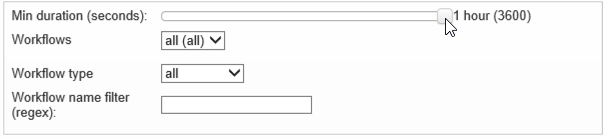

# Workflow HeatMap {#workflow-heatmap}

Adobe Campaign Workflow HeatMap包含当前运行的所有工作流的彩色编码图形表示。 它仅对实例管理员可用。

本页介绍了其他监视不同营销活动流程 [的方法](https://helpx.adobe.com/campaign/kb/acc-maintenance.html)。

## 关于Workflow HeatMap {#about-the-workflow-heatmap}

通过提供并发工作流数的快速概述，Workflow HeatMap使Adobe Campaign平台管理员能够相应地监控实例负载和计划工作流。

更准确地说，它有助于平台管理员：

* 查看和了解并发工作流
* 按持续时间筛选工作流，以查看哪些工作流可能遇到问题
* 按持续时间筛选活动，以查看哪些活动可能遇到问题
* 轻松查找单个工作流和所有相关活动（持续时间）
* 按工作流类型(技术工[作流或营销活动](../../workflow/using/building-a-workflow.md#technical-workflows)[工作流](../../workflow/using/building-a-workflow.md#campaign-workflows))搜索
* 查找要分析的特定工作流

>[!NOTE]
>
>除了工作 **流热图**，您还可以创建一个工作流，通过它可以监视一组工作流的状态并向主管发送循环消息。 For more on this, refer to the [dedicated section](../../workflow/using/supervising-workflows.md).

使用Workflow HeatMap需要对以下概念有很好的理解：工作 [流](../../workflow/using/about-workflows.md)、活 [动](../../workflow/using/about-activities.md) 和工 [作流最佳实践](../../workflow/using/workflow-best-practices.md)。

默认情况下，Adobe Campaign 18.10版开始提供Workflow HeatMap。 如果您的版本介于8700和8977(18.10)之间，您还可以从此功能中受益。 要请求相应的包，请与 [Adobe客户关怀部门联系](https://support.neolane.net/) ，并按照本页中的说 [明进行操作](https://helpx.adobe.com/campaign/kb/install-workflow-heatmap-package.html) ，以了解如何安装它。

首次访问Worklow HeatMap时，将显示以下弹出窗口。 本协议允许在美国进行转让和存储，允许Adobe Campaign:

* 监视实例以调查任何性能问题。
* 收集数据以进行异常检测。

请注意，只有使用Adobe ID连接到Adobe Campaign的用户才能传输数据。

有三个选项可用：

* **[!UICONTROL Accept]** :接受本协议后，即授权Adobe Campaign收集数据并将其传输至美国，以便在异常检测时为您提供帮助。
* **[!UICONTROL Refuse]** :通过拒绝协议，您的数据将不会传输，但您仍可以使用工作流热图。
* **[!UICONTROL Do not show this message again]** :通过单 **[!UICONTROL Do not show this message again]** 击，在访问“工作流热图”时，弹出窗口将停止显示，但仍可通过按钮 **[!UICONTROL Term of use]** 显示。

此选项不是最终选项，您始终可以通过单击按钮来更改 **[!UICONTROL Term of use]** 它。

## 使用HeatMap {#using-the-heatmap}

>[!NOTE]
>
>只有具有管理权限的用户才能访问营销活动工作流热图。

1. 转到并 **[!UICONTROL Monitoring]** 单击链 **[!UICONTROL Workflow HeatMap]** 接以显示页 **[!UICONTROL Campaign Workflow HeatMap]** 面。

   

1. 单击日历以选择日。

   默认情况下，该页面显示当天的工作流活动。 您可以更改它并选择过去的任何一天。

   >[!NOTE]
   >
   >只有尚未被工作流删除的工作流 **[!UICONTROL Database cleanup]** 才可见。 有关数据库清理工作流的详细信息，请参 [阅此部分](../../production/using/database-cleanup-workflow.md)。\
   >默认情况下，Workflow HeatMap时区是为当前管理员用户定义的时区。 例如，如果您与正在处理的营销用户不在同一区域，则可能希望更改它。

1. Click the **[!UICONTROL Filters]** button.

   

1. 使用滑块将最小持续时间从0秒设置为1小时。 这使您能够仅搜索运行超过特定秒数或分钟数的工作流。

   

1. 您还可以从列表中选择特定的工 **[!UICONTROL Workflows]** 作流。

   

   >[!NOTE]
   >
   >将应 **[!UICONTROL Min duration]** 用滤镜。 如果找不到特定的工作流，请将最小持续时间重置为0，以便所有工作流都显示在列表中。

1. 您还可以在以下位置进行筛选 **[!UICONTROL Workflow type]** :

   * **[!UICONTROL Technical]** :只 [显示现成的技术工作流和数据](../../workflow/using/building-a-workflow.md#technical-workflows)[管理工作流](../../workflow/using/targeting-data.md#data-management) 。
   * **[!UICONTROL Marketing]** :只显示链接到营销活动的工作流(称为营销 [活动工作流](../../workflow/using/building-a-workflow.md#campaign-workflows))。

1. 要按名称搜索特定工作流，您还可以使用该字 **[!UICONTROL Workflow name filter]** 段。

   

1. 如果您在其间编辑了一些工作流，请单击 **[!UICONTROL Reload data]** 按钮刷新网格中显示的数据。

## 阅读热图 {#reading-the-heatmap}

营销活动工作流热图是一个自左上角到右下角自然可读的网格，它允许查找具有绿色到红色编码范围的“热点区域”。

* 较深的红色单元格对应于同时运行大量工作流的时段。
* 灰色单元格与没有运行工作流的期间相对应。

要了解如何应用颜色代码以及如何导航热图，请单击按 **[!UICONTROL Help]** 钮。

每行代表一天的一小时，每个单元格代表该小时的5分钟。

网格显示每个5分钟期间同时运行的所有工作流。

在以下示例中，在上午8点到上午8点05分之间，正在运行三个工作流（不管它们各自的持续时间如何）:

1. 单击一个彩色单元格，以显示该期间运行的所有并发工作流的详细信息。

   

   对于每个工作流，将列出它包含的所有活动及其持续时间。

1. 单击工作流ID或名称以直接打开工作流。
1. 要返回视图， **[!UICONTROL Campaign Workflow HeatMap]** 请单击该 **[!UICONTROL Home]** 按钮。

## 用例：使用HeatMap执行操作 {#use-cases--using-the-heatmap-to-take-actions}

营销活动工作流热图在两种主要情况下很有用。

### 减少并发工作流的数量 {#reducing-the-number-of-concurrent-workflows}

作为营销活动管理员，Workflow HeatMap可以帮助您了解实例的负载情况，并在适当的时间规划现有或新的工作流。

1. 在视图 **[!UICONTROL Campaign Workflow HeatMap]** 中，单击按 **[!UICONTROL Filters]** 钮。
1. 将持续时间设置为几秒或几分钟。
1. 通过增加持续时间过滤器来排除不重要的最短工作流。

   

1. 浏览结果以了解实例的负载并采取相应的操作：

   * 如果您遇到性能问题，并且网格中显示了一个或多个红色单元格，请考虑更改多个工作流的开始时间。 要求营销用户手动将工作流从忙碌（“热”）时段移到更多可用时间段。 这应该能够维持一天的稳定活动水平。
   * 要避免出现峰值并防止实例过载，请在规划新工作流程之前查看HeatMap并选择最佳时间。 考虑网格中与灰色或绿色单元格对应的时隙，以开始新的工作流。

### 查找影响性能的长时间运行的工作流程 {#finding-long-running-workflows-that-impact-performance}

作为营销活动管理员，Workflow HeatMap可帮助您找到可减慢活动的最长工作流。

1. 在视图 **[!UICONTROL Campaign Workflow HeatMap]** 中，单击按 **[!UICONTROL Filters]** 钮。
1. 将持续时间设置为1小时。

   

1. 通过减少滤镜来包含更多 **[!UICONTROL Min duration]** 结果。
1. 浏览结果，找出最长的工作流程，这些工作流可能会对服务器和数据库资源（CPU、RAM、网络、IOPS等）产生更大的影响。
1. 采取适当的操作：

   * 建议营销用户拆分最长的工作流以缩短处理时间。
   * 对特定工作流程和特定活动（如JavaScript、导入、导出等）进行更深入的分析，以便隔离问题并更轻松地解决这些问题。

## 示例：使用HeatMap改进工作流规划 {#example--using-the-heatmap-to-improve-workflow-planning}

以下示例演示了在使用Adobe Campaign Workflow HeatMap时如何提高计划效率以及如何改进性能。

在这种情况下，许多用户抱怨工作流的性能。 您需要检查哪些因素减缓了活动，以及如何解决问题。

1. 转到并 **[!UICONTROL Monitoring]** 单击链 **[!UICONTROL Workflows]** 接以显示页 **[!UICONTROL Campaign Workflow HeatMap]** 面。
1. 将过滤 **[!UICONTROL Min duration]** 器设置为5分钟。
1. 将过滤 **[!UICONTROL Workflow type]** 器设置为 **[!UICONTROL Marketing]** 。
1. 从HeatMap网格中，观察以下情况：

   

   * 50个持续时间长（超过5分钟）的营销活动工作流程在上午10点开始运行。
   * 大多数应用程序都有待处理状态（默认情况下，并发限制设置为20）。
   * 需要每天手动重新启动待处理的工作流。
   * 性能低。

1. 不是从上午10点开始有50个工作流，而是在一天的其余时间平均分配工作流的开始时间。
1. 返回页面 **[!UICONTROL Campaign Workflow HeatMap]** 并单击按 **[!UICONTROL Reload data]** 钮。
1. 现在，请注意以下事项：

   

   * 只有十八个长期的营销活动工作流程在上午10点仍在运行。
   * 不再有工作流处于待处理状态（并发限制仍设置为20）。
   * 工作流开始时间在一天中平均分配。
   * 不再有用户抱怨性能问题。
