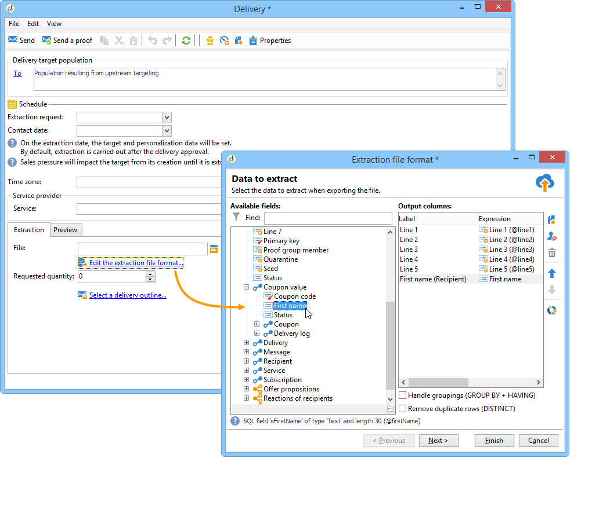

# 如何使用工作流数据{#how-to-use-workflow-data}

## 更新数据库 {#updating-the-database}

所有收集的数据都可用于更新数据库或在投放中使用。 例如，您可以丰富消息内容个性化的可能性（包括消息中的合同数量，指定去年的平均购物车数等）或详细信息群体定位（向合同共同所有者发送消息，以在线服务的1,000个最佳订阅者为目标等）。 此数据还可以在列表中导出或存档。

### 列表和直接更新 {#lists-and-direct-updates}

Adobe Campaign数据库和现有列表的数据可以使用两个专用活动进行更新：

* **[!UICONTROL List update]**&#x200B;活动允许您在数据列表中存储工作表。

  您可以选择现有列表或创建现有列表。 在这种情况下，将计算名称，并可能计算记录文件夹。

  

  请参阅[列表更新](list-update.md)。

* **[!UICONTROL Update data]**&#x200B;活动对数据库中的字段执行批量更新。

  有关详细信息，请参阅[更新数据](update-data.md)。

### 订阅/退订管理 {#subscription-unsubscription-management}

要了解通过工作流订阅和取消订阅信息服务的收件人的相关信息，请参阅[订阅服务](subscription-services.md)。

## 通过工作流发送 {#sending-via-a-workflow}

### 投放活动 {#delivery-activity}

在[投放](delivery.md)中详细介绍了投放活动。

### 丰富和定位投放 {#enriching-and-targeting-deliveries}

投放可以处理来自工作流的数据，以自定义内容或在目标群体选择框架中。

例如，在直邮投放的框架中，您可以在提取文件中包含从在工作流中执行的数据操作获取的其他数据：

除了常规个性化字段之外，您还可以将个性化字段从工作流阶段添加到投放内容。 工作流活动中定义的其他数据可在投放助手中保留并可访问，如以下示例所示，用于在直邮投放框架内定义输出文件的名称：

工作流表中包含的数据由其名称标识：它始终由&#x200B;**targetData**&#x200B;链接组成。 有关详细信息，请参阅[目标数据](data-life-cycle.md#target-data)。

在电子邮件投放的框架内，个性化字段还可以使用在定向工作流阶段执行的目标扩展中的数据，如以下示例所示：

如果在定向活动中指定了区段代码，则该区段代码会添加到工作流表的特定列，并且会与个性化字段一起提供。 要显示所有个性化字段，请单击可通过个性化按钮访问的&#x200B;**[!UICONTROL Target extension > Other...]**&#x200B;链接。

