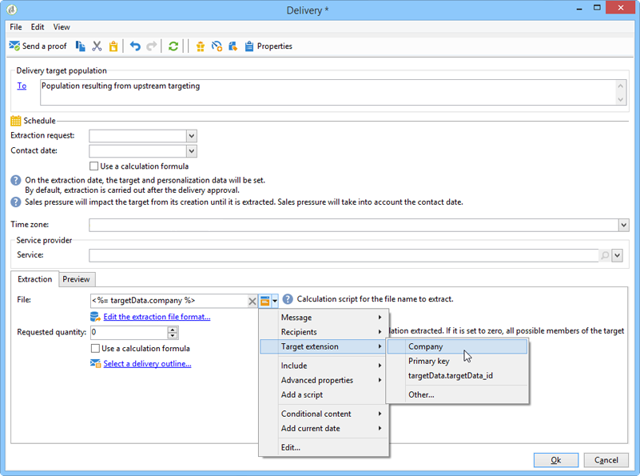

# 如何使用工作流数据{#how-to-use-workflow-data}

## 更新数据库 {#updating-the-database}

所有收集的数据都可用于更新数据库或投放。 例如，您可以扩充邮件内容的个性化可能性（包括邮件中的合同数、指定去年的平均购物车数等） 或详细定位群体（向合同合同持有者发送消息，定位在线服务的1,000位最佳订阅者，等等）。 此数据也可以在列表中导出或存档。

### 列表和直接更新 {#lists-and-direct-updates}

Adobe Campaign数据库和现有列表的数据可以使用两个专用活动进行更新：

* 的 **[!UICONTROL List update]** 活动允许您在数据库中存储工作表。

   您可以选择或创建现有列表。 在这种情况下，会计算名称，可能还会计算记录文件夹。

   

   请参阅 [列表更新](list-update.md).

* 的 **[!UICONTROL Update data]** 活动会批量更新数据库中的字段。

   有关更多信息，请参阅 [更新数据](update-data.md).

### 订阅/退订管理 {#subscription-unsubscription-management}

要了解如何通过工作流为信息服务的收件人订阅和取消订阅，请参阅 [订阅服务](subscription-services.md).

## 通过工作流发送 {#sending-via-a-workflow}

### 投放活动 {#delivery-activity}

有关投放活动的详情，请参阅 [投放](delivery.md).

### 丰富和定位投放 {#enriching-and-targeting-deliveries}

投放可以处理来自工作流的数据，以便自定义内容或在目标群体选择的框架内。

例如，在直邮投放的框架内，您可以在提取文件中包含从工作流中执行的数据操作获取的附加数据：

除了常规的个性化字段之外，您还可以将工作流阶段的个性化字段添加到投放内容。 可以在投放向导中保留和访问工作流活动中定义的附加数据，如以下示例所示，用于在直邮投放框架中定义输出文件的名称：

工作流表中包含的数据由其名称标识：它总是由 **targetData** 链接。 有关更多信息，请参阅 [目标数据](data-life-cycle.md#target-data).

在电子邮件投放的框架中，个性化字段还可以使用在定位工作流阶段中执行的定位扩展中的数据，如以下示例所示：

如果在定位活动中指定了段码，则该段码会添加到工作流表的特定列，并随个性化字段一起提供。 要显示所有个性化字段，请单击 **[!UICONTROL Target extension > Other...]** 可通过个性化按钮访问的链接。

