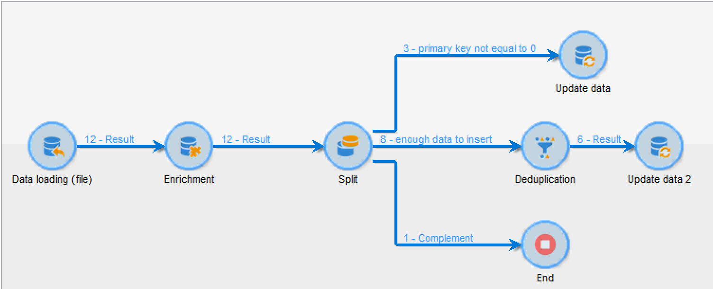

# 导入数据{#importing-data}

## 如何收集数据 {#how-to-collect-data}

### 使用列表中的数据：阅读列表 {#using-data-from-a-list--read-list}

在工作流中发送的数据可以来自预先准备和构造数据的列表。

此列表可能已在Adobe Campaign中直接创建或通过选项导 **[!UICONTROL Import a list]** 入。 For more on this option, refer to this [page](../../platform/using/generic-imports-and-exports.md).

有关在工作流中使用读取列表活动的详细信息，请参阅 [读取列表](../../workflow/using/read-list.md)。

### 从文件加载数据 {#loading-data-from-a-file}

可以从结构化文件中提取工作流中处理的数据，以便将其导入Adobe Campaign。

在数据加载（文件）部分可以找到加载数 [据活动的说明](../../workflow/using/data-loading--file-.md) 。

要导入的结构化文件示例：

```
lastname;firstname;birthdate;email;crmID
Smith;Hayden;23/05/1989;hayden.smith@example.com;124365
Mars;Daniel;17/11/1987;dannymars@example.com;123545
Smith;Clara;08/02/1989;hayden.smith@example.com;124567
Durance;Allison;15/12/1978;allison.durance@example.com;120987
```

### 在处理之前解压缩或解密文件 {#unzipping-or-decrypting-a-file-before-processing}

Adobe Campaign允许您导入压缩或加密文件。 在活动中读取它们之 **[!UICONTROL Data loading (file)]** 前，您可以定义一个预处理来解压缩或解密文件。

要做到这一点，请执行以下操作：

* 如果您的Adobe Campaign安装由Adobe托管：向支持部门发 [送请求](https://support.neolane.net) ，要求在服务器上安装必要的实用程序。
* 如果您安装的Adobe Campaign是内部部署：安装要使用的实用程序(例如：GPG、GZIP)以及应用程序服务器上必需的密钥（加密密钥）。

1. 在工作流中添 **[!UICONTROL File transfer]** 加和配置活动。
1. 添加活 **[!UICONTROL Data loading (file)]** 动并定义文件格式。
1. 选中该 **[!UICONTROL Pre-process the file]** 选项。
1. 指定要应用的预处理命令。 例如，使用PGP解密文件：

   ```
   <path-to_pgp_if-not_global_or_server/>pgp.exe --decrypt --input nl6/var/vp/import/filename.pgp --passphrase "your password" --recipient recipient @email.com --verbose --output nl6/var/vp/import/filename
   ```

1. 添加其他活动以管理来自文件的数据。
1. 保存并执行您的工作流。

导出文件时，您还可以压缩或加密文件。 请参 [阅压缩或加密文件](../../workflow/using/how-to-use-workflow-data.md#zipping-or-encrypting-a-file)。

## 导入数据时的最佳实践 {#best-practices-when-importing-data}

谨慎并遵循下面详述的几个简单规则，将有助于确保数据库内的数据一致性，并避免在数据库更新或数据导出过程中出现常见错误。

### 使用导入模板 {#using-import-templates}

大多数导入工作流应包含以下活动： **[!UICONTROL Data loading (file)]**, **[!UICONTROL Enrichment]**, **[!UICONTROL Split]**, **[!UICONTROL Deduplication]**, **[!UICONTROL Update data]**.

使用导入模板可以非常方便地准备类似的导入并确保数据库中的数据一致性。 了解如何在“工作流模板”部分构建 [工作流模板](../../workflow/using/building-a-workflow.md#workflow-templates) 。

在许多项目中，导入是无活 **[!UICONTROL Deduplication]** 动构建的，因为项目中使用的文件没有重复项。 有时，从导入不同的文件中会显示重复项。 因此，重复数据消除很困难。 因此，重复数据消除步骤是所有导入工作流程中的一个良好预防措施。

切勿假定传入的数据是一致和正确的，或由IT部门或Adobe Campaign主管负责处理。 在项目过程中，请牢记数据清理。 在导入数据时消除重复、协调和维护一致性。

在设置循环导入部分中 [提供了导入模板示例](#setting-up-a-recurring-import) 。

### 使用平面文件格式 {#using-flat-file-formats}

导入的最有效格式是平面文件。 平面文件可以在数据库级别以批量模式导入。

例如：

* 分隔符：制表符或分号
* 第一行带有标题
* 无字符串分隔符
* 日期格式：YYYY/MM/DD HH:mm:SS

Adobe Campaign无法使用标准文件导入活动导入XML文件。 可以使用JavaScript导入XML文件，但只能用小卷导入：每个文件不足10K记录。

### 使用压缩和加密 {#using-compression-and-encryption}

尽可能使用压缩文件进行导入和导出。

在Linux上，可以使用命令行解压缩文件并同时导入。 例如：

```
zcat nl6/var/vp/import/filename.gz
```

如果文件不安全，最好加密通过网络发送的文件。 GPG可用于此。

### 从文件批量加载数据 {#loading-data-in-batch-from-files}

从文件批量加载数据比实时加载一行数据（例如，通过Web服务）更有效。

使用Web服务导入效率不高。 最好尽可能使用文件。

调用外部Web服务来实时丰富配置文件也会导致性能问题和内存泄漏，因为它在线级工作。

如果您需要导入数据，最好使用工作流批量导入，而不是使用Web应用程序或Web服务实时导入。

### 使用数据管理 {#using-data-management}

使用JavaScript以迭代模式（逐行）加载应限制为小卷。

为了提高效率，请始终在数据管 **[!UICONTROL Data Loading (File)]** 理工作流程中使用活动。

### 在增量模式下导入 {#importing-in-delta-mode}

常规导入必须在增量模式下完成。 这意味着每次只向Adobe Campaign发送修改的或新的数据，而不是发送整个表。

完全导入应仅用于初始加载。

使用数据管理而不是JavaScript导入数据。

### 保持一致性 {#maintaining-consistency}

要维护Adobe Campaign数据库中的数据一致性，请遵循以下原则：

* 如果导入的数据与Adobe Campaign中的引用表匹配，则应将其与工作流中的该表协调一致。 不匹配的记录应被拒绝。
* 确保导入的数据始终“ **标准化”** （电子邮件、电话号码、直邮地址），并且这种标准化是可靠的，并且不会在多年内发生变化。 如果不是这样，某些重复项可能会出现在数据库中，而Adobe Campaign不提供用于执行“模糊”匹配的工具，因此很难管理和删除它们。
* 交易数据应具有对帐密钥，并与现有数据对帐，以避免创建重复项。
* **按顺序导入相关文件**。

   如果导入由多个相互依赖的文件组成，则工作流应确保以正确的顺序导入文件。 当文件失败时，不导入其他文件。

* **在导入数据时**，可以消除重复项、协调并保持一致性。

## 设置循环导入 {#setting-up-a-recurring-import}

如果需要定期导入具有相同结构的文件，则使用导入模板是最佳做法。

此示例说明如何预先设置一个工作流，该工作流可用于导入来自Adobe Campaign数据库中CRM的配置文件。 有关每个活动的所有可能设置的详细信息，请参阅此 [部分](../../workflow/using/about-activities.md)。

1. 从创建新的工作流模板 **[!UICONTROL Resources > Templates > Workflow templates]**。
1. 添加以下活动：

   * **[!UICONTROL Data loading (file)]**:定义包含要导入的数据的文件的预期结构。
   * **[!UICONTROL Enrichment]**:协调导入的数据与数据库数据。
   * **[!UICONTROL Split]**:创建过滤器以根据记录是否可以协调而以不同方式处理记录。
   * **[!UICONTROL Deduplication]**:在将数据插入数据库之前，从传入文件中删除重复数据。
   * **[!UICONTROL Update data]**:使用导入的配置文件更新数据库。
   

1. 配置活 **[!UICONTROL Data Loading (file)]** 动：

   * 通过上传示例文件来定义期望的结构。 示例文件应仅包含几行，但包含导入所需的所有列。 检查并编辑文件格式，确保正确设置每列的类型：文本、日期、整数等。 例如：

      ```
      lastname;firstname;birthdate;email;crmID
      Smith;Hayden;23/05/1989;hayden.smith@mailtest.com;123456
      ```

   * 在部分 **[!UICONTROL Name of the file to load]** 中，选择 **[!UICONTROL Upload a file from the local machine]** 字段并将其留空。 每次从此模板创建新工作流时，您都可以在此处指定所需的文件，只要该文件与定义的结构相对应。

      您可以使用任何选项，但必须相应地修改模板。 例如，如果您选择 **[!UICONTROL Specified in the transition]**&#x200B;了此选项，则可以在 **[!UICONTROL File Transfer]** 之前添加一个活动，以从FTP/SFTP服务器检索要导入的文件。 通过S3或SFTP连接，您还可以使用Adobe实时客户数据平台将细分数据导入Adobe Campaign。 For more on this, refer to this [documentation](https://docs.adobe.com/content/help/en/experience-platform/rtcdp/destinations/destinations-cat/adobe-destinations/adobe-campaign-destination.html).

      

1. 配置活 **[!UICONTROL Enrichment]** 动。 此活动在此上下文中的目的是识别传入的数据。

   * 在选项卡 **[!UICONTROL Enrichment]** 中，选择并 **[!UICONTROL Add data]** 定义导入的数据与收件人定位维之间的链接。 在此示例中， **CRM ID** custom字段用于创建连接条件。 只要允许识别唯一记录，就使用所需字段或字段组合。
   * 在选项卡 **[!UICONTROL Reconciliation]** 中，将选项保留为未选 **[!UICONTROL Identify the document from the working data]** 中状态。
   

1. 配置活 **[!UICONTROL Split]** 动，以在一个过渡中检索已协调的收件人和在第二个过渡中具有足够数据的无法协调的收件人。

   随后可以使用与已协调的接收方进行的过渡来更新数据库。 如果文件中有最少的一组信息可用，则具有未知收件人的过渡可用于在数据库中创建新收件人条目。

   在补充出站过渡中，将选择无法协调且没有足够数据的收件人，这些收件人可以导出到单独的文件中，或者只是忽略。

   * 在活动 **[!UICONTROL General]** 的选项卡中，选择“筛选 **[!UICONTROL Use the additional data only]** 设置”并确保自动 **[!UICONTROL Targeting dimension]** 设置为 **[!UICONTROL Enrichment]**。

      选中 **[!UICONTROL Generate complement]** 此选项可查看是否无法在数据库中插入任何记录。 如果需要，您随后可以对补充数据应用进一步处理：文件导出、列表更新等。

   * 在选项卡的第一个子集 **[!UICONTROL Subsets]** 中，在入站人口上添加过滤条件以仅选择收件人主键不等于0的记录。 这样，来自与来自数据库的收件人协调的文件的数据在该子集中被选择。

      

   * 添加第二个子集，该子集选择具有足够数据要插入到数据库中的未协调记录。 例如：电子邮件地址、名字和姓氏。

      子集按其创建顺序被处理，这意味着当处理第二子集时，在第一子集中已经存在于数据库中的所有记录被选择。

      

   * 未在前两个子集中选择的所有记录在中被选择 **[!UICONTROL Complement]**。

1. 配置位 **[!UICONTROL Update data]** 于之前配置的活动的首次出站转 **[!UICONTROL Split]** 换之后的活动。

   * 选择 **[!UICONTROL Update]** 为， **[!UICONTROL Operation type]** 因为入站过渡只包含数据库中已存在的收件人。
   * 在部分 **[!UICONTROL Record identification]** 中，选 **[!UICONTROL Using reconciliation keys]** 择并定义定位维与在中创建的链接之间的键 **[!UICONTROL Enrichment]**。 在此示例中，将 **使用CRM ID** custom字段。
   * 在部 **[!UICONTROL Fields to update]** 分中，指示收件人维中的字段，以使用文件中的相应列的值进行更新。 如果文件列的名称与收件人维字段的名称相同或几乎相同，则可以使用魔棒按钮自动匹配不同的字段。

      

1. 配置在转 **[!UICONTROL Deduplication]** 换后包含未协调的收件人的活动：

   * 选 **[!UICONTROL Edit configuration]** 择定位维并将其设置为从工作流活动生成的 **[!UICONTROL Enrichment]** 临时架构。

      

   * 在此示例中，电子邮件字段用于查找唯一的配置文件。 您可以使用您确定已填写的任何字段，并且它是唯一组合的一部分。
   * 在屏 **[!UICONTROL Deduplication method]** 幕中，选 **[!UICONTROL Advanced parameters]** 择并选中选 **[!UICONTROL Disable automatic filtering of 0 ID records]** 项，以确保主键等于0的记录（应该是此转换的所有记录）不被排除。
   

1. 配置先 **[!UICONTROL Update data]** 前配置的活动之 **[!UICONTROL Deduplication]** 后的活动。

   * 选择 **[!UICONTROL Insert]** 为， **[!UICONTROL Operation type]** 因为入站过渡只包含数据库中不存在的收件人。
   * 在部分 **[!UICONTROL Record identification]** 中，选择 **[!UICONTROL Directly using the targeting dimension]** 并选择 **[!UICONTROL Recipients]** 尺寸。
   * 在部 **[!UICONTROL Fields to update]** 分中，指示收件人维中的字段，以使用文件中的相应列的值进行更新。 如果文件列的名称与收件人维字段的名称相同或几乎相同，则可以使用魔棒按钮自动匹配不同的字段。

      

1. 在活动的第三次转 **[!UICONTROL Split]** 换后，如果要跟踪未插入到数 **[!UICONTROL Data extraction (file)]****[!UICONTROL File transfer]** 据库的数据，请添加活动和活动。 配置这些活动以导出所需的列，并在FTP或SFTP服务器上传输文件，从中可以检索文件。
1. 添加活 **[!UICONTROL End]** 动并保存工作流模板。

该模板现在可以使用，并且可用于每个新工作流。 然后，需要全部指定包含要在活动中导入的数据的文 **[!UICONTROL Data loading (file)]** 件。



